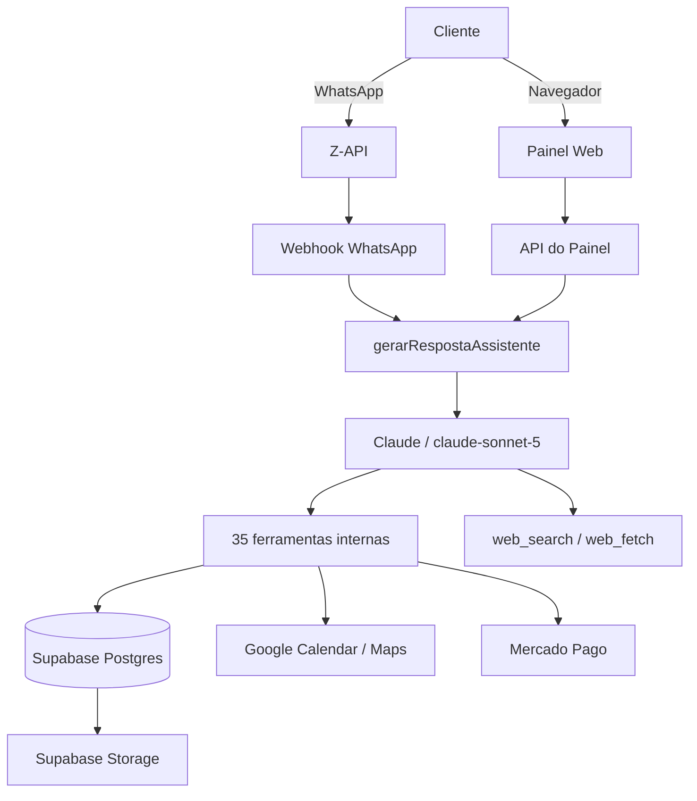
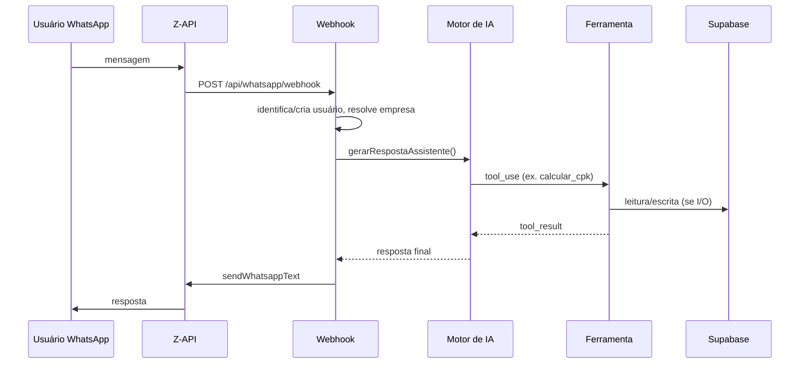
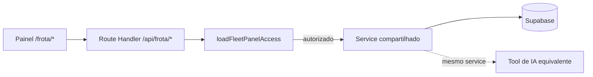
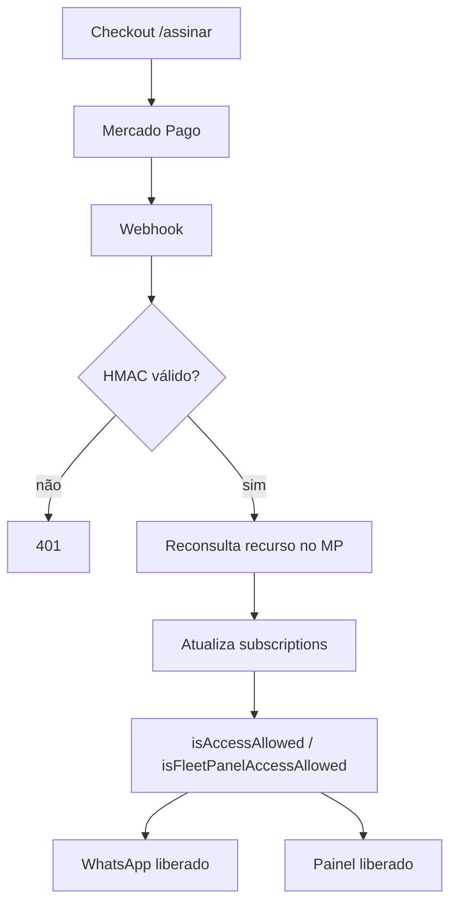
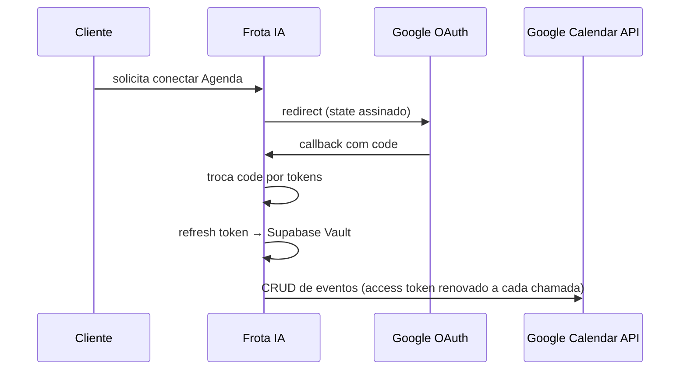
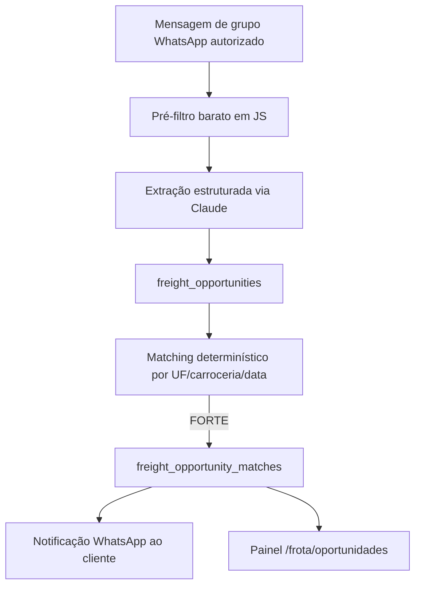
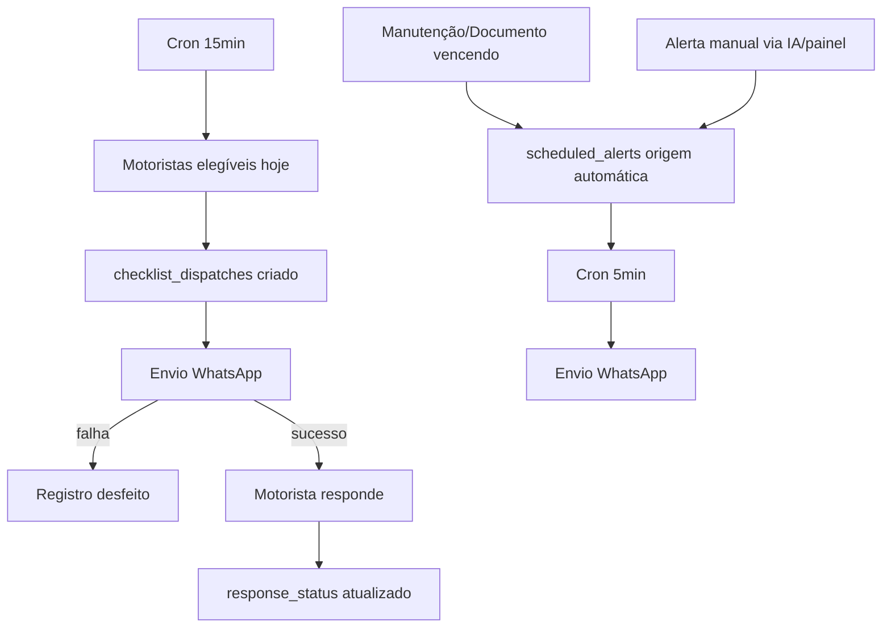

# FROTA IA — Arquitetura Técnica Completa (estado atual)

| | |
|---|---|
| **Branch auditada** | `claude/frota-ia-assistente-setup-qlrbac` |
| **Commit auditado** | `dc5903d1c726f8cab75a32126f9543ada568049b` |
| **Data da auditoria** | 2026-08-28 |
| **Framework** | Next.js `16.2.10` (App Router) |
| **Linguagem** | TypeScript `^5` (resolvida `5.9.3`), `strict: true` |
| **Runtime** | Node.js (versão fixada via variável Railway `NIXPACKS_NODE_VERSION`, não via `engines` do `package.json` — valor não lido nesta auditoria por não ser necessário revelar) |
| **Arquitetura geral** | Monolito Next.js full-stack (App Router + Route Handlers), 1 único deploy, 2 canais de entrada (WhatsApp e Painel Web) convergindo no mesmo motor de IA |
| **Infraestrutura** | Railway (app principal + 6 serviços de cron, região `sfo`) |
| **Banco** | Supabase Postgres (33 tabelas, RLS ativo, Supabase Storage, Supabase Vault) |
| **Autenticação** | Supabase Auth — Google OAuth (painel) + criação direta via Admin API (WhatsApp, sem senha) |
| **IA** | Anthropic Claude via `@anthropic-ai/sdk` `^0.115.0`, modelo `claude-sonnet-5` |
| **WhatsApp** | Z-API (não-oficial), webhook único |
| **APIs externas** | Google Calendar, Google Maps Platform, busca web nativa da Anthropic (`web_search`/`web_fetch`) |
| **Pagamentos** | Mercado Pago (assinatura recorrente + pagamento único) |
| **Jobs/crons** | 6 serviços Railway independentes, todos `curl` batendo em rotas HTTP protegidas por token |
| **Armazenamento** | Supabase Storage — 2 buckets privados |
| **Observabilidade** | `@sentry/nextjs` `^10.71.0` (server + edge, condicional a `SENTRY_DSN`) + log estruturado próprio |
| **Segurança** | RLS multiempresa via funções `SECURITY DEFINER`, tokens HMAC/estáticos em webhooks e crons, Storage 100% privado com signed URLs |

> Este documento foi gerado por auditoria direta do código-fonte (não de documentação antiga). Onde a documentação anterior (`docs/*.md`) divergia do código, o código prevaleceu — as divergências relevantes estão listadas na Seção 13.4.

---

## Sumário

1. [Visão geral da arquitetura](#1-visão-geral-da-arquitetura)
2. [Stack tecnológica](#2-stack-tecnológica)
3. [Infraestrutura](#3-infraestrutura)
4. [Banco de dados](#4-banco-de-dados)
5. [Motor de IA](#5-motor-de-ia)
6. [WhatsApp](#6-whatsapp)
7. [Painel Web](#7-painel-web)
8. [APIs e integrações externas](#8-apis-e-integrações-externas)
9. [Pagamentos](#9-pagamentos)
10. [Crons / Automações](#10-crons--automações)
11. [Segurança](#11-segurança)
12. [Diagramas](#12-diagramas)
13. [Estado final](#13-estado-final)

---

## 1. Visão geral da arquitetura

O Frota IA é um monolito Next.js que serve dois canais de entrada — **WhatsApp** (via Z-API) e **Painel Web** — que convergem no **mesmo motor de IA** e nos **mesmos services** de acesso ao banco. Não existem dois sistemas paralelos: o painel lê/escreve nas mesmas tabelas que as ferramentas de IA usam no WhatsApp, e o widget de IA do painel chama a mesma função de chat que o webhook do WhatsApp chama.

```
Cliente (motorista / gestor de frota)
        │
        ├── WhatsApp (Z-API) ──────────┐
        │                              │
        └── Painel Web (navegador) ────┤
                                        ▼
                         Next.js App Router (Railway)
                    ┌───────────────────────────────────┐
                    │  Webhook WhatsApp  │  API do Painel │
                    └───────────────────────────────────┘
                                        │
                                        ▼
                      Motor de IA (gerarRespostaAssistente)
                   Claude (claude-sonnet-5) + loop de tool-use
                                        │
                        ┌───────────────┼────────────────┐
                        ▼               ▼                ▼
                35 ferramentas   web_search/web_fetch   (resposta
                internas         nativos da Anthropic     de texto)
                        │         (domínios restritos)
                        ▼
        ┌───────────────────────────────────────────┐
        │  Supabase Postgres (33 tabelas, RLS)       │
        │  Supabase Storage (2 buckets privados)     │
        │  Google Calendar / Google Maps             │
        │  Mercado Pago                               │
        └───────────────────────────────────────────┘
                                        │
                                        ▼
                    Resposta ao cliente (WhatsApp ou painel)
```

Não há filas, workers ou serviços separados para processamento assíncrono — tudo roda dentro do request/response do Next.js (síncrono, sem streaming). Os "jobs em background" (alertas, checklist, notícias, reconciliação de pagamento, expiração de radar, avisos de trial) são implementados como rotas HTTP comuns, disparadas por 6 serviços de cron externos no Railway que fazem `curl` nelas — não há runtime de fila (nenhum Redis/BullMQ/SQS).

---

## 2. Stack tecnológica

| Camada | Tecnologia | Versão | Observação |
|---|---|---|---|
| Frontend | React | `19.2.4` | Server Components + Client Components |
| Frontend | Next.js (App Router) | `16.2.10` | Único framework, front e back no mesmo projeto |
| Estilo | Tailwind CSS | `^4` (`4.3.3` resolvida) | + `tailwind-merge`, `clsx` |
| Ícones | `lucide-react` | `^1.25.0` | |
| Tema | `next-themes` | `^0.4.6` | Dark/light |
| Backend | Next.js Route Handlers | `16.2.10` | 45 rotas de API |
| Linguagem | TypeScript | `^5` | `strict: true`, alias `@/*` |
| Validação | `zod` | `^4.4.3` | Schemas de input de tools/APIs |
| Banco | Supabase Postgres | — | Via `@supabase/supabase-js ^2.110.8` + `@supabase/ssr ^0.12.3` |
| Autenticação | Supabase Auth | — | Google OAuth (painel) + Admin API (WhatsApp) |
| Hospedagem | Railway | — | App principal + 6 crons, região `sfo` |
| Storage | Supabase Storage | — | 2 buckets privados |
| IA | `@anthropic-ai/sdk` | `^0.115.0` | Modelo `claude-sonnet-5`, hardcoded |
| Transcrição de áudio | OpenAI Whisper (`gpt-4o-mini-transcribe`) | — | Via `fetch` direto, **sem SDK** `openai` |
| Geração de PDF | `pdf-lib` | `^1.17.1` | Relatórios e documentos gerados |
| Leitura de planilha | `exceljs` | `^4.4.0` | `.xlsx`/`.csv` (não `xlsx`/SheetJS, por vulnerabilidade conhecida) |
| Mapas | Google Maps Platform | — | Geocoding + Routes + Static Maps, via `fetch` direto, **sem SDK** `googleapis` |
| Calendário | Google Calendar API | — | OAuth 2.0, via `fetch` direto |
| Mensageria | Z-API (WhatsApp não-oficial) | — | Via `fetch` direto |
| Pagamentos | Mercado Pago | — | Via `fetch` direto (`preapproval` + `checkout/preferences`) |
| Observabilidade | `@sentry/nextjs` | `^10.71.0` | Server + Edge apenas |
| Testes | `vitest` | `^4.1.10` | Cobertura de services/tools/rotas críticas |
| Lint | `eslint` + `eslint-config-next` | `^9` / `16.2.10` | |

**Nenhum SDK oficial** é usado para OpenAI, Google ou Mercado Pago — todas essas integrações são implementadas via `fetch` HTTP direto contra as APIs REST, por escolha de implementação (documentada no código), não por ausência acidental.

---

## 3. Infraestrutura

### 3.1 Railway

- **Projeto**: `frotaiaassistente`.
- **Serviço principal**: `frota-ia-assistente` — fonte `rafaelkamosaquario-cpu/frotaia`, branch `claude/frota-ia-assistente-setup-qlrbac`, `rootDirectory` vazio (código na raiz do repo). Builder `RAILPACK` (V3). Região `sfo`, 1 réplica.
- **Domínios**: `frotaia.up.railway.app` (domínio Railway, em produção) + `frotaia.app.br` (domínio próprio configurado como custom domain no Railway — status de resolução DNS não verificado nesta auditoria, fora do escopo de código).
- **Health check**: `GET /api/health`, timeout 30s — ver Seção 8 para o que ele de fato verifica.
- **6 serviços de cron** (imagem `curlimages/curl`, `restartPolicyType: NEVER`, cada um faz 1 `curl` numa rota HTTP do serviço principal com token na query string) — detalhados na Seção 10.

### 3.2 Variáveis de ambiente (nomes, sem valores)

| Categoria | Variáveis |
|---|---|
| IA (Anthropic) | `ANTHROPIC_API_KEY` |
| IA (transcrição) | `OPENAI_API_KEY` |
| Banco (Supabase) | `NEXT_PUBLIC_SUPABASE_URL`, `NEXT_PUBLIC_SUPABASE_PUBLISHABLE_KEY`, `SUPABASE_SECRET_KEY` |
| WhatsApp (Z-API) | `ZAPI_INSTANCE_ID`, `ZAPI_INSTANCE_TOKEN`, `ZAPI_CLIENT_TOKEN`, `WHATSAPP_WEBHOOK_SECRET` |
| Pagamento (Mercado Pago) | `MERCADOPAGO_ACCESS_TOKEN`, `MERCADOPAGO_WEBHOOK_SECRET` |
| Google | `GOOGLE_CLIENT_ID`, `GOOGLE_CLIENT_SECRET`, `GOOGLE_CALENDAR_REDIRECT_URI`, `GOOGLE_CALENDAR_ENCRYPTION_KEY`, `GOOGLE_MAPS_API_KEY` |
| Crons (secrets de token) | `ALERTS_DISPATCH_SECRET`, `CHECKLIST_DISPATCH_SECRET`, `NEWS_DISPATCH_SECRET`, `FREIGHT_EXPIRE_DISPATCH_SECRET`, `TRIAL_WARNINGS_DISPATCH_SECRET`, `SUBSCRIPTION_CANCEL_RECONCILE_SECRET` |
| Observabilidade | `SENTRY_DSN`, `SENTRY_ORG`, `SENTRY_PROJECT`, `SENTRY_AUTH_TOKEN` |
| Infra / runtime | `APP_URL`, `NODE_ENV`, `NEXT_RUNTIME`, `RAILWAY_GIT_COMMIT_SHA`, `NIXPACKS_NODE_VERSION` |
| Feature flags | `ADMIN_PANEL_ENABLED`, `CUSTOMER_PANEL_ENABLED` |

### 3.3 Supabase

- Postgres com **33 tabelas**, RLS habilitado na grande maioria (ver Seção 4.3).
- **Supabase Vault** — usado exclusivamente para o refresh token do Google Calendar (nunca em texto puro em tabela comum).
- **Supabase Storage** — 2 buckets privados: `vehicle-documents` e `generated-documents` (ver Seção 4.4).
- Região: não confirmada nesta auditoria (não é informação exposta no código-fonte).

### 3.4 Observabilidade

- **Sentry** (`@sentry/nextjs`): configurado em `sentry.server.config.ts` e `sentry.edge.config.ts`, `tracesSampleRate: 0.05`, ativado condicionalmente a `SENTRY_DSN` estar presente (sem DSN, vira no-op seguro). **Não existe `sentry.client.config.ts`** — erros do lado do navegador no painel **não são capturados**. Cobertura: 🟡 parcial (server/edge sim, client-side não).
- **Log estruturado** (`src/lib/observability/logger.ts`): `logEvent`/`captureError`/`logDispatchStart`/`logDispatchEnd`, usado nas rotas de maior risco (webhooks, os 6 dispatch/reconcile, `/api/chat`, `/api/health`). Regra explícita no código: nunca logar secrets, tokens, conteúdo de mensagem/documento ou dado financeiro sensível — só IDs técnicos.

---

## 4. Banco de dados

### 4.1 Visão geral

**33 tabelas** confirmadas (nenhuma removida — 0 `DROP TABLE` em 76 migrations aplicadas cronologicamente). Isolamento multiempresa via `company_id` na maioria das tabelas, com RLS baseado em funções `SECURITY DEFINER` que evitam recursão de policy.

### 4.2 Tabelas por domínio

| Domínio | Tabelas | Finalidade resumida |
|---|---|---|
| Identidade / multiempresa | `profiles`, `companies`, `company_members`, `user_channels`, `onboarding_sessions` | Conta Supabase Auth, empresa, papel do usuário na empresa, canal externo (WhatsApp), progresso do cadastro conversacional |
| Veículos / motoristas | `vehicles`, `drivers` | Cadastro de frota e de motoristas (não são contas de usuário) |
| Perfis operacionais | `vehicle_cost_profiles`, `vehicle_tire_profiles` | Premissas de custo e de pneu por veículo, com vigência temporal |
| Manutenção | `maintenance_schedules` | Agenda de manutenção, com execução real (km/data) e próximo vencimento informativo |
| Documentos | `vehicle_documents`, `generated_documents` | Documentos de veículo/motorista (com arquivo anexado desde 08/2026) e PDFs gerados pela IA |
| Despesas | `expenses` | Lançamentos financeiros, com vínculo opcional a uma manutenção |
| Jornadas | `saved_journeys` | Jornadas operacionais reais (distinto da simulação `calcular_jornada`) |
| Rotas | `saved_routes` | Rotas frequentes salvas, com origem manual ou Google Routes |
| Checklist | `checklist_dispatches` | Disparo diário de checklist por motorista e resposta |
| Alertas | `scheduled_alerts` | Fila central de avisos — manuais e automáticos (manutenção/documento) |
| Agenda / Calendar | `google_integrations`, `calendar_action_logs` | Conexão OAuth por empresa (token só no Vault) e log de ações no Calendar |
| Radar de Fretes | `freight_sources`, `freight_radars`, `freight_opportunities`, `freight_opportunity_matches` | Whitelist de fontes, busca ativa do cliente, carga recebida, cruzamento privado por empresa |
| Pagamentos | `subscriptions`, `payment_events`, `trial_usage` | 1 assinatura por empresa, log bruto de webhook, controle de trial por telefone |
| Memória / IA | `conversations`, `messages`, `ai_memories`, `analysis_runs`, `tool_executions` | Histórico de conversa, memória de longo prazo, registro de cálculo/execução de ferramenta |
| Notícias | `news_digests` | Resumo diário do setor (conteúdo geral, não por empresa) |
| Preferências | `company_preferences` | Config por empresa: estilo de resposta, checklist, notícias, região, guias V1/V2, memória automática |

### 4.3 Isolamento multiempresa e RLS

- Funções `SECURITY DEFINER`: `is_company_member(company_id)`, `has_company_role(company_id, roles[])`, `default_company_id()` — base de quase toda policy, evitando recursão.
- Padrão comum: `select` liberado a qualquer membro da empresa; `insert`/`update` a `owner/admin/operator`; `delete` a `owner/admin`.
- **Tabelas "só backend"** (RLS ligado, **zero policy** para `authenticated`, só `service_role`/client admin): `payment_events`, `trial_usage`, `freight_opportunities`, e (parcialmente) `analysis_runs`/`tool_executions`/`generated_documents`/`expenses`/`saved_journeys`/`checklist_dispatches` (só `select`, escrita via backend).
- `scheduled_alerts` tem uma exceção notável: `insert`/`update` liberados a `authenticated` **só** para alertas manuais (`maintenance_schedule_id is null and vehicle_document_id is null`) — alertas de origem automática continuam graváveis só pelo backend.
- **Colunas sensíveis protegidas mesmo com policy de UPDATE na tabela**: `companies.fleet_panel_enabled` e `profiles.is_admin` foram excluídas de `GRANT UPDATE` genérico (corrigido em migration dedicada) para impedir autopromoção.
- Tabelas sem `company_id` (por design): `freight_opportunities` (isolamento fica em `freight_opportunity_matches`), `news_digests` (conteúdo global do setor).

### 4.4 Storage

| Bucket | Público? | Path | Acesso |
|---|---|---|---|
| `vehicle-documents` | Não | `company_id/documents/vehicle\|driver/entity_id/arquivo` | Sem policy de `storage.objects` — só client admin; isolamento por `company_id` garantido em código |
| `generated-documents` | Não | `company_id/generated/document_id-arquivo.pdf` | Idem |

Ambos servidos via **signed URL de 60 segundos**, gerada sob demanda pelo backend — nunca há link direto/público.

### 4.5 Funções e triggers relevantes

| Função/Trigger | O que faz |
|---|---|
| `handle_new_user()` + `on_auth_user_created` | Cria `profiles` automaticamente após novo `auth.users` |
| `ensure_single_default_company()` / `ensure_single_default_vehicle()` | Garante no máx. 1 empresa/veículo padrão por usuário/empresa |
| `prevent_last_owner_removal()` | Impede remover o último `owner` ativo de uma empresa (⚠️ sem exceção para "excluir empresa inteira" — gap conhecido, não corrigido) |
| `normalize_vehicle_plate()` | Uppercase/trim da placa antes de gravar |
| `enforce_vehicle_limit_by_entitlement()` | Limite de veículos ativos por empresa: 1 (sem painel) ou 10 (com `fleet_panel_enabled`/`fleet_panel_included`) |
| `store_google_refresh_token` / `read_google_refresh_token` / `delete_google_refresh_token` | Único acesso ao refresh token do Google, via Vault, restrito a `service_role` |
| `upsert_pending_preapproval_cancellation` / `resolve_pending_preapproval_cancellation` | Controle de cancelamento pendente de assinatura anterior no Mercado Pago (trava de linha `for update`) |

### 4.6 Enums principais

`frota_ia_tool_name` (35 valores, um por ferramenta de IA), `onboarding_state` (15 estados, incluindo `awaiting_vehicle_count` **obsoleto** mantido só por histórico), `subscription_plan` (`TRIAL`, `MENSAL`, `GESTAO_MENSAL`, `ANUAL_PARCELADO`, `ANUAL_PIX`, `EMPRESA`), `subscription_status` (`TRIAL`, `ATIVA`, `INADIMPLENTE`, `CANCELADA`, `EXPIRADA`), `vehicle_type`, `vehicle_body_type`, `vehicle_document_type`, `maintenance_status`, `scheduled_alert_status`, `freight_radar_status`/`freight_opportunity_status`/`freight_match_status`, entre outros.

---

## 5. Motor de IA

### 5.1 Provedor, modelo e SDK

- Provedor: **Anthropic**, direto (sem Bedrock/Vertex).
- SDK: `@anthropic-ai/sdk ^0.115.0`.
- Modelo: **`claude-sonnet-5`** — constante `CLAUDE_MODEL`, **hardcoded** em `src/lib/anthropic/client.ts` (não vem de env var). Usado em 4 pontos: motor principal de chat, extração de oportunidade de frete, insight do dashboard, resumo de notícias.
- Timeout: **90 segundos por chamada** (`ANTHROPIC_TIMEOUT_MS`), decisão deliberada (o SDK usa 10 min por padrão, longo demais para webhook interativo).
- Retry: **sem retry customizado da aplicação** — delega ao padrão do SDK (2 tentativas em 429/5xx, respeitando `retry-after`).

### 5.2 Fluxo da mensagem

Função única `gerarRespostaAssistente` (`src/ai/chat/gerarRespostaAssistente.ts`), compartilhada pelo painel (`/api/chat`) e pelo webhook do WhatsApp:

1. Grava título da conversa (se vazio).
2. Carrega **últimas 30 mensagens** da conversa como histórico.
3. Persiste a mensagem recebida.
4. Monta o array de mensagens (com imagem/PDF em base64 se houver — o binário nunca é persistido, só o texto).
5. Monta o system prompt (`construirSystemPrompt`).
6. Monta as ferramentas: as 35 internas + `web_search`/`web_fetch` nativas restritas por domínio.
7. **Loop de tool-use**: `MAX_TOOL_ROUNDS = 4` (até 5 chamadas à API por mensagem), `MAX_TOKENS = 1536` por chamada.
   - Trata `stop_reason === "pause_turn"` (busca nativa pausada internamente pela Anthropic).
   - Fallback de "busca ampla" (nível 8, ver 5.5) se toda busca restrita voltar vazia — no máx. 1x por troca.
   - Executa cada `tool_use`, sempre devolvendo um `tool_result` (erro nunca propaga como exceção).
8. Se não sobrar texto ao final, resposta fixa de fallback ("Não consegui concluir essa resposta agora...").

### 5.3 System prompt

String única (não usa blocos com `cache_control`), montada por `construirSystemPrompt(customer, vehicle, agora)`. Estrutura: data/hora atual → identidade/estilo de resposta → bloco extenso de "regras invioláveis" (formatação WhatsApp, regra por ferramenta, hierarquia de confiança de fontes, hierarquia memória×dado estruturado) → texto completo de ajuda → blocos condicionais (empresa, região, veículo padrão, perfil de custo, memórias, radares ativos, preferência de memória).

Os 6 arquivos `src/ai/conhecimentos/*.md` **não** entram automaticamente no prompt — são lidos sob demanda só pela ferramenta `consultar_conhecimento_operacional`.

### 5.4 Memória de longo prazo

`ai_memories` (tabela), carregada no prompt via `listMemoriesForPrompt`. Ferramenta `gerenciar_memoria` (`SALVAR`/`LISTAR`/`ESQUECER`), escopo empresa ou usuário, respeitando `company_preferences.allow_automatic_memory`. Hierarquia explícita: dado da mensagem atual > confirmado recentemente > dado estruturado (veículo/custo/pneu) > preferência da empresa > memória > perguntar ao cliente.

### 5.5 Ferramentas nativas Anthropic (busca web)

Catálogo de 8 níveis de fonte, implementado como `allowed_domains` de `web_search`/`web_fetch`:

| Nível | Conteúdo |
|---|---|
| 1 | Dado que o próprio cliente informou/tem salvo |
| 2-4 | `DOMINIOS_OFICIAIS` (gov.br, ANTT, ANP, Planalto, DNIT, Senatran, LexML, Inmetro, Inmet, agências estaduais de pedágio SP/PR/SC/RS, portais de CT-e/MDF-e) |
| 5 | `DOMINIOS_FABRICANTES` (Michelin, Bridgestone, Goodyear, Continental, Pirelli, Vipal, Prometeon, Tipler, Borex; Scania, Volvo, Mercedes-Benz, DAF, Iveco, VWCO, Agrale, Cummins) |
| 6-7 | `DOMINIOS_ENTIDADES_E_IMPRENSA` (CNT, NTC&Logística, SEST SENAT + 12 veículos de imprensa especializada do setor) |
| 8 | Busca aberta, **sem** `allowed_domains` — fallback controlado, só quando o nível restrito volta vazio, máx. 1x por troca, resposta obrigatoriamente marcada como "não oficial/não verificada" |

### 5.6 Diferença WhatsApp × Painel

| Aspecto | Painel | WhatsApp |
|---|---|---|
| Client Supabase | Sessão (RLS ativo) | Admin (bypass RLS) |
| Streaming | Não | Não |
| Entrada multimodal | Só imagem | Imagem, PDF, planilha, áudio (transcrito), localização, contato |
| Interceptações antes da IA | Nenhuma | Onboarding, checklist, gate de assinatura, ajuda, intenção comercial, Guia V1, sugestões |
| Contexto extra | `pageContext` (rótulo da tela) | — |

Não há branch de canal dentro do motor — toda diferença fica nos dois arquivos de rota que o chamam.

### 5.7 Catálogo das 35 ferramentas de IA

14 são cálculo puro (sem I/O); 21 fazem I/O real (banco e/ou API externa).

| Ferramenta | Função | Entrada principal | Canal | API externa | Banco | Tipo |
|---|---|---|---|---|---|---|
| `analisar_frete` | Classifica viabilidade de um frete (10 modos) | receita/custo/distância/prazo | Ambos | — | — | Pura |
| `calcular_cpk` | Custo por km por categoria ou comparação | custos, km | Ambos | — | — | Pura |
| `calcular_combustivel` | Litros, custo, autonomia, cenários | distância, consumo, preço | Ambos | — | — | Pura |
| `comparar_pneus` | Compara custo total do ciclo de vida de pneus | opções de pneu | Ambos | — | — | Pura |
| `calcular_custo_viagem` | Custo operacional completo de viagem | veículo, distância, pedágio | Ambos | — | — | Pura |
| `calcular_margem` | Margem, markup, ponto de equilíbrio | receita, custo, deduções | Ambos | — | — | Pura |
| `calcular_valor_minimo_frete` | Preço mínimo econômico do frete | custo, margem-alvo | Ambos | — | — | Pura |
| `calcular_receita_km` | Receita/custo/lucro por km | receita, distância, custo | Ambos | — | — | Pura |
| `calcular_custo_dia` | Custo diário fixo/variável | custos, tipo de dia | Ambos | — | — | Pura |
| `calcular_custo_veiculo_parado` | Impacto financeiro de veículo parado | motivo/duração da parada | Ambos | — | — | Pura |
| `calcular_jornada` | Jornada de motorista/veículo, conformidade | horários, etapas | Ambos | — | — | Pura |
| `verificar_piso_minimo_antt` | Piso legal ANTT (Lei 13.703/2018) | distância, CCD/CC, oferta | Ambos | — | — | Pura |
| `gerenciar_assinatura` | Gera link de checkout (`/assinar`) | plano | Ambos | (indireta) | — | Pura |
| `vincular_painel` | Gera link assinado de acesso ao painel | userId/companyId | Ambos | — | — | Pura |
| `gerenciar_google_calendar` | CRUD de eventos, verificação de conexão | modo, datas ISO | Ambos | Google Calendar | `google_integrations`, `calendar_action_logs` | I/O |
| `consultar_historico` | Busca análises ou documentos gerados | origem, texto, período | Ambos | — | `analysis_runs`, `generated_documents` | I/O |
| `gerenciar_alerta` | Cria/lista/cancela alertas | título, data | Ambos | — | `scheduled_alerts` | I/O |
| `gerar_documento` | Gera PDF e envia por WhatsApp | análise ou título+conteúdo | Ambos | Z-API (envio) | `generated_documents`, Storage | I/O |
| `consultar_rota` | Geocodifica/calcula distância e mapa | endereços | Ambos | Google Maps | — | I/O |
| `registrar_despesa` | CRUD de despesa | tipo, valor, data | Ambos | — | `expenses` | I/O |
| `gerenciar_veiculo` | CRUD de veículo + perfis | dados do veículo | Ambos | — | `vehicles`, perfis | I/O |
| `definir_estilo_resposta` | Salva estilo de resposta preferido | estilo | Ambos | — | `company_preferences` | I/O |
| `consultar_conhecimento_operacional` | Conteúdo de referência (6 tópicos) | tópico | Ambos | — | arquivo local | I/O |
| `gerenciar_rota_salva` | CRUD de rota salva/favorita | origem/destino | Ambos | — | `saved_routes` | I/O |
| `gerenciar_noticias_setor` | Liga/desliga notícias diárias | boolean | Ambos | — | `company_preferences` | I/O |
| `gerenciar_motorista` | CRUD de motorista | nome, telefone, veículo | Ambos | — | `drivers` | I/O |
| `gerenciar_manutencao` | CRUD de manutenção (+ despesa auto) | veículo, tipo, data | Ambos | — | `maintenance_schedules` | I/O |
| `gerenciar_documento_frota` | CRUD de documento de veículo/motorista | tipo, vencimento | Ambos | — | `vehicle_documents` | I/O |
| `gerenciar_jornada_salva` | CRUD de jornada operacional real | origem/destino, horários | Ambos | — | `saved_journeys` | I/O |
| `consultar_checklist` | Consulta aderência/ranking de checklist | modo, motorista | Ambos | — | `checklist_dispatches` | I/O |
| `gerenciar_memoria` | Salva/lista/esquece memória auxiliar | categoria, valor | Ambos | — | `ai_memories` | I/O |
| `gerenciar_radar_frete` | CRUD de radar de busca ativa | origem/destino, veículo | Ambos | — | `freight_radars` | I/O |
| `consultar_oportunidades_frete` | Lista/analisa/favorita oportunidades | matchId | Ambos | — | `freight_opportunity_matches` | I/O |
| `gerenciar_empresa` | Consulta/atualiza dados da empresa | nome, tipo, cidade | Ambos | — | `companies` | I/O |
| `gerenciar_checklist_config` | Config do checklist automático | horário, itens | Ambos | — | `company_preferences` | I/O |

---

## 6. WhatsApp

### 6.1 Provedor e webhook

Z-API (não-oficial). Único endpoint `POST /api/whatsapp/webhook`, autenticado por token estático na query string (`timingSafeEqual`) — **a Z-API não assina o corpo da requisição** (sem HMAC).

### 6.2 Fluxo técnico completo

```
Z-API (mensagem real)
  → webhook (token na query string)
  → filtra eco/callback vazio
  → mensagem de GRUPO? → desvia pro Radar de Fretes, nunca cria conta/onboarding
  → resposta pendente de checklist de motorista? → intercepta antes de identidade de usuário
  → resolveOrCreateUserByPhone (cria auth.user + user_channels se novo número)
  → cliente novo? → primeira mensagem do onboarding, encerra
  → onboarding em andamento? → máquina de estados determinística (onboardingConversation.ts)
  → onboarding completo:
       → carrega customerContext + vehicleContext
       → garante conversa aberta
       → Guia de Primeiros Passos (se aplicável)
       → interceptadores determinísticos (ajuda, intenção comercial, sugestões)
       → resolve conteúdo da mensagem (texto/imagem/PDF/planilha/áudio/localização/contato)
       → gate de assinatura (isAccessAllowed)
       → gerarRespostaAssistente (mesmo motor do painel)
       → sendWhatsappText (resposta)
```

### 6.3 Tipos de mensagem tratados

Texto, áudio (transcrito via Whisper `gpt-4o-mini-transcribe`), imagem (lida nativamente pela Claude), PDF (nativo), planilha `.xlsx`/`.csv` (convertida em texto via `exceljs`, Claude não lê nativamente), localização, contato (vCard), lista nativa (`listResponseMessage`). **Botões nativos** (`buttonsResponseMessage`) ainda são suportados estruturalmente, mas **descontinuados na prática** em todo fluxo atual — falharam silenciosamente em teste real (a chamada à Z-API não lançava erro, mas a mensagem nunca chegava).

### 6.4 Onboarding V1 (resumo — detalhado no Documento 2)

Sequência real: nome → perfil → intenção → cidade-base → região → rota fixa (condicional) → veículo (marca/modelo/ano, obrigatório) → placa (opcional) → configuração do veículo (9 opções + rede de segurança anti-loop) → carroceria → consumo → conclusão. **Não pede quantidade de veículos** (etapa removida, enum de banco mantido só por histórico) e **nunca exige Google Calendar**.

### 6.5 Guia, alertas, checklist, Radar, documentos

- **Guia de Primeiros Passos V1**: máquina de estados determinística de 6 passos, oferecida 1x após onboarding, só se houver acesso liberado.
- **Alertas**: fila central `scheduled_alerts`, disparados pelo cron `frotaia-alertas-cron` (5 em 5 min).
- **Checklist**: disparo diário configurável por empresa, cron `frotaia-checklist-cron` (15 em 15 min).
- **Radar de Fretes**: mensagens de grupo autorizado alimentam `freight_opportunities`; nunca cria usuário/empresa a partir de mensagem de grupo.
- **Documentos**: extraídos por foto (CRLV, seguro etc.) — o arquivo em si não é persistido a partir do WhatsApp (só o dado extraído); persistência de arquivo é feature exclusiva do painel.

---

## 7. Painel Web

### 7.1 Autenticação e entitlement

- Login único: **Google OAuth** via Supabase Auth (sem e-mail/senha).
- Gate de acesso ao painel: `loadFleetPanelAccess()` → `company.fleet_panel_enabled OR isFleetPanelAccessAllowed(subscription)`, checado tanto no layout quanto em cada rota de API sob `/api/frota/*`.
- Retornos possíveis: `unauthenticated` → `/login`; `no_company` → onboarding V1 (WhatsApp); `not_entitled` → `/frota-indisponivel`.

### 7.2 Layout

`FrotaShell`: header + sidebar desktop (18 itens, 5 grupos) / bottom nav mobile (4 destinos + "Mais") + widget de IA flutuante + tour guiado (`PanelTour`). Confirmado: as mesmas 18 rotas de sempre, nenhuma nova nem removida nesta auditoria.

### 7.3 IA flutuante

`FrotaAiWidget` — presente em todas as telas, chama **o mesmo motor** do WhatsApp via `POST /api/chat`. Suporta upload de imagem. Após resposta, `router.refresh()` sincroniza a tela (a IA pode ter alterado dados via tool call).

### 7.4 Onboarding V2 (`/frota-ativacao`) — resumo

Wizard de 5 passos (empresa → veículos → motoristas → checklist → resumo), reaproveitando dados já criados no onboarding V1 (nunca duplica). **Google Calendar confirmado removido como requisito global** — vira checagem contextual só em `/frota/agenda`.

### 7.5 Módulos (18) — estado resumido

| Módulo | CRUD real? | Compartilha service com tool de IA? | Estado |
|---|---|---|---|
| Dashboard | Não (read-only) | Indireta (insight via IA) | ✅ Completo |
| Veículos | Sim | Sim | ✅ Completo |
| Motoristas | Sim | Sim | ✅ Completo |
| Fretes/Análises | Não | Sim (leitura) | 🔵 Read-only por design |
| Oportunidades (Radar) | Sim | Sim | ✅ Completo |
| Manutenção | Sim (sem delete físico) | Sim | ✅ Completo |
| Documentos | Sim (+ arquivo) | Sim | ✅ Completo |
| Despesas | Sim (**hard delete**) | Sim | ✅ Completo |
| Jornadas | Não | Sim (leitura) | 🔵 Read-only por design |
| Rotas salvas | Sim | Sim | ✅ Completo |
| Checklists | Não (config fica em Configurações) | Sim (leitura) | 🔵 Read-only por design |
| Agenda | Sim (CRUD real via Google) | Sim | ✅ Completo (dependência externa obrigatória) |
| Alertas | Sim (exceto origem automática) | Sim | ✅ Completo |
| Relatórios | Não (agregação + PDF) | Indireta | ✅ Completo |
| Documentos gerados | Não | Sim (leitura) | 🔵 Read-only por design |
| Notícias | Parcial (1 toggle) | Sim | 🟡 Escopo mínimo |
| Empresa | Sim | Sim | ✅ Completo |
| Configurações | Parcial (estilo + checklist) | Sim | 🟡 Parcial por design |

Detalhamento completo no Documento 2.

---

## 8. APIs e integrações externas

| Integração | Finalidade | Onde é usada | Obrigatória? | Estado |
|---|---|---|---|---|
| Anthropic (Claude) | Motor de IA (chat, tools, insight, notícias) | Todo o produto | ✅ Sim (sem chave, `/api/chat` responde 503) | ✅ Implementado |
| OpenAI Whisper (`gpt-4o-mini-transcribe`) | Transcrição de áudio do WhatsApp | Webhook WhatsApp | Não (degrada com aviso) | ✅ Implementado |
| Z-API | Envio/recebimento de mensagens WhatsApp | Webhook, todos os dispatches | ✅ Sim para o canal WhatsApp | ✅ Implementado (sem HMAC no webhook — token estático) |
| Google Maps Platform (Geocoding + Routes + Static Maps) | `consultar_rota`, tela Rotas | Ferramenta de IA + painel | Não | ✅ Implementado — **sem cálculo de pedágio** (Routes API não pede `TOLLS`) |
| Google Calendar API | Agenda (CRUD real) | Ferramenta de IA + `/frota/agenda` | Não (contextual) | ✅ Implementado, CRUD completo |
| Mercado Pago | Assinatura recorrente + pagamento único | Checkout, webhook, reconciliação | ✅ Sim para pagamento | ✅ Implementado |
| Supabase | Banco, Auth, Storage, Vault | Todo o produto | ✅ Sim | ✅ Implementado |
| Sentry | Captura de erro | Server + Edge (rotas críticas) | Não | 🟡 Parcial (sem client-side) |
| Anthropic `web_search`/`web_fetch` | Busca/leitura web restrita por domínio | Motor de IA, notícias | Não | ✅ Implementado, 8 níveis de fonte |

---

## 9. Pagamentos

### 9.1 Fluxo

```
WhatsApp (gerenciar_assinatura) ou Landing (intenção reconhecida)
  → link assinado (/assinar?token=..., TTL 30 min, HMAC)
  → /assinar (gate público — nunca confia em preço/plano vindo da URL além da chave do plano)
  → CheckoutGate → criarCheckoutAction (preço sempre resolvido de novo no servidor, do catálogo)
  → Mercado Pago (preapproval recorrente OU checkout/preference único)
  → webhook (HMAC validado, sempre reconsulta o recurso real na API do MP antes de aplicar)
  → subscriptions (status + valido_ate + fleet_panel_included)
  → isAccessAllowed() / isFleetPanelAccessAllowed()
  → acesso liberado ao WhatsApp e/ou painel
```

### 9.2 Catálogo atual (confirmado em `src/lib/mercadopago/catalog.ts`)

| Plano | Preço | Cobrança | Painel | Limite de veículos |
|---|---|---|---|---|
| `MENSAL` — Frota IA Individual | R$ 79,90/mês | Recorrente | Não | 1 |
| `GESTAO_MENSAL` — Frota IA Gestão Mensal | R$ 99,90/mês | Recorrente | Sim | 10 |
| `ANUAL_PARCELADO` — Gestão Anual (cartão) | R$ 838,80 (12x) | Única | Sim | 10 |
| `ANUAL_PIX` — Gestão Anual (Pix) | R$ 799,00 à vista | Única | Sim | 10 |
| `EMPRESA` | Sob consulta, atendimento comercial manual | — | — | >10 |

### 9.3 Mecânica

- **Recorrência**: só `MENSAL`/`GESTAO_MENSAL` (via `preapproval` do Mercado Pago) — renovação automática.
- **Pagamento único**: `ANUAL_PARCELADO`/`ANUAL_PIX` (via `checkout/preferences`) — **sem renovação automática**; ao aprovar, `valido_ate = +365 dias corridos`.
- **Upgrade/troca de plano**: nova assinatura é confirmada `ATIVA` **antes** de qualquer cancelamento da anterior (cliente nunca fica sem acesso). Cancelamento tenta até 5x, classificando erro transitório (retry) vs. permanente (falha já na 1ª tentativa); pendências ficam em `subscriptions.pending_preapproval_cancellations` (jsonb) e são reconciliadas por cron horário.
- **Prevenção de cobrança dupla**: reconciliação sempre reconsulta o Mercado Pago antes de agir; trava de linha (`for update`) nas funções SQL de pendência.
- **Validade anual**: 365 dias corridos, corrigida **reativamente** (não por cron) na próxima leitura de `getSubscription` após o vencimento.
- **Trial**: 7 dias (`DIAS_TESTE_GRATIS`), 1 por número de WhatsApp (`trial_usage` sobrevive à recriação da empresa). Avisos no dia 5 e no último dia (cron diário `frotaia-trial-avisos-cron`).
- **Webhooks**: idempotentes via `payment_events` (mesmo `mercadopago_payment_id`+`status` não reaplica).

---

## 10. Crons / Automações

Todos os 6 jobs seguem o mesmo padrão: serviço Railway com imagem `curlimages/curl`, `restartPolicyType: NEVER`, fazendo `curl` numa rota HTTP do serviço principal com token na query string (`timingSafeEqual`), região `sfo`.

| Job (rota) | Frequência (Railway, confirmada) | Função | Autenticação | Idempotência |
|---|---|---|---|---|
| `/api/alerts/dispatch` | `*/5 * * * *` (5 min) | Envia alertas vencidos por WhatsApp | Token `ALERTS_DISPATCH_SECRET` | Compare-and-swap (`UPDATE ... WHERE status='pending'`) |
| `/api/checklists/dispatch` | `*/15 * * * *` (15 min) | Envia checklist diário aos motoristas elegíveis | Token `CHECKLIST_DISPATCH_SECRET` | Registro criado antes do envio; desfeito se falhar; filtro por "já recebeu hoje" |
| `/api/freight/expire-dispatch` | `0 * * * *` (hora em hora) | Expira radares/oportunidades de frete vencidos | Token `FREIGHT_EXPIRE_DISPATCH_SECRET` | Transição de estado por data, idempotente por natureza |
| `/api/news/dispatch` | `0 10 * * *` (10:00 UTC / 07:00 BRT) | Gera 1 resumo de notícias e distribui às empresas elegíveis | Token `NEWS_DISPATCH_SECRET` | Filtro "já recebeu hoje" (UTC), marca só após sucesso |
| `/api/payments/mercadopago/reconcile-cancellations` | `0 * * * *` (hora em hora) | Reconcilia cancelamentos de assinatura pendentes no MP | Token `SUBSCRIPTION_CANCEL_RECONCILE_SECRET` | Reconsulta o MP antes de agir + trava de linha SQL |
| `/api/subscriptions/trial-warnings/dispatch` | `0 12 * * *` (12:00 UTC / 09:00 BRT) | Avisos de trial (dia 5 e último dia) | Token `TRIAL_WARNINGS_DISPATCH_SECRET` | Flags `trial_avisado_dia5`/`trial_avisado_ultimo_dia` |

Nenhuma rota valida IP de origem — o token na query string é o único controle de acesso em todas as 6.

---

## 11. Segurança

- **Autenticação**: Supabase Auth (Google OAuth no painel; criação direta via Admin API no WhatsApp, telefone pré-confirmado, sem OTP).
- **Autorização/RLS**: funções `SECURITY DEFINER` (`is_company_member`, `has_company_role`) sustentam as policies; padrão `select` (membro) / `insert`+`update` (owner/admin/operator) / `delete` (owner/admin).
- **Company isolation**: via RLS no client de sessão; via filtro explícito de `company_id` no código quando se usa o client admin (bypass de RLS).
- **Signed URLs**: 60 segundos, para documentos de veículo/motorista e PDFs gerados.
- **Buckets privados**: `vehicle-documents`, `generated-documents` — sem policy pública, acesso só via backend.
- **Webhook Mercado Pago**: HMAC-SHA256 (`x-signature`), comparação em tempo constante, nunca confia no corpo — sempre reconsulta a API do MP.
- **Webhook WhatsApp (Z-API)**: **sem HMAC** — só token estático na query string (limitação do provedor, documentada no próprio código).
- **Sanitização de logs**: regra explícita no logger — nunca secrets, tokens, conteúdo de mensagem/documento ou dado financeiro; só IDs técnicos.
- **`service_role` vs sessão**: client admin restrito a webhooks, crons e operações de Storage após a sessão já ter validado acesso; marcado com `import "server-only"`.
- **Colunas sensíveis**: `fleet_panel_enabled`/`is_admin` protegidas contra autopromoção via `GRANT UPDATE` restrito a colunas específicas.

---

## 12. Diagramas

### A. Arquitetura geral



### B. WhatsApp → IA → ferramentas → banco/APIs



### C. Painel → API → serviços → banco



### D. Mercado Pago → entitlement



### E. Google Calendar



### F. Radar de Fretes



### G. Checklist / Alertas



---

## 13. Estado final

### 13.1 Componentes implementados (✅)

Motor de IA com 35 ferramentas; onboarding V1 completo; Guia V1; painel com 13 de 18 módulos em CRUD completo; onboarding V2; Guia V2 (tour); IA flutuante no painel; checkout Mercado Pago completo (recorrente + único + upgrade + reconciliação); Google Calendar CRUD; Google Maps (rota/distância/mapa); 6 crons de automação; RLS multiempresa; Storage privado com signed URLs; log estruturado; Sentry server/edge.

### 13.2 Dependências externas

Anthropic (crítica), Supabase (crítica), Z-API (crítica para o canal WhatsApp), Mercado Pago (crítica para pagamento), Google (não crítica — Calendar e Maps são contextuais), OpenAI Whisper (não crítica), Sentry (não crítica).

### 13.3 Pontos parcialmente configurados / limitações conhecidas

- 🟡 Sentry sem captura client-side (só server/edge).
- 🟡 Domínio próprio `frotaia.app.br` configurado no Railway, resolução DNS não verificada nesta auditoria (fora do escopo de código).
- 🟡 Frequência real dos crons é a configurada no Railway (confirmada nesta auditoria) — o código em si não impõe nenhuma frequência, só reage quando chamado.
- ⚪ `ADMIN_PANEL_ENABLED`/`CUSTOMER_PANEL_ENABLED` existem como variáveis mas o gate real de acesso ao painel hoje é `loadFleetPanelAccess`/entitlement, não mais essas flags legadas (não confirmado se ainda são lidas em algum ponto do código — não fizeram parte do escopo desta auditoria detalhada).
- 🔴 Pedágio não é calculado (Google Routes não pede `TOLLS`; Maplink Toll API é roadmap, nunca implementada).
- 🔴 Trigger `prevent_last_owner_removal` sem exceção para excluir uma empresa inteira (gap de produto conhecido, decisão deliberada de não corrigir).
- 🔴 Sem aviso/lembrete de vencimento do plano anual fora do trial.
- 🔴 Enum `onboarding_state` mantém `awaiting_vehicle_count` como valor morto (etapa removida do fluxo real).

### 13.4 Divergências relevantes com documentação antiga

| Documento antigo | Divergência encontrada | Estado atual (código) |
|---|---|---|
| `docs/FROTA_IA_AUDITORIA_28_TOOLS.md` (19/08) | Fala em 28 ferramentas | **35 ferramentas** hoje registradas em `index.ts` |
| Docs anteriores a 23/08 sobre planos/preços (3 links fixos Mensal R$79,90/Anual parcelado/Anual Pix R$647) | Estrutura comercial antiga | Estrutura **Individual/Gestão** atual (Seção 9.2), checkout dinâmico por empresa, não mais links fixos |
| Docs anteriores a 26/08 sobre Google Calendar como requisito global do painel | Calendar bloqueava acesso a todo o painel | **Confirmado removido** — só `/frota/agenda` exige conexão, contextualmente |
| `src/app/api/frota/agenda/route.ts` (comentário interno, não doc externo) | Comentário diz que o layout garante Calendar conectado | Desatualizado — quem garante isso hoje é a própria página `agenda/page.tsx`; **sem impacto funcional** (a rota trata a desconexão com 409 de qualquer forma) |

### 13.5 Roadmap (explicitamente não implementado, não confundir com estado atual)

Pedágio via Maplink Toll API; telemetria/GPS real; Fretebras/Truckpad como fontes do Radar; confirmação de leitura/entrega de WhatsApp; captura de erro client-side no painel (Sentry); função de "excluir minha conta/empresa"; Pix como forma de pagamento nos planos recorrentes Individual/Gestão Mensal (investigado em 29/08/2026 — a API `/preapproval`/`/preapproval_plan` que o checkout usa não tem campo de Pix documentado; ver `docs/FROTA_IA_CHECKOUT_MERCADOPAGO_ATUAL.md`, seção 14, para o achado completo).

---

*Documento gerado por auditoria de código em 2026-08-28, branch `claude/frota-ia-assistente-setup-qlrbac`, commit `dc5903d`. Nenhuma funcionalidade, regra de negócio, banco ou API foi alterada durante a produção deste documento.*
