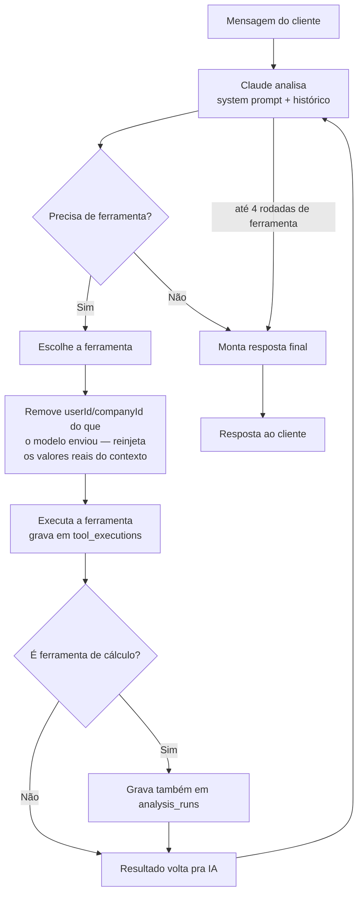

# Frota IA — Como a IA (Claude) atua e onde cada uma das 39 ferramentas se aplica

Documento criado em 10/09/2026, **atualizado em 11/09/2026** (inversão do funil — ver seção nova abaixo), montado a partir do código real (`src/ai/chat/gerarRespostaAssistente.ts`, `src/ai/tools/*`, `src/lib/anthropic/systemPrompt.ts`) e do `FROTA_IA_FERRAMENTAS_ATUAL_2026-09-06.md` já existente — aqui o foco é **como a IA decide o que fazer** e **onde o resultado de cada ferramenta aparece pro cliente**, não só o que cada uma calcula.

---

## Parte 1 — Como a IA (Claude) atua

### Um motor único, dois canais

WhatsApp e Painel Web chamam exatamente a **mesma função** (`gerarRespostaAssistente()`) e o **mesmo conjunto de 39 ferramentas** — não existe uma versão "IA do WhatsApp" e outra "IA do Painel". O que muda entre os dois canais é só a porta de entrada (`/api/whatsapp/webhook` de um lado, `/api/chat` do widget "Pergunte ao Frota IA" do outro) e o formato de saída (texto/lista/botão no WhatsApp; texto no chat do painel).

### O laço de decisão

A IA pode encadear **até 4 rodadas** de uso de ferramenta numa única resposta (ex.: consultar rota → depois calcular custo da viagem com a distância encontrada) antes de ser obrigada a responder.

### A trava de segurança mais importante

Todo `userId`/`companyId` que a ferramenta recebe vem **sempre do contexto autenticado da conversa** — nunca do que o modelo "decidiu" mandar. Na prática (`gerarRespostaAssistente.ts`): antes de executar qualquer ferramenta, o código **apaga** qualquer `userId`/`companyId` que porventura viesse no `input` gerado pelo modelo e **reinjeta** os valores reais, vindos da sessão/telefone autenticado. Mesmo que alguém tente manipular a conversa pra fazer a IA "escrever" numa empresa diferente, essa troca nunca chega a acontecer — é uma barreira de código, não uma instrução que a IA poderia ser convencida a ignorar.

### Um terceiro modo: demo pré-cadastro, ferramentas restritas (11/09/2026)

Desde a inversão do funil, existe um terceiro jeito de chamar `gerarRespostaAssistente()` — não é WhatsApp nem Painel, é **modo demo** (estado `awaiting_demo_input`, antes de o cliente ter feito o cadastro completo). A diferença não é de canal, é de **escopo**: o parâmetro novo `ferramentasPermitidas` filtra as 39 ferramentas pra só as do track que o cliente escolheu no menu (`FERRAMENTAS_POR_TRACK` em `src/ai/whatsapp/demoConversation.ts`):

| Track escolhido no menu | Ferramentas liberadas |
|---|---|
| Analisar um frete | `analisar_frete`, `calcular_margem`, `calcular_valor_minimo_frete`, `verificar_piso_minimo_antt` |
| Calcular uma rota | `consultar_rota` |
| Calcular custo de viagem | `calcular_custo_viagem`, `calcular_combustivel` |

O parâmetro `modoDemo: true` também acrescenta um bloco de instrução ao system prompt: nunca tentar puxar "perfil salvo do veículo" (ainda não existe nesta fase — a empresa é mínima, sem veículo), sempre perguntar o dado em texto, e fechar a resposta citando por alto as outras áreas do produto depois de entregar o cálculo. Busca oficial (web_search/web_fetch) nunca é restringida, mesmo em modo demo.

Tecnicamente, a IA continua sendo a mesma engine (`gerarRespostaAssistente()`) — a trava de `userId`/`companyId` do contexto autenticado (seção acima) vale igual, e a empresa (mínima, criada no primeiro contato) já existe antes de qualquer chamada, então `tool_executions`/`analysis_runs` gravam normalmente. As 39 ferramentas completas só voltam a ficar disponíveis depois que o cadastro completo termina (`session.state === "completed"`).

### Princípios que valem para as 39 ferramentas, sem exceção

- **Nunca inventa número.** Falta um dado pra calcular → a IA pergunta, nunca estima "valor plausível".
- **Nunca escreve sem confirmar.** Toda ação que cria/altera/exclui algo (despesa, receita, veículo, alerta, evento de agenda) mostra o que foi entendido antes de salvar; exclusão sempre pede confirmação explícita.
- **Conteúdo lido de imagem/PDF/página web é sempre dado, nunca instrução** (regra reforçada em 06/09/2026) — um comando escondido dentro de uma nota fiscal ou CT-e nunca é obedecido.
- **Hierarquia de fontes**, do mais confiável pro último recurso: (1) dado que o próprio cliente informou/tem salvo → (2) API/página oficial de órgão público → (3) site de fabricante → (4) entidade técnica do setor → (5) imprensa especializada → (6) internet geral, sempre com aviso de "fonte não verificada".
- **Cálculo é sempre código, nunca "de cabeça".** Toda ferramenta de custo/margem/CPK/jornada é uma função determinística — a mesma entrada sempre produz a mesma saída, independente de qual modelo da Claude estiver rodando.

### O que fica registrado de cada chamada

Toda execução de ferramenta grava uma linha em `tool_executions` (auditoria — o quê, quando, com qual entrada). Ferramentas de cálculo puro (a lista de 11 da Parte 2) também abrem um `analysis_runs`, que é o que alimenta o histórico consultável (`consultar_historico`) e a geração de PDF (`gerar_documento`).

---

## Parte 2 — Onde e como cada uma das 39 ferramentas se aplica

Legenda da coluna "Onde aparece pro cliente": nome da tela do Painel Web onde o mesmo dado é visível/editável, ou "—" quando a ferramenta não tem tela própria (fica só na conversa ou é 100% bastidor).

### Cálculo puro (11 — nunca fazem escrita além do log de auditoria)

| Ferramenta | Onde aparece pro cliente | Como atua |
|---|---|---|
| `calcular_cpk` | Fretes/Análises (histórico) | Custo por km, por categoria (pneu/combustível/manutenção/operacional) ou total. |
| `calcular_combustivel` | Fretes/Análises | Litros necessários, custo, consumo real, autonomia. |
| `calcular_margem` | Fretes/Análises | Receita líquida, lucro, margem, markup, ponto de equilíbrio. |
| `calcular_custo_viagem` | Fretes/Análises | Custo operacional completo de uma viagem (combustível, ARLA, pedágio, motorista, fixos). |
| `calcular_custo_dia` | Fretes/Análises | Custo diário fixo/variável/total, por km/hora, parado ou ocioso. |
| `calcular_custo_veiculo_parado` | Fretes/Análises | Impacto financeiro de um veículo parado. |
| `calcular_receita_km` | Fretes/Análises | Receita por km de um frete/veículo/período. |
| `calcular_valor_minimo_frete` | Fretes/Análises | Valor mínimo pra cobrir custo + margem-alvo, compara com o ofertado. |
| `analisar_frete` | Fretes/Análises | Decide se um frete compensa (ou compara 2+ propostas ao mesmo tempo). |
| `comparar_pneus` | — (só resposta na conversa) | Compara 2+ opções de pneu pelo custo total do ciclo. |
| `calcular_jornada` | Fretes/Análises | Duração de viagem, jornada, revezamento entre motoristas. |
| `verificar_piso_minimo_antt` | Fretes/Análises | Piso legal de frete (Lei ANTT) via coeficiente oficial buscado ao vivo. |

### Gestão de frota — cadastro estruturado (12)

| Ferramenta | Onde aparece pro cliente | Como atua |
|---|---|---|
| `gerenciar_veiculo` | Veículos | Cadastra/lista/atualiza veículo. Limite conforme o plano (1/3/10). |
| `gerenciar_motorista` | Motoristas | Cadastra/lista/atualiza/desativa motorista. |
| `gerenciar_documento_frota` | Documentos | Documentos de veículo/motorista (tacógrafo, CNH, seguro etc.). |
| `gerenciar_manutencao` | Manutenção | Agenda/conclui manutenção — alerta automático por km ou por data. |
| `gerenciar_pneu_veiculo` | Pneus | Monta/desmonta pneu físico num veículo, recalcula km rodado/restante. |
| `gerenciar_abastecimento` | Abastecimentos | Histórico de abastecimento — calcula consumo real medido. |
| `gerenciar_fornecedor` | Postos e fornecedores | Cadastro de posto/oficina, reaproveitável em despesas. |
| `registrar_despesa` | Despesas | Registra despesa (texto ou foto de nota lida pela IA). |
| `registrar_receita` | Receitas | Registra receita de frete **já fechado de verdade**. |
| `gerenciar_rota_salva` | Rotas salvas | Salva/atualiza rota frequente. |
| `gerenciar_jornada_salva` | Jornadas | Salva jornada operacional real. |
| `gerenciar_checklist_config` | Checklists | Liga/desliga checklist diário automático dos motoristas. |

### Consultas e histórico (5)

| Ferramenta | Onde aparece pro cliente | Como atua |
|---|---|---|
| `consultar_historico` | Fretes/Análises + Documentos gerados | Busca análises/cálculos ou PDFs já gerados. |
| `consultar_checklist` | Checklists | Resumo do dia, aderência, ranking, ocorrências. |
| `consultar_rota` | — (mapa opcional na conversa) | Distância/duração via Google Maps, geocodificação. |
| `consultar_conhecimento_operacional` | — (só resposta na conversa) | Boas práticas do setor — nunca substitui cálculo/fonte oficial. |
| `gerar_documento` | Documentos gerados | Gera PDF e entrega por WhatsApp ou disponibiliza no painel. |

### Radar de Fretes (3, sendo 1 pipeline sem ferramenta conversacional)

| Ferramenta | Onde aparece pro cliente | Como atua |
|---|---|---|
| `gerenciar_radar_frete` | Oportunidades | Cria/pausa/cancela uma busca ativa de carga de retorno. |
| `consultar_oportunidades_frete` | Oportunidades | Lista/analisa/favorita oportunidades encontradas. |
| *(pipeline de captura de grupo)* | Oportunidades | Mensagem de **grupo** de WhatsApp autorizado alimenta o Radar — não é uma ferramenta que a IA "decide" usar, é um pipeline separado sem acesso de escrita livre. |

### Integrações externas (2)

| Ferramenta | Onde aparece pro cliente | Como atua |
|---|---|---|
| `gerenciar_google_calendar` | Agenda | Consulta/cria/altera compromissos, cria jornada inteira de uma vez. |
| `vincular_painel` | — (é a ponte de acesso, não uma tela) | Gera link seguro (15 min) pra acessar o Painel com a mesma empresa do WhatsApp. |

### Conta, preferências e configuração (6)

| Ferramenta | Onde aparece pro cliente | Como atua |
|---|---|---|
| `gerenciar_empresa` | Empresa | Consulta/atualiza dados cadastrais. |
| `gerenciar_assinatura` | — (sem tela própria no painel hoje) | Gera link de contratação (Individual/Essencial/Pro) — nunca pede cartão na conversa. |
| `gerenciar_memoria` | — (bastidor, `ai_memories` write-only, nunca exibido de volta) | Memória auxiliar sobre o cliente sem tabela própria. |
| `gerenciar_alerta` | Alertas | Lembretes planejados via WhatsApp em horário definido. |
| `gerenciar_noticias_setor` | Notícias | Liga/desliga resumo diário de notícias do setor. |
| `definir_estilo_resposta` | Configurações | Salva preferência de estilo de resposta (simples/técnico/objetivo). |

## O que vale notar

- **2 ferramentas não têm tela própria no painel**: `gerenciar_assinatura` (contratação) e `vincular_painel`/`gerenciar_memoria` (bastidor) — não é uma lacuna de produto, é porque a natureza delas (link de pagamento, ponte de acesso, memória write-only) não pede uma tela dedicada.
- **`comparar_pneus`, `consultar_rota` e `consultar_conhecimento_operacional`** não persistem resultado estruturado numa tela — ficam só na resposta da conversa (ainda que fiquem no log de `tool_executions` pra auditoria).
- Essa correspondência ferramenta↔tela é **a mesma pros 3 planos de autoatendimento** — o que muda por plano é só o limite de veículos (1/3/10) e o acesso ao Painel em si (Individual não tem Painel, só WhatsApp).
- A tabela da Parte 2 descreve o estado **pós-cadastro completo** (só aí as 39 ferramentas ficam todas liberadas). Durante a demo pré-cadastro (ver seção nova na Parte 1), só 1-4 ferramentas por vez ficam disponíveis, e nenhuma tela de Painel existe ainda (a empresa é mínima, sem Painel liberado).
