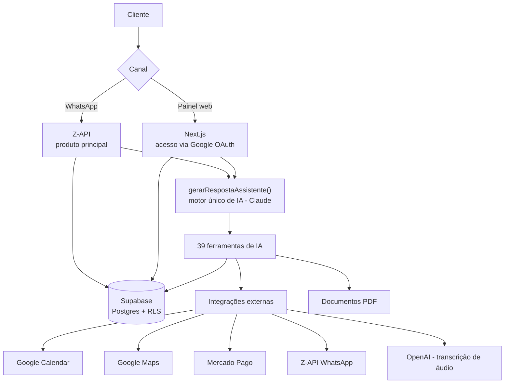
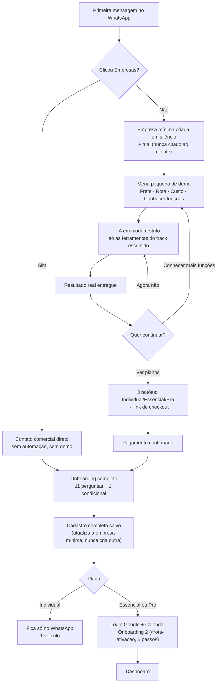
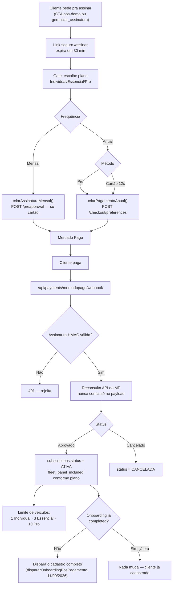
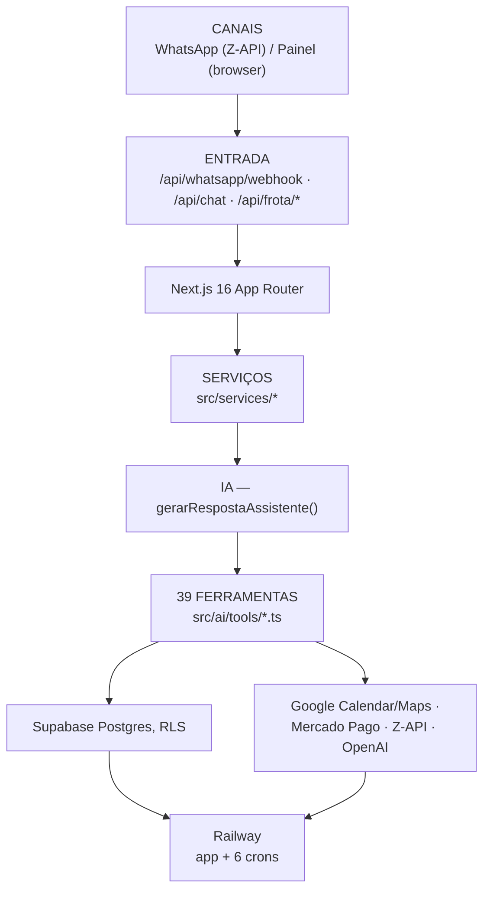

# Frota IA — Fluxograma Atual (atualizado em 2026-09-11)

Documento criado em 10/09/2026 (substitui o antigo `FROTA_IA_FLUXOGRAMA_COMPLETO_V1_V2.md`, 19/08/2026, 28 ferramentas/estrutura de planos antiga), **atualizado em 11/09/2026** para refletir a inversão do funil ("mostrar valor antes de cadastrar" — ver seção 2). Não é uma reauditoria completa de todo o sistema — é focado nos fluxos centrais: ecossistema, jornada do cliente, pagamento e arquitetura.

## 1. Visão geral do ecossistema

## 2. Jornada do cliente — inversão do funil (11/09/2026): demo real antes do cadastro

Substitui o modelo anterior ("11 perguntas antes de qualquer coisa"). Agora o cadastro completo só roda **depois** do pagamento confirmado — a primeira coisa que o cliente vê é uma demonstração de verdade. Detalhe passo a passo em `FROTA_IA_JORNADA_POR_PLANO_2026-09-10.md`.

## 3. Pagamento e checkout (reestruturado em 10/09/2026; disparo mudou em 11/09/2026)

Tecnicamente o checkout em si não mudou — o que mudou é **quando** ele pode ser acionado: antes só depois do onboarding completo, agora também direto do CTA pós-demo (`awaiting_demo_input`, ver fluxograma acima) ou por `gerenciar_assinatura` a qualquer momento.

**9 combinações no catálogo** (3 planos × 3 formas de cobrança) — ver `FROTA_IA_COMERCIAL_ATUAL_2026-09-06.md` pros valores exatos e `FROTA_IA_CHECKOUT_MERCADOPAGO_ATUAL.md` pro detalhe técnico completo.

## 4. Arquitetura técnica (simplificada)

## Notas de precisão

- Contagem de ferramentas (39) e crons (6, incluindo o novo `frotaia-mp-reconcile-cron`) confirmadas contra `FROTA_IA_FERRAMENTAS_ATUAL_2026-09-06.md` e o inventário do Railway feito em 10/09/2026.
- O diagrama de pagamento reflete exatamente a implementação de hoje (catálogo `CATALOGO_OFERTAS`, `src/lib/mercadopago/client.ts`), não uma versão anterior.
- **Seção 2 reescrita em 11/09/2026** — inversão do funil implementada e commitada (`1955b12`, branch `claude/frota-ia-assistente-setup-qlrbac`), verificada com 656 testes automatizados. Deploy no Railway e teste manual ponta a ponta (número real batendo no webhook, seguindo a demo até o pagamento) ainda pendentes de confirmação — ver `FROTA_IA_PENDENCIAS_2026-09-06.md`.
- Durante a demo (`awaiting_demo_input`), a IA roda com um subconjunto restrito das 39 ferramentas (só as do track escolhido — frete/rota/custo), não o conjunto completo. As 39 completas só valem depois do cadastro concluído (`completed`).
- Para o detalhe completo por tela do Painel Web, ferramenta por ferramenta, ou banco de dados tabela por tabela, os documentos antigos (`FROTA_IA_RAIO_X_V1_V2.md`, `FROTA_IA_FLUXOGRAMA_COMPLETO_V1_V2.md`) ainda têm valor histórico, mas **precisam de reauditoria** antes de confiar nos números deles — não foi feita aqui.
