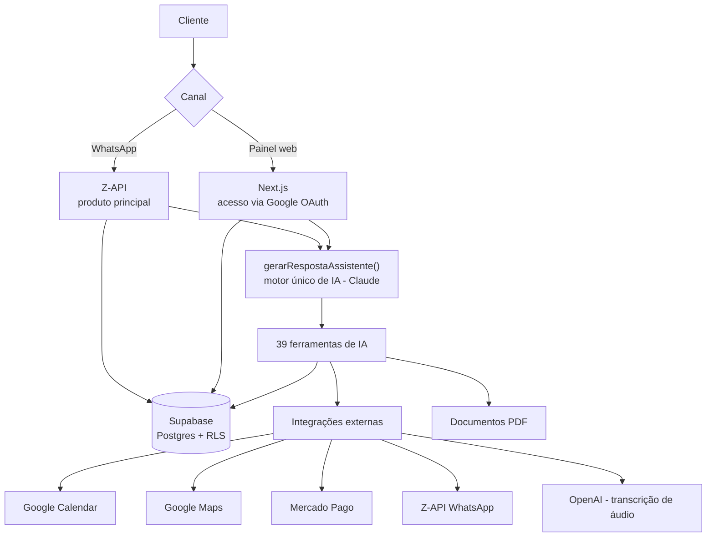
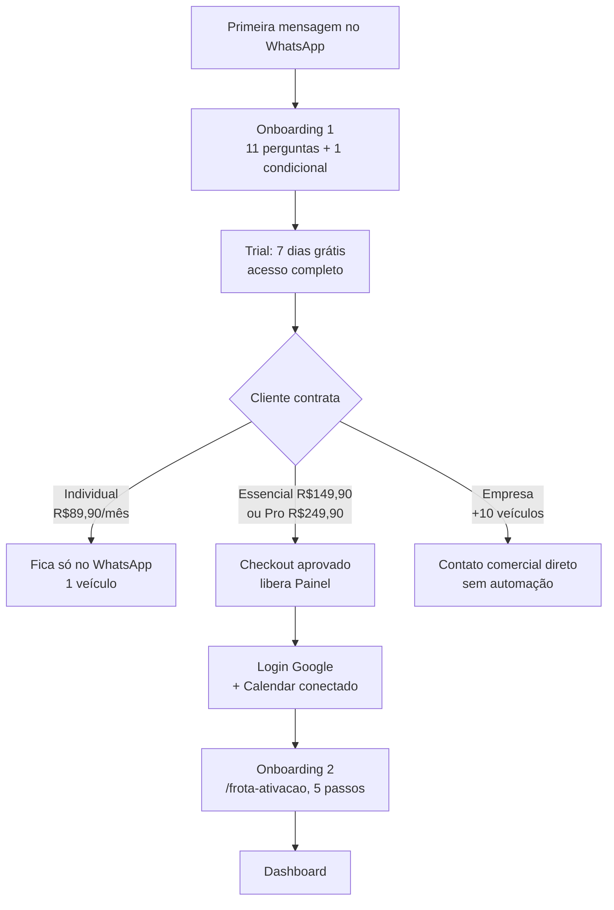
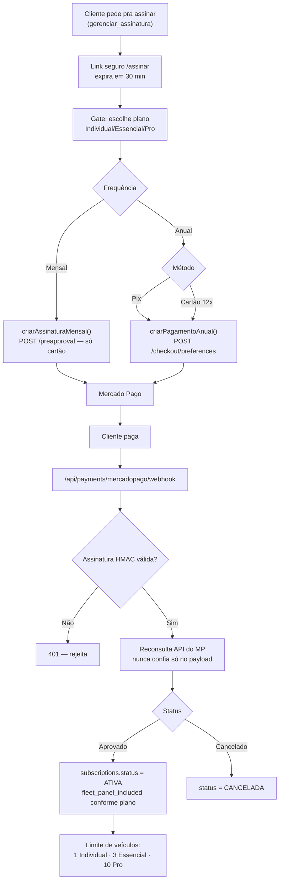
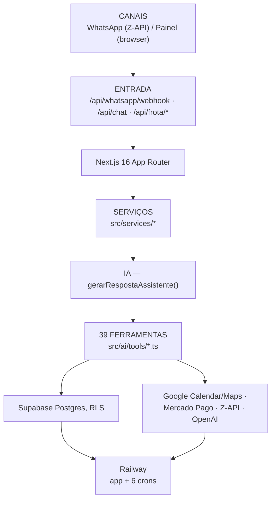

# Frota IA — Fluxograma Atual (2026-09-10)

Documento novo, substitui o antigo `FROTA_IA_FLUXOGRAMA_COMPLETO_V1_V2.md` (19/08/2026, já marcado como desatualizado — 28 ferramentas, estrutura de planos antiga). Este cobre o estado real de hoje, verificado contra o código e contra a implementação da reestruturação de planos feita em 10/09/2026. Não é uma reauditoria completa de todo o sistema (isso é o que o Fluxograma antigo tentava fazer, com 14 diagramas) — é focado nos fluxos centrais: ecossistema, jornada do cliente por plano, pagamento e arquitetura.

## 1. Visão geral do ecossistema

## 2. Jornada do cliente por plano

Cadastro inicial (Onboarding 1, WhatsApp) é **igual para todos** — 11 perguntas + 1 condicional, termina em trial de 7 dias grátis. A partir da contratação, o caminho diverge:

## 3. Pagamento e checkout (reestruturado em 10/09/2026)

**9 combinações no catálogo** (3 planos × 3 formas de cobrança) — ver `FROTA_IA_COMERCIAL_ATUAL_2026-09-06.md` pros valores exatos e `FROTA_IA_CHECKOUT_MERCADOPAGO_ATUAL.md` pro detalhe técnico completo.

## 4. Arquitetura técnica (simplificada)

## Notas de precisão

- Contagem de ferramentas (39) e crons (6, incluindo o novo `frotaia-mp-reconcile-cron`) confirmadas contra `FROTA_IA_FERRAMENTAS_ATUAL_2026-09-06.md` e o inventário do Railway feito em 10/09/2026.
- O diagrama de pagamento reflete exatamente a implementação de hoje (catálogo `CATALOGO_OFERTAS`, `src/lib/mercadopago/client.ts`), não uma versão anterior.
- Para o detalhe completo por tela do Painel Web, ferramenta por ferramenta, ou banco de dados tabela por tabela, os documentos antigos (`FROTA_IA_RAIO_X_V1_V2.md`, `FROTA_IA_FLUXOGRAMA_COMPLETO_V1_V2.md`) ainda têm valor histórico, mas **precisam de reauditoria** antes de confiar nos números deles — não foi feita aqui.
