# FROTA IA — FLUXOGRAMA COMPLETO V1 + V2

## Jornada do Cliente, Arquitetura, Ferramentas e Integração WhatsApp ↔ Painel

**Gerado em:** 19/08/2026 · **Repositório:** `github.com/rafaelkamosaquario-cpu/frotaia`, branch `claude/frota-ia-assistente-setup-qlrbac`, commit `7324e88`
**Companheiro de:** `FROTA_IA_RAIO_X_V1_V2.md` (documento técnico/funcional completo, com o detalhamento textual de cada item aqui representado visualmente).

Este documento não altera nada — é representação visual de comportamento já auditado. Nenhuma seta aparece aqui sem evidência de código citada logo abaixo do diagrama correspondente.

## Legenda obrigatória

🟢 Implementado — 🟡 Parcialmente implementado — 🔵 Estrutura preparada — ⚪ Planejado — 🔴 Legado/problema — ⚫ Não verificável no código (depende de infraestrutura externa, ex. cron do Railway)

---

## Fluxograma 1 — Visão geral do ecossistema

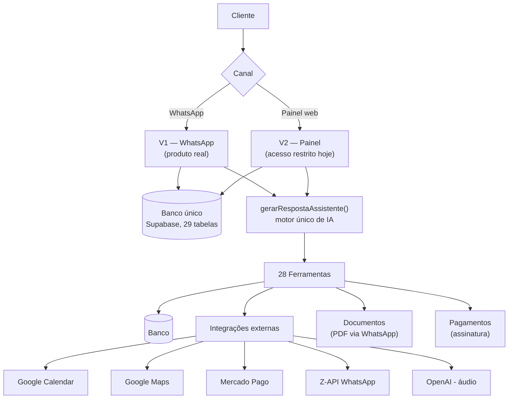

**Evidências no código**: `src/ai/chat/gerarRespostaAssistente.ts` (motor único, chamado por `src/app/api/chat/route.ts` e `src/app/api/whatsapp/webhook/route.ts`); `src/ai/tools/index.ts` (28 ferramentas); `src/lib/supabase/database.types.ts` (29 tabelas).

---

## Fluxograma 2 — Jornada completa V1

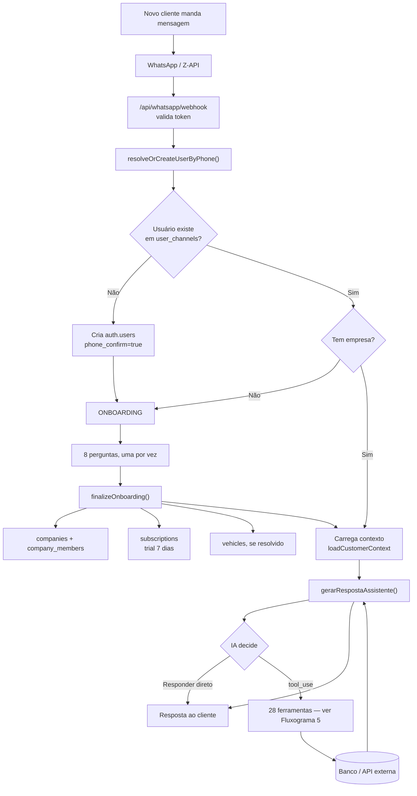

**Evidências**: `src/app/api/whatsapp/webhook/route.ts:192-260`; `src/services/supabase/userIdentityService.ts:28-72`; `src/ai/whatsapp/finalizeOnboarding.ts` (inteiro); `src/ai/chat/gerarRespostaAssistente.ts:89-135`.

---

## Fluxograma 3 — Onboarding V1

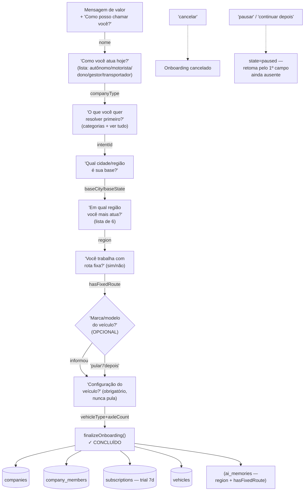

**Evidências**: `src/ai/whatsapp/onboardingConversation.ts` (471 linhas, arquivo inteiro — cada estado citado é um valor real do enum `OnboardingState`); `src/ai/whatsapp/finalizeOnboarding.ts:30-99`.
**Nota**: o estado `awaiting_vehicle_count` existe no enum do banco mas nunca é atribuído pelo código atual 🔴 (legado).

---

## Fluxograma 4 — Processamento de uma mensagem

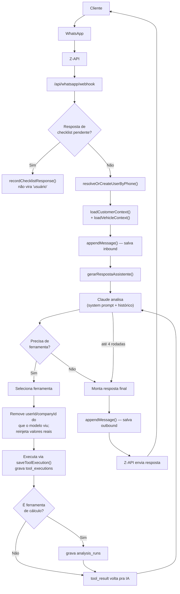

**Evidências**: `src/app/api/whatsapp/webhook/route.ts:225-260`; `src/ai/chat/gerarRespostaAssistente.ts:96-273` (loop completo, `MAX_TOOL_ROUNDS=4`, linhas 198-207 para reinjeção de contexto).

---

## Fluxograma 5 — Ferramentas da IA (28, agrupadas)

```mermaid
flowchart TD
    IA[IA — Claude] --> G1[CUSTOS E VIABILIDADE<br/>12 ferramentas — cálculo puro]
    G1 --> G1a[calcular_cpk]
    G1 --> G1b[calcular_combustivel]
    G1 --> G1c[calcular_margem]
    G1 --> G1d[calcular_custo_viagem]
    G1 --> G1e[calcular_custo_dia]
    G1 --> G1f[calcular_custo_veiculo_parado]
    G1 --> G1g[calcular_receita_km]
    G1 --> G1h[calcular_valor_minimo_frete]
    G1 --> G1i[analisar_frete]
    G1 --> G1j[comparar_pneus]
    G1 --> G1k[calcular_jornada]
    G1 --> G1l[verificar_piso_minimo_antt]

    IA --> G2[CADASTROS — CRUD via IA]
    G2 --> G2a[gerenciar_veiculo]
    G2 --> G2b[gerenciar_motorista]
    G2 --> G2c[gerenciar_manutencao]
    G2 --> G2d[gerenciar_documento_frota]
    G2 --> G2e[registrar_despesa]

    IA --> G3[ROTAS E JORNADA]
    G3 --> G3a["consultar_rota<br/>(Google Maps)"]
    G3 --> G3b[gerenciar_rota_salva]
    G3 --> G3c[gerenciar_jornada_salva]

    IA --> G4[INTEGRAÇÕES EXTERNAS]
    G4 --> G4a["gerenciar_google_calendar<br/>(Google Calendar)"]
    G4 --> G4b["gerenciar_assinatura<br/>(Mercado Pago)"]
    G4 --> G4c["gerar_documento<br/>(PDF via Z-API — só WhatsApp)"]

    IA --> G5[SISTEMA E PREFERÊNCIAS]
    G5 --> G5a[gerenciar_alerta]
    G5 --> G5b[consultar_historico]
    G5 --> G5c[consultar_conhecimento_operacional]
    G5 --> G5d[definir_estilo_resposta]
    G5 --> G5e[gerenciar_noticias_setor]
```

**Evidências**: `src/ai/tools/index.ts` (`FERRAMENTAS_FROTA_IA`, 28 entradas, confirmado 1:1 contra o enum `frota_ia_tool_name`); `src/ai/chat/gerarRespostaAssistente.ts:29-42` (`FERRAMENTAS_DE_ANALISE`, define o grupo de cálculo puro). Detalhe completo de cada ferramenta: ver seção 5 do Raio-X técnico.

---

## Fluxograma 6 — Dados do cliente

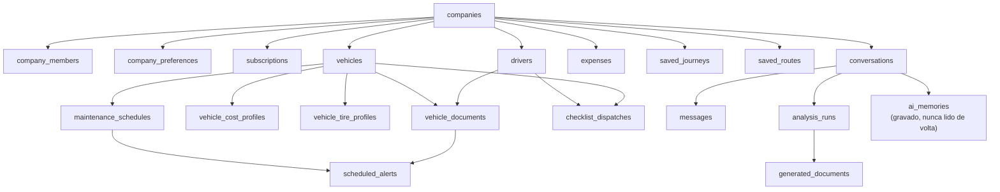

**Evidências**: `src/lib/supabase/database.types.ts` (foreign keys de todas as 29 tabelas); auditoria de banco desta investigação, seção "Relacionamentos".

---

## Fluxograma 7 — Frota IA V2 Painel

```mermaid
flowchart TD
    L[LOGIN — Google OAuth] --> A["/auth/callback"]
    A --> G{"fleetPanelAccess()"}
    G -->|sem sessão| L2[/login]
    G -->|sem empresa| ONB[/onboarding]
    G -->|sem entitlement| IND[/frota-indisponivel]
    G -->|OK| P[PAINEL]

    P --> P1[Dashboard]
    P --> P2[Empresa]
    P --> P3[Veículos]
    P --> P4[Motoristas]
    P --> P5["Fretes/Análises 🟡 leitura"]
    P --> P6[Manutenção]
    P --> P7[Documentos]
    P --> P8["Despesas 🟢 CRUD completo"]
    P --> P9["Jornadas 🟡 leitura"]
    P --> P10["Rotas salvas 🟡 leitura"]
    P --> P11["Checklists 🟡 leitura"]
    P --> P12[Alertas — view derivada]
    P --> P13["Relatórios + PDF"]
    P --> P14[Notícias]
    P --> P15["Configurações 🟡 limitado"]
    P --> WIDGET["Widget Pergunte ao Frota IA<br/>(fixo em toda tela)"]

    P1 -.dados.-> API1["Server Component<br/>fetch direto"]
    P8 -.CRUD.-> API2["/api/frota/despesas<br/>GET/POST/PATCH/DELETE"]
    P13 -.export.-> API3["/api/frota/relatorios/pdf"]
    WIDGET -.chat.-> API4["/api/chat →<br/>gerarRespostaAssistente()"]
    API1 --> DB[(Banco)]
    API2 --> DB
    API3 --> DB
    API4 --> DB
```

**Evidências**: `src/app/frota/layout.tsx:12-27`; `src/services/supabase/fleetPanelAccess.ts:25-37`; `src/components/frota/frotaNavItems.ts` (15 itens); auditoria do painel V2 desta investigação (seção 3, tabela completa por seção).

---

## Fluxograma 8 — V1 ↔ V2 (o mais importante)

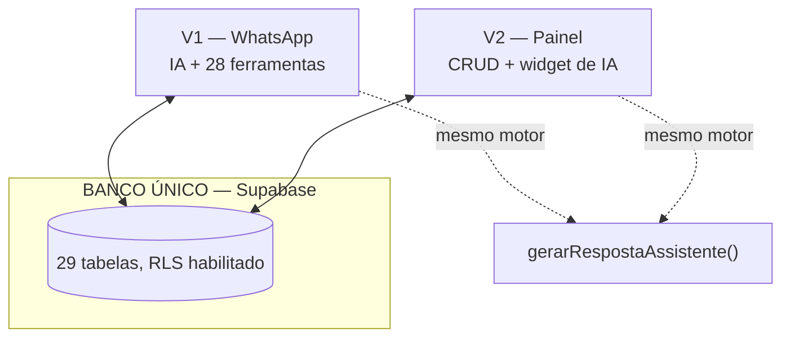

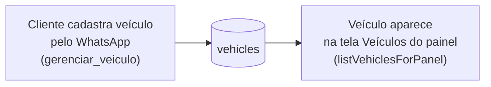

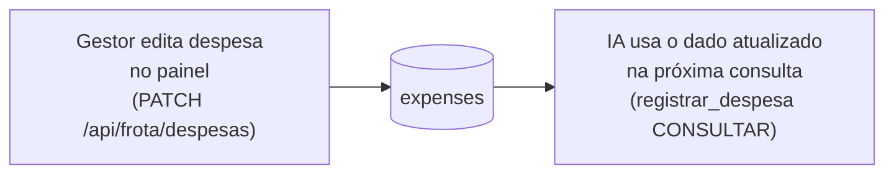

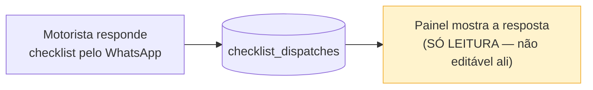

**Status por fluxo**:
- Veículo/Motorista/Manutenção/Documento/Despesa: WhatsApp↔Painel nos dois sentidos — 🟢 confirmado.
- Jornada/Rota salva/Checklist: escrita só pelo WhatsApp, painel é vitrine — 🟡 parcial (por desenho, documentado no código).
- Agenda Google conectada via WhatsApp não "atravessa" automaticamente pra uma sessão do painel (identidades diferentes) — 🟡 parcial (ver Raio-X, seção 19, item 3).

**Evidências**: `src/ai/tools/gerenciar-veiculo.ts`; `src/app/api/frota/despesas/route.ts`, `[id]/route.ts`; `src/app/frota/checklists/page.tsx:8` (comentário explícito "read-only").

---

## Fluxograma 9 — Banco de dados (visão simplificada)

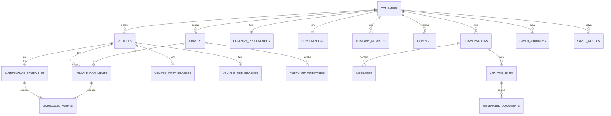

**Evidências**: `src/lib/supabase/database.types.ts` (29 tabelas, foreign keys reais).

---

## Fluxograma 10 — Pagamento

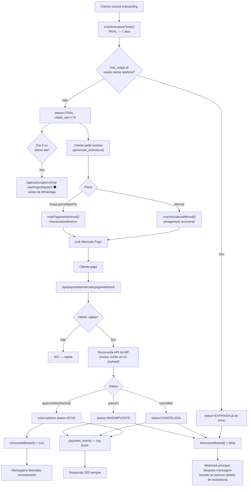

**Evidências**: `src/services/supabase/subscriptionService.ts` (trial, `isAccessAllowed`); `src/lib/mercadopago/client.ts:82-220`; `src/app/api/payments/mercadopago/webhook/route.ts` (inteiro); `src/app/api/whatsapp/webhook/route.ts:544-560` (gating real, confirmado ativo apesar de comentário desatualizado em outro arquivo).

---

## Fluxograma 11 — Integrações

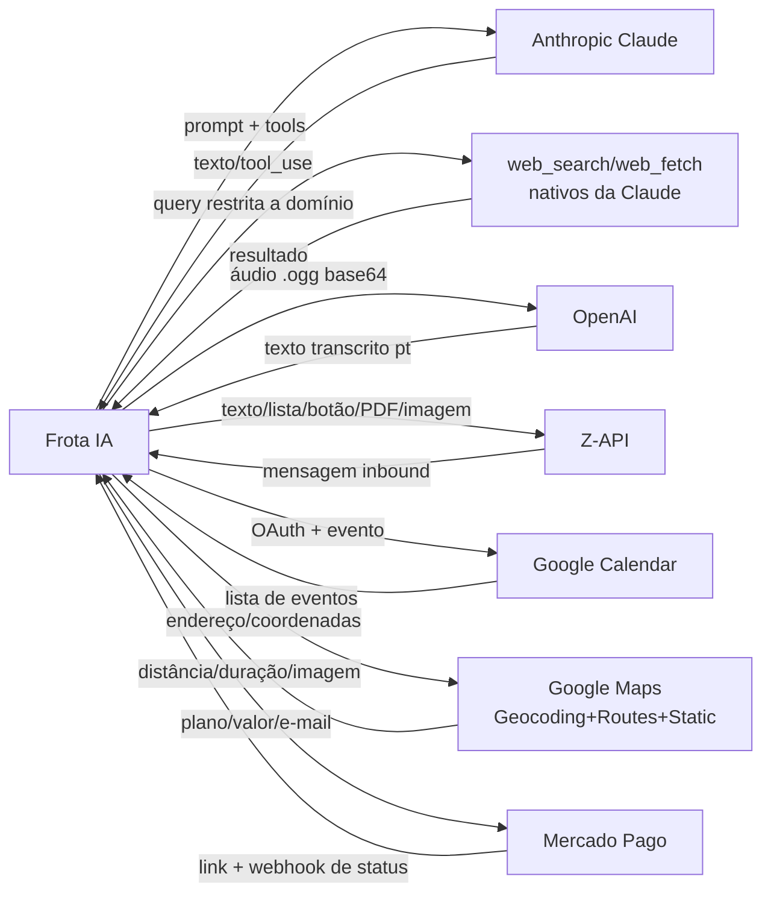

**Evidências**: ver Raio-X técnico, seção 12 (tabela completa com arquivo:linha de cada integração).

---

## Fluxograma 12 — Arquitetura técnica

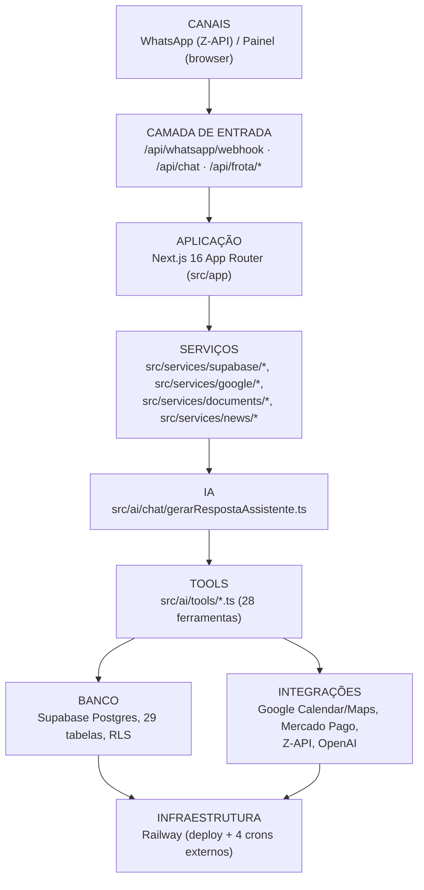

**Evidências**: estrutura de diretórios real do repositório (`src/app`, `src/ai`, `src/services`, `src/lib`); Raio-X técnico, seção 2.

---

## Fluxograma 13 — Experiência do cliente final (visão comercial, sem jargão técnico)

```mermaid
flowchart TD
    A[Cliente manda "oi" no WhatsApp] --> B[Frota IA se apresenta<br/>e explica o que faz]
    B --> C[Cliente informa nome,<br/>perfil e veículo]
    C --> D[Frota IA conhece<br/>a operação do cliente]
    D --> E[Cliente faz uma pergunta<br/>real do dia a dia]
    E --> F[Frota IA analisa a pergunta]
    F --> G[Usa dados do cliente<br/>+ IA + a ferramenta certa]
    G --> H[Entrega a resposta —<br/>número, recomendação,<br/>ou documento]
    H --> I[O dado fica salvo<br/>automaticamente]
    I --> J[Se o gestor quiser,<br/>o Painel Web mostra tudo<br/>organizado e exporta relatório]
```

**Evidência de honestidade**: este fluxograma reflete o comportamento real confirmado no código (não é aspiracional) — a única ressalva é que o Painel Web (última caixa) tem acesso restrito hoje, ver Raio-X seção 19.

---

## Fluxograma 14 — Mapa completo final

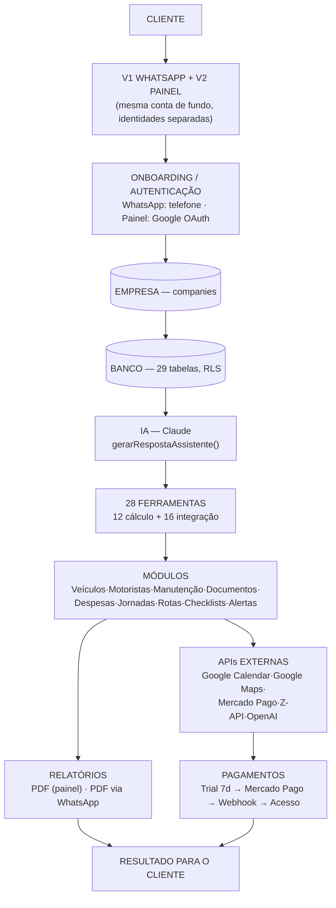

---

## Resumo final

- **14 fluxogramas** produzidos (Mermaid), todos confrontados com o código real na branch `claude/frota-ia-assistente-setup-qlrbac`.
- **28 ferramentas de IA** mapeadas (Fluxograma 5) — 12 de cálculo puro, 16 de integração/escrita.
- **8 módulos V1** cobertos em detalhe: onboarding, processamento de mensagem, mídia, memória, checklist, alertas, notícias, pagamento/trial.
- **15 módulos V2** cobertos (Fluxograma 7): todas as seções da sidebar do painel.
- **7 integrações externas** confirmadas com evidência de código (Fluxograma 11).
- **29 tabelas principais** no banco (Fluxograma 9).
- **Inconsistências encontradas** (detalhadas com evidência no Raio-X técnico, seções 18-19): sistema de memória `ai_memories` write-only · identidade dividida entre canal WhatsApp e login do painel · automação de cron não verificável a partir do repositório · comentários desatualizados em 4 arquivos de código · Configurações do painel mais limitada do que o nome sugere.
- **Caminhos dos arquivos gerados**: `docs/FROTA_IA_FLUXOGRAMA_COMPLETO_V1_V2.md` (este arquivo) e `docs/FROTA_IA_RAIO_X_V1_V2.md` (documento técnico companheiro, com o detalhamento textual completo de cada fluxo aqui representado).

*Nenhum código, banco, configuração ou produção foi alterado na produção deste documento — trabalho exclusivamente de auditoria e representação visual.*
