# Frota IA — Fluxogramas do Estado Atual (V1 + V2)

Branch `claude/frota-ia-assistente-setup-qlrbac`, commit `a4205419165f15a62a5dd815541fef2ce3153e84`, auditado em 2026-08-22. Todos os fluxos abaixo refletem código lido diretamente (ver os outros 3 documentos para evidência arquivo:linha detalhada).

## 1. Ecossistema geral

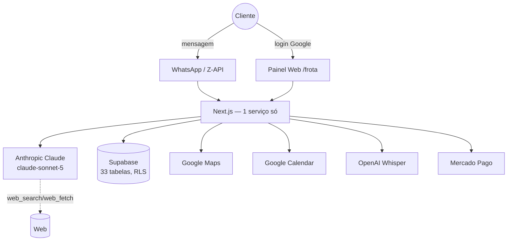

## 2. WhatsApp — webhook completo

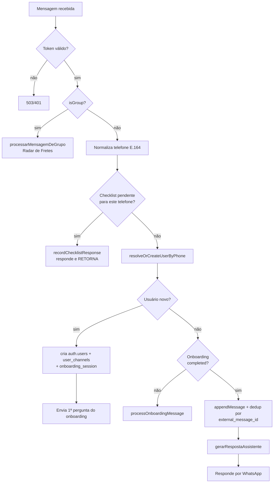

## 3. Onboarding (V1)

```mermaid
flowchart TD
    S0[Boas-vindas: pergunta o nome] --> S1[awaiting_name]
    S1 -->|nome válido| S2[awaiting_profile<br/>lista: 5 perfis]
    S2 -->|válido| S3[awaiting_intent<br/>lista: 9 categorias + ver tudo]
    S3 -->|válido| S4[awaiting_base_location<br/>texto livre]
    S4 -->|válido| S5[awaiting_region<br/>lista: 6 regiões]
    S5 -->|válido| S6[awaiting_fixed_route<br/>texto sim/não]
    S6 -->|não| S7[awaiting_primary_vehicle<br/>texto, obrigatório]
    S6 -->|sim| S6R[awaiting_primary_route<br/>texto livre, condicional]
    S6R --> S7
    S7 --> S8P[awaiting_plate<br/>texto, opcional]
    S8P --> S8[awaiting_vehicle_configuration<br/>lista: 9 tipos]
    S8 -->|resolvido| S9[awaiting_body_type<br/>lista: 9 carrocerias]
    S8 -->|precisa desambiguar| S8b[pergunta composição<br/>5/6/7/9 eixos]
    S8b --> S9
    S8 -->|não reconhecido| S8[repete pergunta]
    S9 -->|sempre resolve, cai em "outro"| S10[awaiting_consumption<br/>texto, opcional]
    S10 --> FIN[finalizeOnboarding]
    FIN --> F1[cria companies + owner]
    F1 --> F2[cria assinatura trial]
    F2 --> F3[vincula user_channels.company_id]
    F3 --> F4[grava memórias: região, rota fixa, rota principal]
    F4 --> F5[cria vehicles completo:<br/>marca/modelo/ano, placa, tipo,<br/>eixos, carroceria, consumo]
    F5 --> F6[cria saved_routes,<br/>se rota principal foi estruturada]
    F6 --> MSG[Mensagem de conclusão + novo menu de 10 sugestões]

    S1 -.cancelar/pausar.-> PAUSED[paused]
    S2 -.-> PAUSED
    S3 -.-> PAUSED
    S4 -.-> PAUSED
    S5 -.-> PAUSED
    S6 -.-> PAUSED
    S6R -.-> PAUSED
    S7 -.-> PAUSED
    S8P -.-> PAUSED
    S8 -.-> PAUSED
    S9 -.-> PAUSED
    S10 -.-> PAUSED
    PAUSED -->|retoma pela pergunta<br/>mais básica pendente| S1
```

Google Calendar **não aparece neste fluxograma de propósito** — nunca faz parte do onboarding; só é conectado sob demanda depois, quando alguma ferramenta (`gerenciar_alerta`/`gerenciar_google_calendar`) precisar (ver item 9).

## 4. Processamento da IA (motor de resposta)

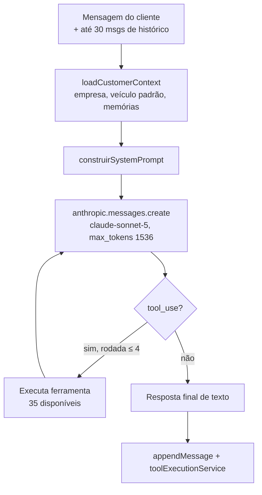

## 5. Ferramentas → banco

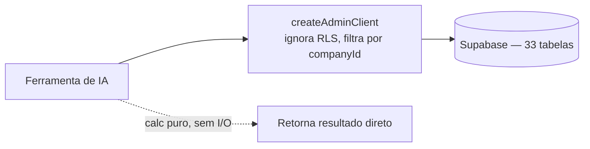

## 6. Painel web

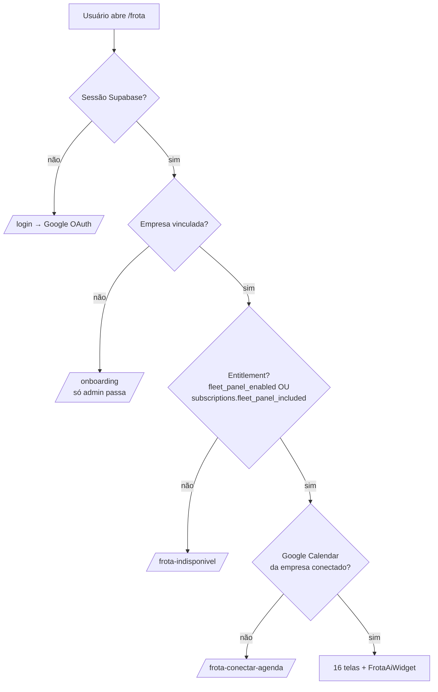

## 7. IA do painel

```mermaid
flowchart LR
    Widget[FrotaAiWidget<br/>presente nas 16 telas] -->|pageContext + anexo opcional| API[/api/chat]
    API --> Motor[gerarRespostaAssistente<br/>MESMO motor do WhatsApp]
    Motor --> Widget
```

## 8. WhatsApp ↔ Painel (identidade compartilhada)

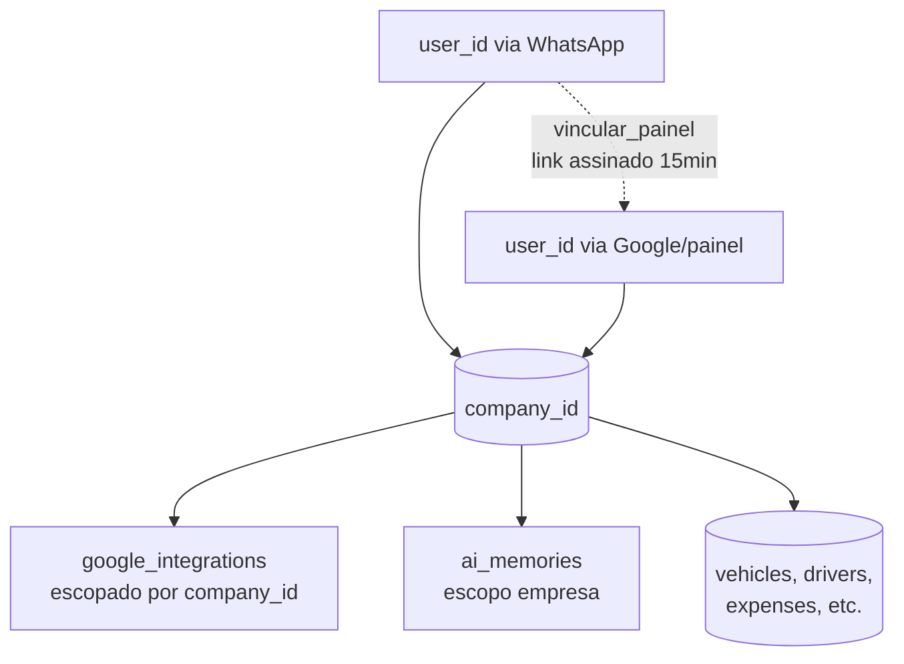

## 9. Google Calendar

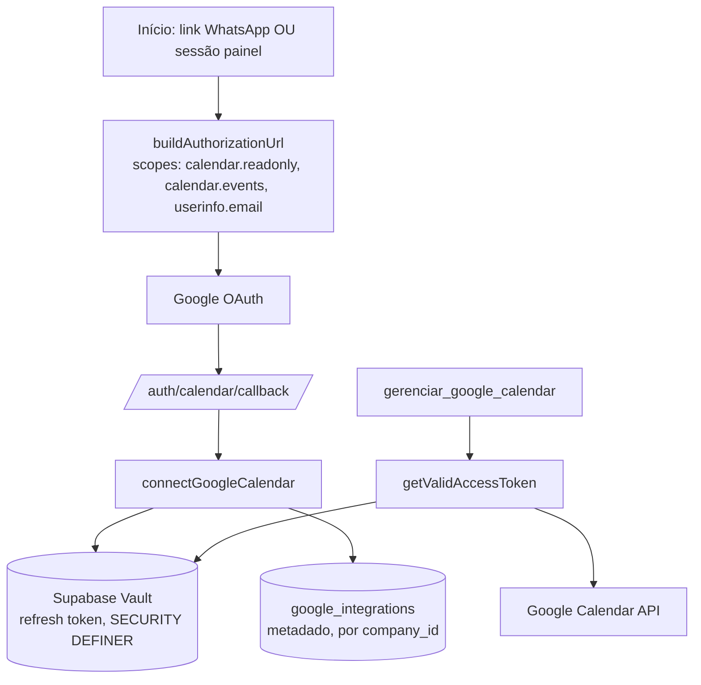

## 10. Checklist

```mermaid
flowchart TD
    Cron[/api/checklists/dispatch] --> Elig[listDriversDueForChecklist<br/>checklist_enabled + horário + não enviado hoje]
    Elig --> Send[Envia texto com itens configurados]
    Send --> Disp[(checklist_dispatches<br/>status: pendente)]
    Resp[Motorista responde] --> Interp[interpretarRespostaChecklist]
    Interp -->|ok| OK[status: ok]
    Interp -->|qualquer outra coisa| ATT[status: atencao]
    ATT --> Alert[scheduled_alerts para owners/admins]
    Alert --> AlertCron[/api/alerts/dispatch]
    Disp -.6h sem resposta.-> NR[não respondido — computado]
```

## 11. Alertas

```mermaid
flowchart LR
    Fontes[Manutenção vencendo /<br/>Documento vencendo /<br/>Lembrete livre /<br/>Checklist com atenção] --> SA[(scheduled_alerts)]
    Cron2[/api/alerts/dispatch] -->|periódico, externo| SA
    SA --> WA2[Envio WhatsApp]
```

## 12. Memória

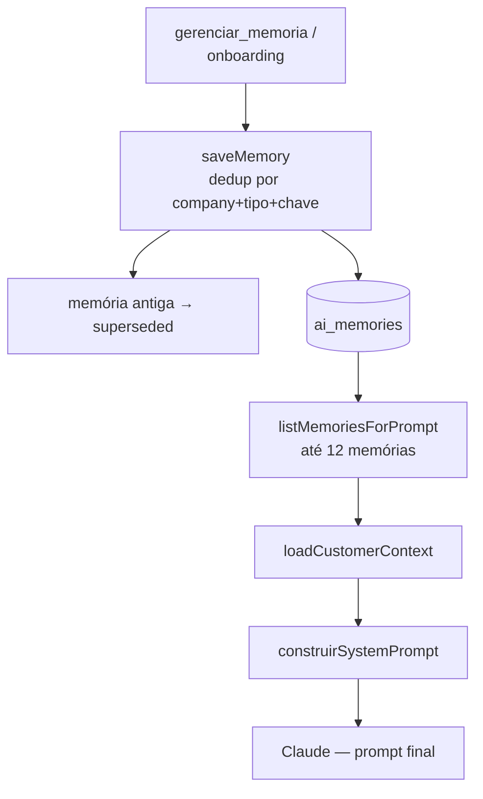

## 13. Análises de frete

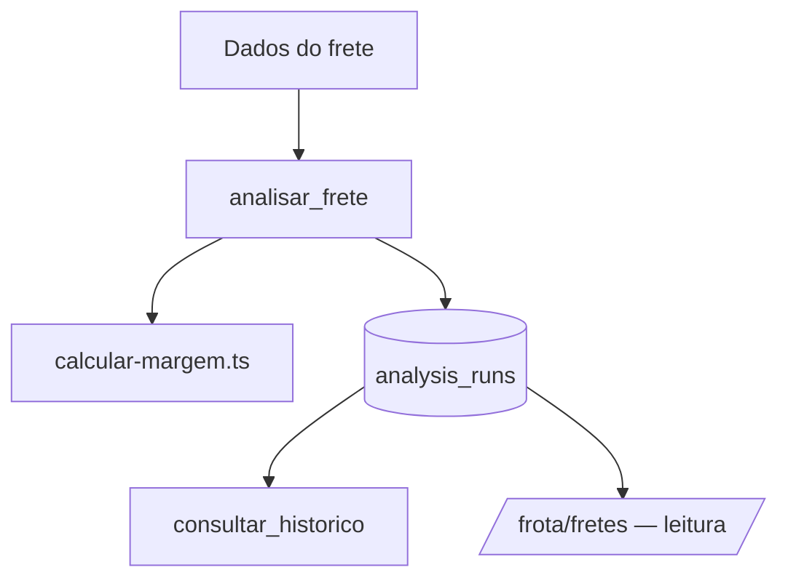

## 14. Radar de Fretes

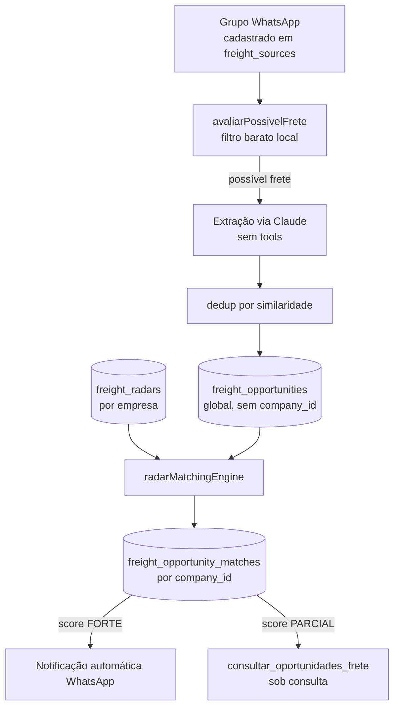

## 15. Assinatura / Mercado Pago

```mermaid
flowchart TD
    Tool5[gerenciar_assinatura] --> MP2[criarAssinaturaMensal /<br/>criarPagamentoAnual]
    MP2 --> Checkout[Checkout Mercado Pago]
    Checkout --> WH[/api/payments/mercadopago/webhook]
    WH --> Valid[validarAssinaturaWebhook<br/>HMAC-SHA256]
    Valid --> Sub[(subscriptions)]
    Sub --> Gate[Gate do painel:<br/>fleet_panel_included]
```

## 16. Jornada completa do cliente (V1 → V2)

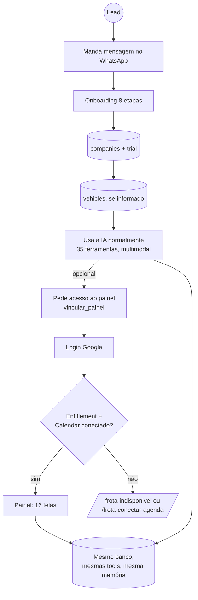
