# FROTA IA — Funcionalidades, Onboardings e Fluxo Operacional (estado atual)

Branch `claude/frota-ia-assistente-setup-qlrbac` · commit `dc5903d` · auditoria de código em 2026-08-28. Companheiro do Documento 1 (Arquitetura Técnica) — aqui o foco é **como o cliente usa o produto**, não a implementação por trás.

---

## Sumário

1. [Produto como um todo](#parte-1--produto-como-um-todo)
2. [Onboarding V1 / WhatsApp](#parte-2--onboarding-v1--whatsapp)
3. [Guia V1](#parte-3--guia-v1)
4. [Onboarding V2 / Gestão / Painel](#parte-4--onboarding-v2--gestão--painel)
5. [Guia V2](#parte-5--guia-v2)
6. [Funcionalidades do WhatsApp](#parte-6--funcionalidades-do-whatsapp)
7. [Funcionalidades do Painel Web](#parte-7--funcionalidades-do-painel-web)
8. [WhatsApp × Painel](#parte-8--whatsapp--painel)
9. [Fluxos operacionais](#parte-9--fluxos-operacionais)
10. [Jornada completa do cliente](#parte-10--exemplo-de-jornada-completa-do-cliente)
11. [Limitações](#parte-11--limitações)

---

## PARTE 1 — Produto como um todo

O Frota IA é **um produto só**, com dois níveis de acesso comercial (Individual e Gestão) e dois canais de uso (WhatsApp e Painel Web) — não são produtos separados.

| Dimensão | Compartilhado? | Detalhe |
|---|---|---|
| Banco de dados | ✅ Sim | Mesmas 33 tabelas, mesma empresa (`company_id`), sem cópia/sincronização — é o mesmo dado lido/escrito dos dois lados |
| Motor de IA | ✅ Sim | Mesma função `gerarRespostaAssistente`, mesmas 35 ferramentas, mesmo system prompt |
| Acesso ao WhatsApp | ✅ Sim, os dois planos | Individual e Gestão usam o WhatsApp normalmente |
| Acesso ao Painel Web | 🔴 Só Gestão | Individual **não tem painel** (`painel: false` no catálogo) |
| Limite de veículos | Diferente | Individual: **1 veículo**. Gestão: **10 veículos** |
| Canal | Diferente por função | Painel só existe pra quem é Gestão; WhatsApp serve os dois planos sempre |

Em outras palavras: **Individual = WhatsApp com 1 veículo. Gestão = WhatsApp + Painel com até 10 veículos.** O upgrade de Individual para Gestão não migra dado nenhum — é a mesma empresa, só o entitlement muda.

---

## PARTE 2 — Onboarding V1 / WhatsApp

Fluxo real (confirmado no código, `src/ai/whatsapp/onboardingConversation.ts`):

```
Cliente manda a 1ª mensagem
  ↓
Nome (obrigatória) → companies.name + profiles.full_name
  ↓
Perfil (obrigatória, lista) → companies.company_type
  ↓
Intenção inicial (obrigatória, lista) → memória ai_memories
  ↓
Cidade-base (obrigatória, texto) → companies.city/state
  ↓
Região de atuação (obrigatória, lista) → company_preferences.operating_region
  ↓
Rota fixa? sim/não (obrigatória, texto simples)
  ↓ (se sim)
Rota principal (obrigatória) → ai_memories + saved_routes (se origem/destino extraídos)
  ↓
Veículo: marca/modelo/ano (OBRIGATÓRIA, sem atalho "depois") → vehicles.name/brand/model/model_year
  ↓
Placa (opcional, "depois" aceito) → vehicles.plate
  ↓
Configuração do veículo (obrigatória, lista de 9 + rede de segurança) → vehicles.vehicle_type/axle_count
  ↓
Carroceria (sempre resolve algo, nunca trava) → vehicles.body_type
  ↓
Consumo médio (opcional, "não sei" aceito) → vehicles.average_consumption_km_l
  ↓
CONCLUSÃO → cria empresa + veículo + trial de 7 dias
  ↓
Pagamento/liberação: trial já ativo automaticamente (nenhum pagamento exigido pra começar)
  ↓
Guia de Primeiros Passos (oferecido 1x)
  ↓
Uso normal
```

| Etapa | Pergunta | Dado salvo | Obrigatória? | Condição para avançar | Exceção |
|---|---|---|---|---|---|
| Nome | "Como posso chamar você (ou sua empresa/operação)?" | `companies.name`, `profiles.full_name` | Sim | Texto não vazio | — |
| Perfil | Lista: autônomo / motorista / dono de empresa / gestor / transportador | `companies.company_type` | Sim | Toque ou texto (fallback "outro") | Texto não reconhecido nunca bloqueia — sempre vira "outro" |
| Intenção | Lista com categorias de ajuda + "ver tudo" | memória `initial_intent` | Sim | Toque, "ver tudo" ou título digitado | — |
| Cidade-base | "Qual cidade você usa como base...?" | `companies.city/state` | Sim | Texto não vazio | — |
| Região | Lista de 6 regiões (aceita texto livre p/ múltiplas) | `company_preferences.operating_region` | Sim | Toque ou texto | — |
| Rota fixa | "sim"/"não" (texto simples, sem botão) | memória `has_fixed_route` | Sim | Reconhecimento de sim/não | — |
| Rota principal | "Qual sua rota principal?" | memória + `saved_routes` (se parseável) | Sim, só se "sim" na etapa anterior | Texto não vazio | Pulada inteira se rota fixa = não |
| Veículo (marca/modelo/ano) | "Qual a marca, modelo e ano?" | `vehicles.name/brand/model/model_year` | **Sim, sem atalho** | Texto não vazio | Nenhuma — decisão deliberada "1 usuário + 1 veículo" |
| Placa | "Qual a placa? Se preferir, responda 'depois'" | `vehicles.plate` | Não | Sempre avança | "depois" ou formato inválido só pula |
| Configuração do veículo | Lista de 9 tipos + "Outro/não sei" | `vehicles.vehicle_type/axle_count` | Sim (mas sempre resolve algo) | Classificador determinístico | Após 2 tentativas sem sucesso, 3ª resposta força "outro"/"cavalo mecânico" — nunca trava |
| Carroceria | Lista de 9 opções + "Outro/não sei" | `vehicles.body_type` | Sim (nunca trava) | Sempre resolve, cai em "outro" se não reconhecer | — |
| Consumo médio | "Qual o consumo em km/l? Se não souber, 'não sei'" | `vehicles.average_consumption_km_l` | Não | Sempre finaliza | "não sei" ou texto não numérico vira `null` |

**Atalhos gerais (válidos a qualquer momento)**: "cancelar" (encerra), "continuar depois"/"pausar" (pausa, retoma de onde parou). Idempotente contra reentrega de webhook (mensagem repetida ignorada). Durante o onboarding, **mídia não é aceita** (áudio/foto pedem que o cliente responda em texto/toque).

---

## PARTE 3 — Guia V1

- **Quando aparece**: uma única vez, logo após concluir o cadastro — só se o cliente já tem acesso liberado (trial ativo).
- **Etapas** (6 posições): veículo → frete → custos → registro → radar → final. Cada passo é um convite conversacional pra experimentar uma função real.
- **Como continuar**: toque nas opções nativas ("fazer agora", "próximo"/"pular").
- **Como sair**: "não preciso"/"dispensar" ou "sair".
- **Como reabrir**: a qualquer momento, digitando "primeiros passos", "guia rápido", "tutorial", "como usar o Frota IA".
- **Persistência**: estado gravado em `company_preferences.guide_v1_status/guide_v1_step` — sobrevive a fechar o WhatsApp.
- **Integração com IA**: se o cliente manda algo que não é um controle do guia enquanto ele está em andamento, a IA responde normalmente e depois um lembrete curto retoma o passo pausado — nunca perde o progresso.

---

## PARTE 4 — Onboarding V2 / Gestão / Painel

```
Cliente contrata plano Gestão (Mensal ou Anual)
  ↓
Webhook Mercado Pago confirma pagamento → subscriptions.fleet_panel_included = true
  ↓
Cliente faz login no painel (Google OAuth)
  ↓
loadFleetPanelAccess() libera acesso
  ↓
/frota-ativacao (wizard de 5 passos, só se ainda não concluído)
  ↓
Passo 1 — Empresa: confirma/edita nome (reaproveita dado do onboarding V1, nunca duplica)
  ↓
Passo 2 — Veículos: mostra veículo já existente, permite adicionar até o limite do plano (10)
  ↓
Passo 3 — Motoristas: opcional, cadastro rápido
  ↓
Passo 4 — Checklist diário: liga/desliga, horário, itens
  ↓
Passo 5 — Resumo → "Ir para o Dashboard" → companies.fleet_onboarding_completed_at
  ↓
/frota/dashboard
  ↓
Guia V2 (tour visual, oferecido 1x)
```

**Confirmado no código atual**: Google Calendar **não é pré-requisito** para concluir esse wizard — aparece só como status informativo opcional no Passo 5, com link pra conectar depois. Isso corrige qualquer versão antiga de documentação que descrevesse Calendar como bloqueio de acesso ao painel.

---

## PARTE 5 — Guia V2

- **Disparo**: ao chegar pela 1ª vez no `/frota/dashboard`, se nunca foi oferecido — mostra um card de convite ("Conheça o Frota IA Gestão... 8 passos").
- **Passos**: definidos em `panelTourSteps.ts`, cada um mirando um elemento real da tela (`data-tour="chave"`) com spotlight.
- **Spotlight**: overlay escurecido + destaque recalculado a cada 400ms/scroll/resize, sempre seguindo o elemento real (não uma imagem estática).
- **Desktop**: cartão de texto fixo no canto inferior direito.
- **Mobile**: cartão fixo no rodapé; se o alvo estiver escondido no drawer "Mais" (bottom nav só tem 4 destinos diretos), o passo aponta pro próprio botão "Mais".
- **Ajuda contextual**: nenhuma automação além do tour — a IA flutuante cobre dúvidas específicas de tela via `pageContext`.
- **Reabertura**: botão dedicado em Configurações ("Reveja o tour rápido"), funciona mesmo depois de dispensado.
- **Conclusão/dispensa**: X, Esc ou "Sair" grava `dismissed`; terminar todos os passos grava `completed`.
- **Dependências**: nenhuma — resiliente a elemento ausente (pula o passo automaticamente).

---

## PARTE 6 — Funcionalidades do WhatsApp

Tabela completa das 35 ferramentas, agrupadas por área (ver Documento 1, Seção 5.7, para a tabela técnica completa com entrada/saída/canal/API/banco). Resumo por grupo funcional:

| Grupo | Funções (ferramentas) |
|---|---|
| **Fretes** | `analisar_frete` (viabilidade, comparação de propostas, previsto×realizado) |
| **Radar** | `gerenciar_radar_frete`, `consultar_oportunidades_frete` |
| **Custos / CPK / combustível / margem** | `calcular_cpk`, `calcular_combustivel`, `calcular_margem`, `calcular_valor_minimo_frete`, `calcular_receita_km`, `calcular_custo_dia`, `calcular_custo_veiculo_parado` |
| **Viagens** | `calcular_custo_viagem`, `consultar_rota` |
| **Despesas** | `registrar_despesa` |
| **Veículos** | `gerenciar_veiculo` |
| **Motoristas** | `gerenciar_motorista` |
| **Manutenção** | `gerenciar_manutencao` |
| **Documentos** | `gerenciar_documento_frota`, `gerar_documento` |
| **Pneus** | `comparar_pneus` |
| **Jornada** | `calcular_jornada`, `gerenciar_jornada_salva` |
| **Rotas** | `gerenciar_rota_salva` |
| **Alertas / Agenda** | `gerenciar_alerta`, `gerenciar_google_calendar` |
| **Checklist** | `consultar_checklist` (config fica no painel) |
| **Relatórios** | `consultar_historico` |
| **Notícias** | `gerenciar_noticias_setor` |
| **Documentos gerados** | `gerar_documento` (mesma ferramenta acima) |
| **Memória/contexto** | `gerenciar_memoria`, `definir_estilo_resposta` |
| **Legislação/piso ANTT** | `verificar_piso_minimo_antt` + busca web (8 níveis) |
| **Empresa/conta** | `gerenciar_empresa`, `gerenciar_assinatura`, `vincular_painel` |
| **Configuração de checklist** | `gerenciar_checklist_config` |

Todas acionadas por linguagem natural — o cliente nunca digita nome de comando, a Claude decide qual ferramenta chamar.

---

## PARTE 7 — Funcionalidades do Painel Web

| Módulo | Rota | Visualiza | Cadastra | Edita | Exclui/desativa | Estado |
|---|---|---|---|---|---|---|
| Dashboard | `/frota/dashboard` | KPIs agregados + insight de IA | — | — | — | ✅ Read-only por design |
| Veículos | `/frota/veiculos` | Lista/cards, documentos vinculados | Veículo (até limite do plano) | Dados do veículo | Soft delete (`active`) | ✅ Completo |
| Motoristas | `/frota/motoristas` | Lista, vínculo com veículo | Motorista | Dados, veículo vinculado | Soft delete (`active`) | ✅ Completo |
| Fretes/Análises | `/frota/fretes` | Histórico de simulações da IA | — | — | — | 🔵 Read-only por design |
| Oportunidades | `/frota/oportunidades` | Matches de frete com score | Radar, fonte privada de grupo | Status do match, radar, fonte | Sem delete (só status/enabled) | ✅ Completo (MVP) |
| Manutenção | `/frota/manutencao` | Cronograma, despesas vinculadas | Manutenção | Dados, status | Sem delete (só status) | ✅ Completo |
| Documentos | `/frota/documentos` | Documentos + arquivo anexado | Documento + upload | Metadados, arquivo | Remove só o arquivo (mantém registro) | ✅ Completo |
| Despesas | `/frota/despesas` | Lista (limit 200) | Despesa | Despesa | **Hard delete real** | ✅ Completo |
| Jornadas | `/frota/jornadas` | Jornadas salvas | — | — | — | 🔵 Read-only por design |
| Rotas salvas | `/frota/rotas` | Rotas, favoritas | Rota (+ cálculo de distância) | Dados, favoritar | Soft delete (`active`) | ✅ Completo |
| Checklists | `/frota/checklists` | Histórico de disparos | — | — | — | 🔵 Read-only (config em Configurações) |
| Agenda | `/frota/agenda` | Eventos Google (30 dias) | Evento | Evento | Evento (com confirmação) | ✅ Completo (exige Google conectado) |
| Alertas | `/frota/alertas` | Janela ampla (-30/+90 dias) | Alerta manual | Alerta manual | Cancela (status), bloqueado se origem automática | ✅ Completo |
| Relatórios | `/frota/relatorios` | Agregação filtrável + export PDF | — | — | — | ✅ Completo (read-only por design) |
| Documentos gerados | `/frota/documentos-gerados` | Histórico de PDFs da IA | — | — | — | 🔵 Read-only por design |
| Notícias | `/frota/noticias` | Último resumo do setor | — | Toggle de recebimento | — | 🟡 Escopo mínimo |
| Empresa | `/frota/empresa` | Dados completos da empresa | — | Dados (owner/admin) | — | ✅ Completo |
| Configurações | `/frota/configuracoes` | Estilo de resposta, checklist, memória | — | Campos habilitados (owner/admin) | — | 🟡 Parcial por design (outras preferências ainda não têm UI) |

---

## PARTE 8 — WhatsApp × Painel

| Funcionalidade | WhatsApp | Painel | Banco compartilhado | IA | Observação |
|---|---|---|---|---|---|
| Veículos | ✅ CRUD via `gerenciar_veiculo` | ✅ CRUD | ✅ `vehicles` | Sim (mesmo service) | Ambos leem/escrevem |
| Motoristas | ✅ CRUD via `gerenciar_motorista` | ✅ CRUD | ✅ `drivers` | Sim | Ambos leem/escrevem |
| Manutenção | ✅ CRUD via `gerenciar_manutencao` | ✅ CRUD | ✅ `maintenance_schedules` | Sim | Ambos leem/escrevem, sincroniza alerta+despesa |
| Documentos | ✅ Extrai dado (não guarda arquivo) | ✅ CRUD + upload de arquivo real | ✅ `vehicle_documents` | Sim | Painel escreve arquivo; WhatsApp só metadado |
| Despesas | ✅ CRUD via `registrar_despesa` | ✅ CRUD (hard delete) | ✅ `expenses` | Sim | Ambos leem/escrevem |
| Rotas salvas | ✅ CRUD via `gerenciar_rota_salva` | ✅ CRUD | ✅ `saved_routes` | Sim | Ambos leem/escrevem |
| Alertas | ✅ CRUD via `gerenciar_alerta` | ✅ CRUD (exceto automáticos) | ✅ `scheduled_alerts` | Sim | Fila única, cron dispara pra ambos os canais |
| Agenda (Google) | ✅ CRUD via `gerenciar_google_calendar` | ✅ CRUD | Google (não é tabela local) | Sim | Mesma API do Google, nenhum cache — "sempre veem os mesmos eventos" |
| Radar de Fretes | ✅ Cria/gerencia radar, mensagem de grupo alimenta oportunidades | ✅ Gerencia radar/fonte, analisa/favorita/ignora | ✅ `freight_*` | Sim (mesmo motor de matching) | Painel "analisar" chama a mesma função da IA |
| Checklist | ✅ Consulta (`consultar_checklist`) | 🔵 Só visualiza; config fica em Configurações | ✅ `checklist_dispatches` | Sim (leitura) | Disparo é sempre automático (cron), nenhum canal "cria" manualmente |
| Fretes/Análises | ✅ Escreve (`analisar_frete`) | 🔵 Só lê (`analysis_runs`) | ✅ `analysis_runs` | Sim | Exclusivo de escrita no WhatsApp |
| Jornadas (real) | ✅ Escreve (`gerenciar_jornada_salva`) | 🔵 Só lê | ✅ `saved_journeys` | Sim | Exclusivo de escrita no WhatsApp |
| Documentos gerados | ✅ Gera (`gerar_documento`) | 🔵 Só lê/baixa | ✅ `generated_documents` | Sim | Exclusivo de geração no WhatsApp |
| Notícias | ✅ Liga/desliga (`gerenciar_noticias_setor`) | ✅ Liga/desliga (mesmo campo) | ✅ `company_preferences` | Sim | Ambos escrevem o mesmo campo |
| Empresa | ✅ Consulta/atualiza (`gerenciar_empresa`) | ✅ Atualiza (owner/admin) | ✅ `companies` | Sim | Ambos leem/escrevem |
| Memória | ✅ CRUD (`gerenciar_memoria`) | 🔴 Sem tela própria | ✅ `ai_memories` | Sim | Exclusivo do WhatsApp/IA |
| Estilo de resposta | ✅ Define (`definir_estilo_resposta`) | ✅ Define (Configurações) | ✅ `company_preferences` | Sim | Ambos escrevem o mesmo campo |

---

## PARTE 9 — Fluxos operacionais

### 1. Analisar um frete

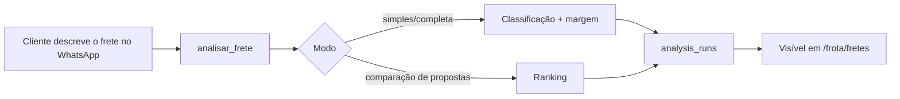

### 2. Radar de Fretes

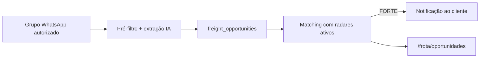

### 3. Registrar despesa

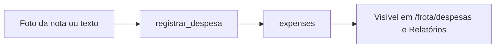

### 4. Manutenção

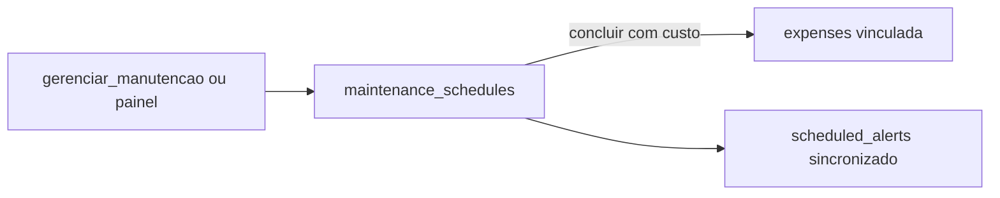

### 5. Documento e vencimento

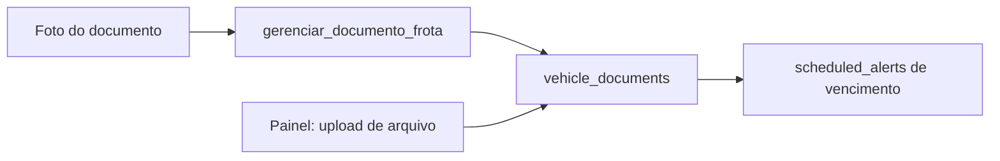

### 6. Alerta

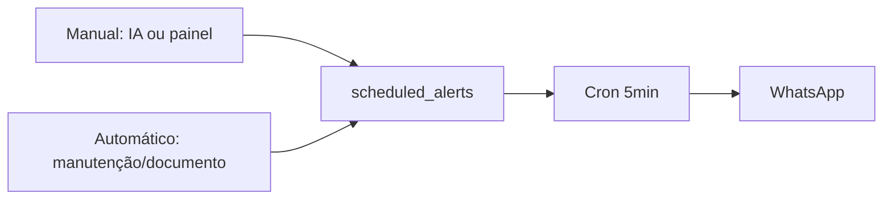

### 7. Checklist

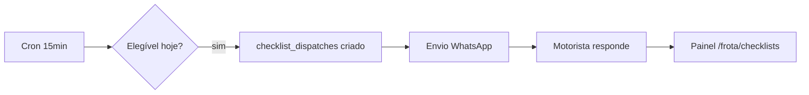

### 8. Agenda Google

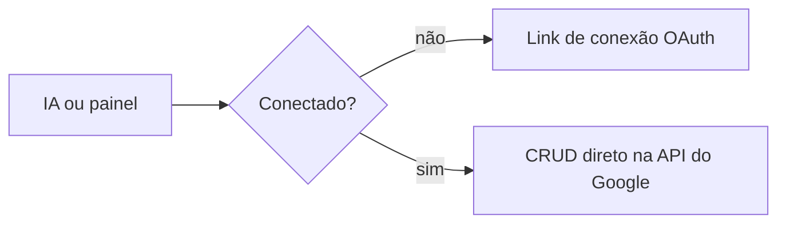

### 9. Jornada

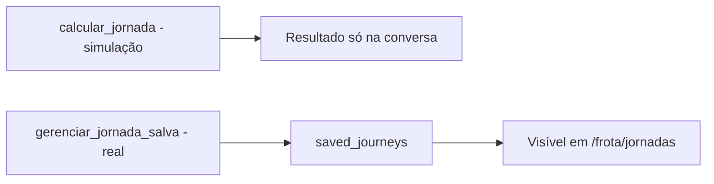

### 10. Rota

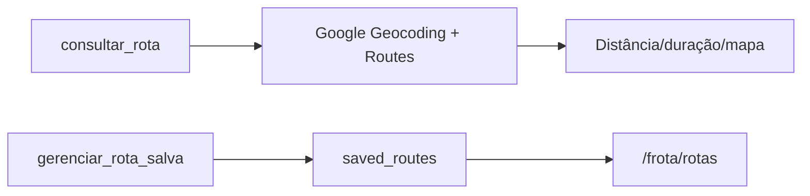

### 11. Relatório

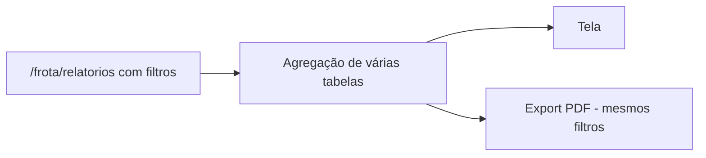

### 12. IA do painel

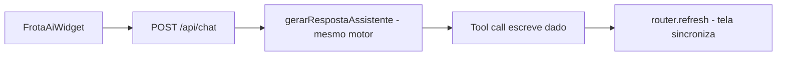

### 13. Geração de documento

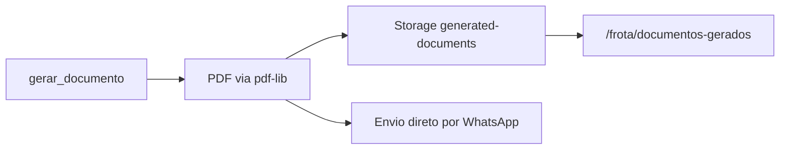

### 14. Pagamento

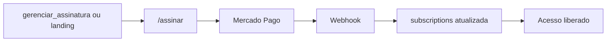

### 15. Upgrade Individual → Gestão

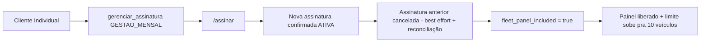

---

## PARTE 10 — Exemplo de jornada completa do cliente

### Cliente Individual (motorista autônomo)

1. Vê um anúncio/indicação, manda "oi" no WhatsApp do Frota IA.
2. Passa pelo onboarding V1 completo (~12 perguntas, 2-3 minutos): nome, perfil (motorista autônomo), intenção (ex.: "calcular frete"), cidade-base, região, rota fixa, veículo (Scania R450 2022), placa, tipo (cavalo mecânico + carreta), carroceria (sider), consumo.
3. Trial de 7 dias já ativo automaticamente — nenhum cartão pedido ainda.
4. Recebe o menu de sugestões iniciais + oferta do Guia V1.
5. No dia a dia: manda foto de nota fiscal → `registrar_despesa`; pergunta "vale a pena esse frete de Curitiba pra SP a R$3.800?" → `analisar_frete` + `consultar_rota`; ativa um radar de frete pra sua rota.
6. No dia 5 do trial, recebe aviso; no último dia, recebe outro aviso.
7. Responde "quero assinar" → recebe link `/assinar` → escolhe Individual R$79,90/mês → paga → acesso recorrente liberado, sem painel (não precisa, só usa o WhatsApp).

### Cliente Gestão (pequena transportadora)

1. Dono da transportadora começa igual (onboarding V1 pelo WhatsApp, 1 veículo cadastrado).
2. Decide que precisa gerenciar mais veículos e motoristas → pede upgrade ou já entra direto pela landing como Gestão.
3. Paga Gestão Mensal (R$99,90) ou Anual (Pix R$799 ou 12x R$838,80) → `fleet_panel_included = true`.
4. Recebe link de acesso ao painel (`vincular_painel`) ou faz login direto com Google.
5. Completa `/frota-ativacao` (5 passos): confirma empresa, cadastra os demais veículos (até 10) e motoristas, liga o checklist diário.
6. Cai no Dashboard, recebe o convite do Guia V2 (tour de 8 passos), aceita.
7. Passa a operar dos dois lados: motoristas registram despesas e recebem checklist pelo WhatsApp; o gestor acompanha tudo pelo painel (Veículos, Manutenção, Documentos, Alertas, Relatórios), conecta a Agenda Google para a equipe interna, e eventualmente usa o widget de IA do painel pra tirar dúvidas rápidas sem trocar de tela.

---

## PARTE 11 — Limitações

| Categoria | Item |
|---|---|
| **Funciona hoje (completo)** | Onboarding V1/V2, Guias V1/V2, 35 ferramentas de IA, 13/18 módulos do painel em CRUD completo, checkout Mercado Pago (recorrente + único + upgrade + reconciliação), Google Calendar CRUD, Google Maps (sem pedágio), Radar de Fretes (via WhatsApp), 6 crons de automação |
| **Funciona parcialmente** | Notícias (só 1 toggle no painel); Configurações (só estilo de resposta + checklist têm UI; outras preferências existem no banco mas sem tela); Sentry (sem captura client-side) |
| **Depende de fornecedor externo** | Google Calendar (OAuth do cliente); Google Maps (chave e cota); Z-API (WhatsApp não-oficial, sem confirmação de leitura/entrega); Mercado Pago (parcelamento "sem juros" depende de config da própria conta MP, não controlável pelo código) |
| **Ainda não existe** | Cálculo de pedágio; telemetria/GPS real (odômetro é sempre informado manualmente); Fretebras/Truckpad como fonte do Radar (só WhatsApp hoje); upload de arquivo de documento a partir do WhatsApp (só extrai dado da foto); confirmação de leitura/entrega de mensagem; exclusão de conta/empresa pelo próprio cliente; aviso de vencimento do plano anual |
| **Roadmap explícito** | Maplink Toll API (pedágio); ampliar fontes do Radar; captura de erro client-side no painel |

---

*Documento gerado por auditoria de código em 2026-08-28, branch `claude/frota-ia-assistente-setup-qlrbac`, commit `dc5903d`. Nenhuma funcionalidade, regra de negócio, banco ou API foi alterada durante a produção deste documento.*
