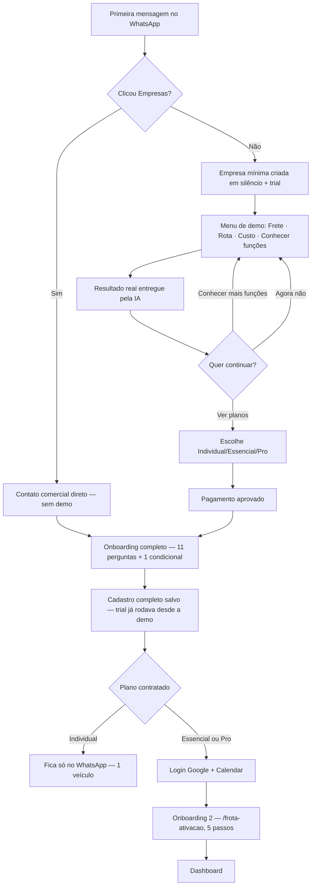

# Frota IA — Jornada do cliente por plano (apresentação, demo, onboarding e checkout)

Documento criado em 10/09/2026 a partir do código real e dos docs técnicos existentes, **reescrito em 11/09/2026** para refletir a inversão do funil ("mostrar valor antes de cadastrar") — o cadastro completo de perfil deixou de ser a primeira coisa que o cliente vê e passou a rodar só depois do pagamento confirmado. Serve pra você analisar a jornada completa, plano por plano.

## Visão geral — onde cada plano diverge

Todo cliente entra pelo **mesmo ponto** (WhatsApp). Exceto quem clica "Empresas" na landing (vai direto pro atendimento comercial, sem demo), todo mundo passa pela **mesma demonstração pré-cadastro** antes de qualquer pergunta de perfil. O cadastro completo (11+1 perguntas) só acontece depois de pagar:

## Como o Frota IA se apresenta (igual pra todo mundo, antes de saber qual plano)

Primeira mensagem, texto literal do sistema (`askDemoChoice()`, `src/ai/whatsapp/demoConversation.ts`):

> Olá! Eu sou o Frota IA, seu gestor de frota direto no WhatsApp. 🚛
>
> Posso ajudar você a saber se um frete compensa, calcular custos e rotas, controlar combustível, pneus e manutenção, acompanhar documentos e alertas e consultar informações atualizadas do transporte.
>
> Você pode falar comigo por texto, áudio ou documento.
>
> Quer ver como funciona na prática?

Seguida de uma lista com 4 opções: **Analisar um frete · Calcular uma rota · Calcular custo de viagem · Conhecer o que o Frota IA faz**.

Ninguém escolhe plano nesse momento — nem nome, nem perfil, nem cidade. Por baixo, uma empresa mínima (só um nome placeholder) e o trial de 7 dias já foram criados em silêncio (é o que permite a IA responder de verdade), mas isso nunca é dito ao cliente nesta fase.

## Demo pré-cadastro (todos os planos passam por aqui, exceto Empresa)

1. **Escolhe um track** (ex.: "Analisar um frete") → o sistema manda uma pergunta de transição fixa pedindo só o dado necessário pra aquele cálculo (ex.: "Me mande os dados do frete — origem, destino, valor ofertado...").
2. **A IA responde em modo restrito** — só tem acesso às ferramentas daquele track (frete: `analisar_frete`/`calcular_margem`/`calcular_valor_minimo_frete`/`verificar_piso_minimo_antt`; rota: `consultar_rota`; custo: `calcular_custo_viagem`/`calcular_combustivel`), nunca as 39 completas. Se faltar dado, pergunta — nunca inventa, nunca tenta puxar "perfil salvo do veículo" (ainda não existe nesta fase).
3. **Resultado real entregue** — a IA calcula de verdade e, ao final, adiciona 1-2 frases citando por alto as outras áreas do produto (gestão da operação, alertas, fontes oficiais, notícias) sem listar tudo.
4. **CTA com 3 botões**: *Ver planos* (mostra Individual/Essencial/Pro, gera link de checkout de verdade pro plano escolhido) · *Conhecer mais funções* (reabre o menu de 4) · *Agora não* (segue testando à vontade). Digitar "quero assinar" a qualquer momento tem o mesmo efeito de "Ver planos".
5. Cliente pode repetir a demo quantas vezes quiser antes de decidir — o trial (7 dias, nunca mencionado) é o que sustenta esse acesso.

**Nesse momento, todo mundo está no mesmo lugar** — empresa mínima, sem veículo, sem Painel — independente de qual plano vai escolher depois.

---

## Depois do pagamento: cadastro completo (11+1 perguntas, roda igual pros 3 planos de autoatendimento)

Assim que o Mercado Pago confirma o pagamento (`dispararOnboardingPosPagamento`), o sistema manda "Pagamento confirmado! Agora vamos configurar sua operação..." e inicia o mesmo cadastro de sempre — nenhuma pergunta mudou, só o **momento** em que rodam:

1. **Nome**
2. **Perfil** (lista): Motorista autônomo · Apenas motorista · Dono de empresa/transportadora · Gestor de frota · Transportador
3. **Objetivo inicial** (lista de 9 categorias + "ver tudo")
4. **Cidade base** (texto livre)
5. **Região de atuação** (lista): Norte/Nordeste/Centro-Oeste/Sudeste/Sul/Todas
6. **Rota fixa?** (sim/não) — se sim, pergunta condicional **6.1 Rota principal**
7. **Veículo — marca/modelo/ano** (obrigatório, não pode pular)
8. **Placa** (opcional, "depois" pula)
9. **Configuração do veículo** (lista: Toco/Truck/Três-quartos/Bitruck/Cavalo mecânico/Carreta/Bitrem/Rodotrem/Outro) — cavalo/carreta abre pergunta extra de nº de eixos
10. **Carroceria/implemento** (lista de 9 tipos — nunca trava, cai em "Outro" se não reconhecer)
11. **Consumo médio km/l** (opcional, última etapa — cadastro sempre termina aqui)

Ao concluir: a empresa mínima criada lá na demo é **atualizada** com esses dados (nunca cria uma segunda empresa — `finalizeOnboarding` detecta que já existe `companyId` e usa `updateCompany`), cria o veículo, e mostra o menu de 10 sugestões (agora sim as 39 ferramentas completas ficam liberadas). O convite pro guia de 5 passos também só aparece aqui, no fim deste cadastro.

---

## Plano Individual — R$89,90/mês (ou R$899,00/ano)

**Depois do cadastro completo, não muda nada estruturalmente** — o cliente continua só WhatsApp, 1 veículo, sem Painel Web.

**Como contrata**: durante a demo, no CTA "Ver planos" (ou a qualquer momento, pedindo "quero assinar"). Gera um **link seguro** (`/assinar`, expira em 30 min) — nunca gera o checkout direto sem o cliente confirmar antes.

1. Cliente abre o link → vê os 3 planos lado a lado (Individual pré-selecionado se veio de um CTA de plano específico da landing) com toggle Mensal/Anual.
2. Escolhe Mensal → tela pede e-mail (obrigatório pra assinatura recorrente) → "Ir para pagamento".
3. Vai pro Mercado Pago (assinatura recorrente, `/preapproval`) — só aceita cartão no mensal.
4. Pagamento aprovado → webhook confirma → assinatura fica `ATIVA` → **dispara o cadastro completo** (seção acima).

---

## Plano Essencial — R$149,90/mês (até 3 veículos) e Plano Pro — R$249,90/mês (até 10 veículos)

Os dois seguem **exatamente o mesmo caminho** — a única diferença entre eles é preço e limite de veículos (3 vs. 10), nunca o fluxo.

**Como contrata**: mesmo mecanismo do Individual, só que escolhendo Essencial ou Pro na tela, com opção Mensal (cartão) ou Anual (Pix ou cartão parcelado).

**Depois do pagamento aprovado**, o webhook libera `fleet_panel_included=true` e dispara o cadastro completo de 11 perguntas (igual ao Individual). Só depois disso, ao concluir o cadastro:

1. **Pré-requisito, não etapa do onboarding**: o cliente precisa logar com **Google** e conectar o **Google Calendar** da empresa.
2. Entra no **Onboarding 2** (`/frota-ativacao`), 5 passos, nenhum obrigatório além do primeiro:
   - **Passo 1**: "Encontramos sua conta Frota IA" — confirma nome da empresa, mostra o Veículo 1 já cadastrado pelo WhatsApp (**nunca duplica**, só reaproveita).
   - **Passo 2**: Veículos — "Seu plano permite gerenciar até {3 ou 10} veículos" — pode adicionar mais ou deixar pra depois.
   - **Passo 3**: Motoristas (opcional) — nome, telefone, veículo vinculado, CNH.
   - **Passo 4**: Checklist diário (opcional) — liga/desliga, horário, 4 itens fixos (óleo, água, pneus, luzes).
   - **Passo 5**: Resumo final + botão "Ir para o Dashboard" — só aqui o onboarding é marcado como concluído.
3. Cai no Dashboard — WhatsApp e Painel passam a operar sobre a **mesma conta**, sem duplicar nada.

**Diferença prática Essencial vs. Pro**: só o número que aparece no Passo 2 ("até 3" ou "até 10") e o preço cobrado — telas, perguntas e comportamento são idênticos.

---

## Plano Empresa — mais de 10 veículos

**Nunca passa pela demo nem por checkout automático** (decisão confirmada: frota grande já é negociação humana). Se o cliente clica "Empresas" na landing ou pede algo relacionado a "mais de 10 veículos"/"frota grande", recebe direto (texto fixo, sem gerar link nenhum):

> Legal que você tem uma frota maior! O Frota IA Empresas é atendimento comercial direto, sem automação — me conta quantos veículos você tem e o volume de uso esperado que já te encaminho com o time.

Logo em seguida, entra direto no **cadastro completo de 11+1 perguntas** (mesmo caminho legado de antes da inversão do funil — sem demo), enquanto a negociação comercial acontece em paralelo, fora do sistema. Preço "sob consulta", nunca amarrado a `CATALOGO_OFERTAS`.

---

## Tabela-resumo

| | Individual | Essencial | Pro | Empresa |
|---|---|---|---|---|
| Passa pela demo pré-cadastro? | Sim | Sim | Sim | **Não** |
| Cadastro completo (11+1 perguntas) roda... | Depois do pagamento | Depois do pagamento | Depois do pagamento | Logo após a mensagem de interesse (sem demo) |
| Canal final | Só WhatsApp | WhatsApp + Painel | WhatsApp + Painel | WhatsApp + Painel |
| Limite de veículos | 1 | 3 | 10 | Sob negociação |
| Precisa de Google/Calendar? | Não | Sim (pré-requisito do Painel) | Sim | — |
| Passa pelo Onboarding 2 (`/frota-ativacao`)? | Não | Sim | Sim | Não |
| Como contrata | CTA da demo → link `/assinar` → Mercado Pago | CTA da demo → link `/assinar` → Mercado Pago | CTA da demo → link `/assinar` → Mercado Pago | Contato comercial manual |
| Pix disponível? | Só no anual | Só no anual | Só no anual | Negociado à parte |

## O que este documento NÃO cobre

- Telas exatas do Painel (dashboard, veículos, motoristas etc.) — isso está em `FROTA_IA_FERRAMENTAS_ATUAL_2026-09-06.md`.
- Detalhe técnico de cada chamada ao Mercado Pago (endpoints, `external_reference`, validação de webhook) — isso está em `FROTA_IA_CHECKOUT_MERCADOPAGO_ATUAL.md`.
- Detalhe técnico da inversão do funil em si (arquivos exatos, migration, testes) — isso está registrado na memória do projeto e no commit `1955b12`.
- Teste de clique real do checkout com a nova jornada, e confirmação do deploy no Railway — ainda pendentes, registrado em `FROTA_IA_PENDENCIAS_2026-09-06.md`.
