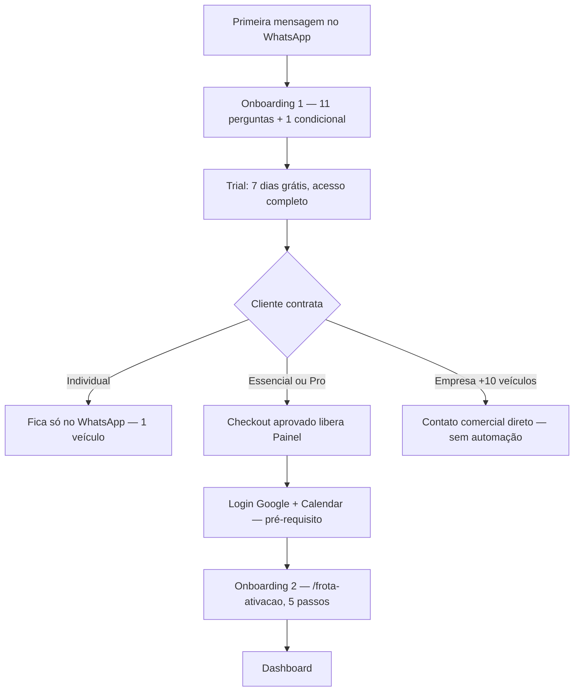

# Frota IA — Jornada do cliente por plano (apresentação, onboarding e checkout)

Documento novo, montado em 10/09/2026 a partir do código real e dos docs técnicos existentes (`FROTA_IA_ONBOARDING_V1_ATUALIZADO_2026-08-23.md`, `FROTA_IA_ONBOARDING_GESTAO_ATUAL.md`, `FROTA_IA_CHECKOUT_MERCADOPAGO_ATUAL.md`) — junta pela primeira vez o cadastro (onboarding) com a contratação (checkout), que antes eram descritos em documentos separados e sem conexão entre si. Serve pra você analisar a jornada completa, plano por plano.

## Visão geral — onde cada plano diverge

Todo cliente entra pelo **mesmo ponto** (WhatsApp) e passa pelo **mesmo cadastro inicial** (Onboarding 1). A partir da contratação, o caminho se separa:

## Como o Frota IA se apresenta (igual pra todo mundo, antes de saber qual plano)

Primeira mensagem, texto literal do sistema:

> Olá! Eu sou o Frota IA, seu assistente especializado em transporte. 🚛
>
> Posso analisar fretes, calcular custos, organizar despesas, manutenção, documentos e rotas, criar lembretes e ajudar você a encontrar oportunidades de carga com o Radar de Fretes.
>
> Você pode falar comigo por texto, áudio, foto, PDF ou planilha.
>
> Para eu usar os dados corretos do seu veículo nas análises e recomendações, vou configurar sua operação primeiro.
>
> Como posso chamar você?

Ninguém escolhe plano nesse momento — o cadastro é sempre igual, sem cobrar nada, sem pedir cartão.

## Onboarding 1 — cadastro inicial (WhatsApp, todos os planos passam por aqui)

11 perguntas obrigatórias + 1 condicional, sempre nesta ordem:

1. **Nome**
2. **Perfil** (lista): Motorista autônomo · Apenas motorista · Dono de empresa/transportadora · Gestor de frota · Transportador
3. **Objetivo inicial** (lista de 9 categorias + "ver tudo")
4. **Cidade base** (texto livre)
5. **Região de atuação** (lista): Norte/Nordeste/Centro-Oeste/Sudeste/Sul/Todas
6. **Rota fixa?** (sim/não) — se sim, pergunta condicional **6.1 Rota principal**
7. **Veículo — marca/modelo/ano** (obrigatório, não pode pular)
8. **Placa** (opcional, "depois" pula)
9. **Configuração do veículo** (lista: Toco/Truck/Três-quartos/Bitruck/Cavalo mecânico/Carreta/Bitrem/Rodotrem/Outro) — cavalo/carreta abre pergunta extra de nº de eixos
10. **Carroceria/implemento** (lista de 9 tipos — nunca trava, cai em "Outro" se não reconhecer)
11. **Consumo médio km/l** (opcional, última etapa — cadastro sempre termina aqui)

Ao concluir: cria a empresa, inicia o **trial de 7 dias grátis** (acesso completo, sem cartão), cria o veículo com todos os dados coletados, e mostra o menu de 10 sugestões (Analisar frete, Radar de Fretes, Calcular custos, Registrar despesa, Organizar manutenção, Documentos, Consultar rota, Criar lembrete, Analisar pneus, Ver tudo).

**Nesse momento, todo mundo está no mesmo lugar** — 1 veículo, só WhatsApp, sem Painel, independente de qual plano vai escolher depois.

---

## Plano Individual — R$89,90/mês (ou R$899,00/ano)

**Depois do onboarding, não muda nada estruturalmente** — o cliente continua exatamente como terminou o cadastro: só WhatsApp, 1 veículo, sem Painel Web.

**Como contrata**: em qualquer momento da conversa, pede pra assinar (ex.: "quero assinar") ou clica no CTA "Frota IA Individual" da landing page. A IA chama `gerenciar_assinatura`, que gera um **link seguro** (`/assinar`, expira em 30 min) — nunca gera o checkout direto sem o cliente confirmar antes.

1. Cliente abre o link → vê os 3 planos lado a lado (Individual pré-selecionado) com toggle Mensal/Anual.
2. Escolhe Mensal → tela pede e-mail (obrigatório pra assinatura recorrente) → "Ir para pagamento".
3. Vai pro Mercado Pago (assinatura recorrente, `/preapproval`) — só aceita cartão no mensal.
4. Pagamento aprovado → webhook confirma → assinatura fica `ATIVA`.

**O que muda pro cliente depois de pagar**: nada no fluxo de uso — ele já estava usando o produto desde o trial, só passa a ter acesso contínuo (sem o limite de 7 dias). Não ganha Painel, continua com 1 veículo.

---

## Plano Essencial — R$149,90/mês (até 3 veículos) e Plano Pro — R$249,90/mês (até 10 veículos)

Os dois seguem **exatamente o mesmo caminho** depois da contratação — a única diferença entre eles é preço e limite de veículos (3 vs. 10), nunca o fluxo.

**Como contrata**: mesmo mecanismo do Individual (`gerenciar_assinatura` → link `/assinar` → Mercado Pago), só que escolhendo Essencial ou Pro na tela, com opção Mensal (cartão) ou Anual (Pix ou cartão parcelado).

**Depois do pagamento aprovado, é aqui que a jornada diverge do Individual** — o webhook libera `fleet_panel_included=true`, e isso desbloqueia o Painel Web. Mas o Painel **não abre direto** — antes disso:

1. **Pré-requisito, não etapa do onboarding**: o cliente precisa logar com **Google** e conectar o **Google Calendar** da empresa — o sistema barra quem não tem isso feito, antes mesmo de mostrar qualquer tela do painel.
2. Só depois disso entra no **Onboarding 2** (`/frota-ativacao`), 5 passos, nenhum obrigatório além do primeiro:
   - **Passo 1**: "Encontramos sua conta Frota IA" — confirma nome da empresa, mostra o Veículo 1 já cadastrado pelo WhatsApp (**nunca duplica**, só reaproveita).
   - **Passo 2**: Veículos — "Seu plano permite gerenciar até {3 ou 10} veículos" — pode adicionar mais ou deixar pra depois.
   - **Passo 3**: Motoristas (opcional) — nome, telefone, veículo vinculado, CNH.
   - **Passo 4**: Checklist diário (opcional) — liga/desliga, horário, 4 itens fixos (óleo, água, pneus, luzes).
   - **Passo 5**: Resumo final + botão "Ir para o Dashboard" — só aqui o onboarding é marcado como concluído.
3. Cai no Dashboard — WhatsApp e Painel passam a operar sobre a **mesma conta**, sem duplicar nada.

**Diferença prática Essencial vs. Pro**: só o número que aparece no Passo 2 ("até 3" ou "até 10") e o preço cobrado — telas, perguntas e comportamento são idênticos.

---

## Plano Empresa — mais de 10 veículos

**Nunca passa por checkout automático.** Se o cliente pede algo relacionado a "empresa"/"mais de 10 veículos"/"frota grande", recebe direto (texto fixo, sem gerar link nenhum):

> Legal que você tem uma frota maior! O Frota IA Empresas é atendimento comercial direto, sem automação — me conta quantos veículos você tem e o volume de uso esperado que já te encaminho com o time.

Dali em diante é negociação humana (você), fora do sistema — preço "sob consulta", nunca amarrado a `CATALOGO_OFERTAS`.

---

## Tabela-resumo

| | Individual | Essencial | Pro | Empresa |
|---|---|---|---|---|
| Onboarding inicial | WhatsApp (11+1 perguntas) — igual pros 4 | | | |
| Canal final | Só WhatsApp | WhatsApp + Painel | WhatsApp + Painel | WhatsApp + Painel |
| Limite de veículos | 1 | 3 | 10 | Sob negociação |
| Precisa de Google/Calendar? | Não | Sim (pré-requisito do Painel) | Sim | — |
| Passa pelo Onboarding 2 (`/frota-ativacao`)? | Não | Sim | Sim | Não |
| Como contrata | Link `/assinar` → Mercado Pago | Link `/assinar` → Mercado Pago | Link `/assinar` → Mercado Pago | Contato comercial manual |
| Pix disponível? | Só no anual | Só no anual | Só no anual | Negociado à parte |

## O que este documento NÃO cobre

- Telas exatas do Painel (dashboard, veículos, motoristas etc.) — isso está em `FROTA_IA_FERRAMENTAS_ATUAL_2026-09-06.md`.
- Detalhe técnico de cada chamada ao Mercado Pago (endpoints, `external_reference`, validação de webhook) — isso está em `FROTA_IA_CHECKOUT_MERCADOPAGO_ATUAL.md`.
- Teste de clique real do checkout com os preços novos — ainda pendente, registrado em `FROTA_IA_PENDENCIAS_2026-09-06.md`.
