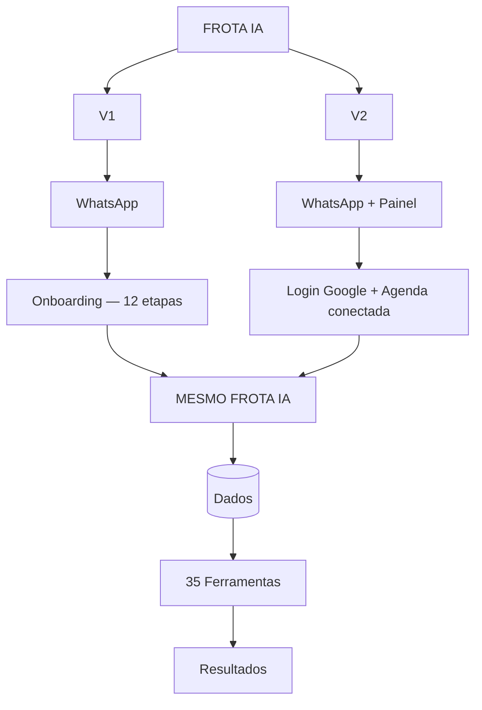

# FROTA IA — JORNADA REAL DO CLIENTE

**Documento visual, não técnico.** Feito para o dono do produto acompanhar exatamente o que um cliente vive hoje, mensagem por mensagem, tela por tela.

> **Fonte de verdade**: código da branch `claude/frota-ia-assistente-setup-qlrbac`, commit `a4205419165f15a62a5dd815541fef2ce3153e84`, lido diretamente em 2026-08-22. Onde o texto abaixo está marcado **"Texto atual do sistema"**, é uma cópia literal do código. Onde está marcado **"Exemplo ilustrativo"**, é uma simulação plausível pra facilitar a leitura — nunca invenção de funcionalidade. Onde algo não existe ainda, está marcado ⚠️ **AINDA NÃO IMPLEMENTADO NO FLUXO ATUAL**.

---

# PARTE 1 — VISÃO GERAL DO PRODUTO

## O que é a V1?

```text
CLIENTE
   ↓
WHATSAPP
   ↓
FROTA IA
   ↓
CONVERSA
   ↓
FERRAMENTAS (35)
   ↓
RESULTADO
```

A V1 é o produto inteiro cabendo dentro do WhatsApp. Não existe cadastro em site, não existe senha, não existe app pra baixar. O cliente manda uma mensagem pro número do Frota IA e, a partir dali, tudo acontece na conversa: cadastro, cálculos, registros, lembretes, documentos.

## O que é a V2?

```text
CLIENTE
   ↓
WHATSAPP  +  PAINEL
   ↓
MESMO FROTA IA
   ↓
MESMA EMPRESA
   ↓
MESMOS DADOS
```

A V2 não é um produto separado — é uma **camada visual** por cima do mesmo motor. O cliente que já usa o WhatsApp pode pedir acesso a um painel web, onde vê os mesmos dados organizados em telas, gráficos e listas, e pode continuar conversando com a mesma IA por lá.

---

# ══════════════════════════════════
# V1 — FROTA IA PELO WHATSAPP
# ══════════════════════════════════

# PARTE 2 — A JORNADA COMPLETA DA V1

```text
CLIENTE FICA SABENDO DO FROTA IA
                    ↓
       MANDA MENSAGEM NO WHATSAPP
                    ↓
        (não existe barreira de entrada —
      qualquer número novo já é atendido)
                    ↓
              ONBOARDING
                    ↓
          CONVERSA NORMAL
```

Hoje **não existe checkout prévio nem senha** para começar a usar — o próprio primeiro "Olá" já cria a conta do cliente automaticamente, com um período de teste grátis. A cobrança (assinatura mensal/anual) é algo que o cliente ativa depois, de dentro da conversa, quando quiser continuar após o teste — não é abordado neste documento por não fazer parte da experiência de *uso* do produto.

---

# PARTE 3 — PRIMEIRA MENSAGEM NO WHATSAPP

## PASSO 1 — Cliente chama o Frota IA

📱 **WhatsApp**

**Cliente**
```text
┌────────────────────────────────────┐
│ Olá                        08:30 ✓✓│
└────────────────────────────────────┘
```

**Frota IA** — *Texto atual do sistema (atualizado em 2026-08-23)*
```text
┌──────────────────────────────────────────────────┐
│ 🟢 Frota IA                                       │
│                                                    │
│ Olá! Eu sou o Frota IA, seu assistente            │
│ especializado em transporte. 🚛                   │
│                                                    │
│ Posso analisar fretes, calcular custos, organizar │
│ despesas, manutenção, documentos e rotas, criar   │
│ lembretes e ajudar você a encontrar oportunidades │
│ de carga com o Radar de Fretes.                   │
│                                                    │
│ Você pode falar comigo por texto, áudio, foto,    │
│ PDF ou planilha.                                  │
│                                                    │
│ Para eu usar os dados corretos do seu veículo nas │
│ análises e recomendações, vou configurar sua      │
│ operação primeiro.                                │
│                                                    │
│ Como posso chamar você?                08:30 ✓✓   │
└──────────────────────────────────────────────────┘
```

Essa mensagem é sempre a mesma para qualquer número novo — não varia por origem/campanha. Ela já avisa, no fim, que a configuração do veículo faz parte do cadastro — pra nenhuma das novas perguntas (placa, consumo etc.) pegar o cliente de surpresa mais adiante.

---

# PARTE 4 — ONBOARDING V1, PASSO A PASSO

**12 etapas de pergunta ao todo** (11 sempre perguntadas + 1 condicional — a rota principal só aparece pra quem diz ter rota fixa). Redesenho de 2026-08-23 sob o princípio **"1 usuário + 1 veículo"**: o veículo passou a ser configurado por completo no cadastro — só ficaram opcionais placa e consumo médio; marca/modelo/ano deixou de poder ser pulado.

---

## PASSO 1 — Nome

📱 Frota IA *(mesma mensagem do Passo anterior — já pergunta o nome)*

**Cliente**
```text
João
```

**O que o sistema está coletando:** o nome do cliente.
**Onde isso será utilizado depois:** personalizar todas as próximas mensagens ("Prazer, João!") e o nome do dono da conta.

---

## PASSO 2 — Perfil de atuação

📱 Frota IA — *Texto atual do sistema*
```text
┌───────────────────────────────────────┐
│ Prazer, João! Como você atua hoje?    │
│                                        │
│ ○ 🚛 Motorista autônomo               │
│ ○ 👤 Apenas motorista                 │
│ ○ 🏢 Dono de empresa / transportadora │
│ ○ 📊 Gestor de frota                  │
│ ○ 🚚 Transportador                    │
│                                        │
│           [ Escolher opção ]          │
└───────────────────────────────────────┘
```

**Cliente:** toca em "Dono de empresa / transportadora".

**O que o sistema está coletando:** o tipo de perfil/empresa.
**Onde isso será utilizado depois:** define `company_type` — afeta, por exemplo, quantos veículos ativos são permitidos ao mesmo tempo.

---

## PASSO 3 — Por onde começar

📱 Frota IA — *Texto atual do sistema*
```text
┌───────────────────────────────────────────┐
│ O que você quer resolver primeiro         │
│ com o Frota IA?                           │
│                                            │
│ 🚛 Fretes e oportunidades                 │
│ 💰 Custos e despesas                      │
│ 🔧 Manutenção e pneus                     │
│ 📄 Documentos e vencimentos                │
│ 📅 Agenda e lembretes                     │
│ 🕐 Jornada                                │
│ 🗺️ Rotas e viagens                        │
│ 📊 Análises e histórico                   │
│ 📰 Notícias do transporte                 │
│ 📋 Ver tudo que o Frota IA faz             │
│                                            │
│              [ Escolher opção ]           │
└───────────────────────────────────────────┘
```

**Cliente:** toca em "🚛 Fretes e oportunidades".

📱 Frota IA responde com uma transição personalizada — *Texto atual do sistema*:
```text
Perfeito! Você pode me mandar uma proposta de frete
para analisar ou usar o Radar de Fretes para procurar
oportunidades compatíveis com sua operação.

Agora vamos configurar sua base e seu veículo para eu
usar informações mais precisas nas análises.

Qual cidade você usa como base principal da sua
operação?

Ex.: Curitiba - PR
```

**O que o sistema está coletando:** o interesse inicial do cliente.
**Onde isso será utilizado depois:** só para personalizar a mensagem de conclusão do cadastro (mostrando que o sistema "lembrou" o que ele disse) — não muda nenhum cálculo. A categoria "Fretes e oportunidades" já apresenta o Radar de Fretes de cara, pra quem escolhe essa opção entender que existe busca automática de carga, não só análise sob pedido.

---

## PASSO 4 — Cidade base

**Cliente**
```text
Curitiba, PR
```

**O que o sistema está coletando:** cidade/estado base.
**Onde isso será utilizado depois:** cadastro da empresa (`city`/`state`).

---

## PASSO 5 — Região de atuação

📱 Frota IA — *Texto atual do sistema*
```text
┌────────────────────────────────────────────┐
│ Em quais regiões você costuma rodar mais?  │
│ Toque numa opção, ou digite se forem       │
│ várias (ex.: "Sul e Sudeste").             │
│                                             │
│ ○ Norte      ○ Nordeste                    │
│ ○ Centro-Oeste  ○ Sudeste                  │
│ ○ Sul        ○ Todas as regiões            │
│                                             │
│              [ Escolher opção ]            │
└────────────────────────────────────────────┘
```

**Cliente:** toca em "Sul".

**Onde isso será utilizado depois:** vira uma memória da IA (`operating_region`) — a IA pode usar isso depois sem precisar perguntar de novo.

---

## PASSO 6 — Rota fixa

📱 Frota IA — *Texto atual do sistema*
```text
Você costuma trabalhar em uma rota fixa ou recorrente?

Responda "sim" ou "não".
```

> Nota de bastidor: essa pergunta usa texto simples em vez de botões porque botões nativos do WhatsApp tiveram falha real de entrega em teste (mensagem nunca chegava no aparelho, sem erro visível). Não afeta o cliente — ele só vê uma pergunta de texto normal.

**Cliente**
```text
sim
```

**Onde isso será utilizado depois:** vira outra memória da IA (`has_fixed_route`). Responder "sim" abre uma pergunta extra (Passo 6.1); quem responde "não" pula direto pro veículo (Passo 7).

---

## PASSO 6.1 — Rota principal *(nova etapa, só aparece pra quem disse "sim" no Passo 6)*

📱 Frota IA — *Texto atual do sistema*
```text
Qual é sua rota principal?

Ex.: Curitiba → São Paulo
```

**Cliente**
```text
Curitiba → São Paulo
```

**O que o sistema está coletando:** origem e destino da rota mais comum do cliente.
**Onde isso será utilizado depois:** vira uma rota salva de verdade (visível depois em Rotas, tanto no WhatsApp quanto no painel) **e** uma memória da IA com o texto completo — mesmo que o cliente mencione mais de uma rota numa mensagem só, nenhuma informação se perde, só a primeira vira um registro estruturado.

---

## PASSO 7 — Veículo (marca, modelo e ano)

📱 Frota IA — *Texto atual do sistema*
```text
Agora vamos configurar o veículo que você vai usar no
Frota IA.

Qual a marca, modelo e ano?

Ex.: Scania R450 2022
```

**Cliente**
```text
Scania R450 2022
```

**O que o sistema está coletando:** identificação do veículo.
**Onde isso será utilizado depois:** vira o nome do veículo cadastrado. ⚠️ **Mudança de comportamento**: essa pergunta não pode mais ser pulada respondendo "depois" — na V1 "1 usuário + 1 veículo", configurar o veículo é parte obrigatória do cadastro.

---

## PASSO 8 — Placa *(nova etapa, opcional)*

📱 Frota IA — *Texto atual do sistema*
```text
Qual a placa do veículo?

Ex.: ABC1D23

Se preferir informar depois, responda "depois".
```

**Cliente**
```text
ABC1D23
```

**O que o sistema está coletando:** placa do veículo (reconhece formato Mercosul e antigo, aceita com ou sem hífen/espaço).
**Onde isso será utilizado depois:** cadastro do veículo. Se a placa não for reconhecida ou o cliente responder "depois"/"não sei", o cadastro **segue normalmente sem travar** — é a única etapa nova que nunca insiste.

---

## PASSO 9 — Configuração do veículo (obrigatória)

📱 Frota IA — *Texto atual do sistema*
```text
┌────────────────────────────────────────────┐
│ Qual a configuração do seu veículo? Toque  │
│ numa opção, ou digite se preferir          │
│ (ex.: "cavalo mecânico").                  │
│                                             │
│ ○ Toco              ○ Truck / Trucado      │
│ ○ Três-quartos      ○ Bitruck              │
│ ○ Cavalo mecânico   ○ Carreta              │
│ ○ Bitrem            ○ Rodotrem             │
│ ○ Outro / não sei ainda                    │
│                                             │
│              [ Escolher opção ]            │
└────────────────────────────────────────────┘
```

**Cliente:** toca em "Cavalo mecânico".

Como "cavalo mecânico" sozinho é ambíguo (pode ser carreta de vários tamanhos), o Frota IA pergunta de novo:

📱 Frota IA — *Exemplo ilustrativo (texto de desambiguação, conteúdo exato depende da composição escolhida)*
```text
E a composição? 5 eixos, 6 eixos, 7 eixos, 9 eixos,
ou só o cavalo por enquanto?
```

**Cliente:** "6 eixos"

**Onde isso será utilizado depois:** essencial para cálculos de combustível/CPK/pedágio — continua sendo a única pergunta do onboarding que nunca aceita "não sei" e repete até resolver.

---

## PASSO 10 — Carroceria/implemento *(nova etapa)*

📱 Frota IA — *Texto atual do sistema*
```text
┌────────────────────────────────────────────┐
│ Qual carroceria ou implemento você         │
│ utiliza?                                   │
│                                             │
│ ○ Sider              ○ Baú                 │
│ ○ Graneleiro         ○ Basculante (caçamba)│
│ ○ Tanque             ○ Grade baixa / carga │
│                          seca              │
│ ○ Prancha            ○ Frigorífico         │
│ ○ Outro / não sei ainda                    │
│                                             │
│              [ Escolher opção ]            │
└────────────────────────────────────────────┘
```

**Cliente:** toca em "Sider".

**O que o sistema está coletando:** tipo de carroceria — informação diferente da configuração do Passo 9 (uma é sobre o conjunto/eixos, outra é sobre o que carrega).
**Onde isso será utilizado depois:** cadastro do veículo — usado, por exemplo, pelo Radar de Fretes pra saber se uma carga é compatível. Essa etapa **nunca trava**: se o cliente digitar algo que o sistema não reconheça, ela cai automaticamente em "Outro" e segue em frente.

---

## PASSO 11 — Consumo médio *(nova etapa, opcional — última pergunta)*

📱 Frota IA — *Texto atual do sistema*
```text
Qual é o consumo médio do seu veículo em km/l?

Ex.: 2,8 km/l

Se ainda não souber, responda "não sei".
```

**Cliente**
```text
2,8
```

**O que o sistema está coletando:** consumo médio (aceita vírgula ou ponto, com ou sem "km/l").
**Onde isso será utilizado depois:** cadastro do veículo — usado em cálculos de combustível/CPK sem precisar perguntar de novo. Essa é a última pergunta do cadastro: com ou sem número reconhecido, o onboarding **sempre termina** aqui.

---

# PARTE 5 — OPÇÕES, BOTÕES E LISTAS

O onboarding usa 3 formatos diferentes, sempre com o texto real do sistema:

| Formato | Quando é usado | Exemplo |
|---|---|---|
| **Lista nativa do WhatsApp** (toque numa opção) | Perfil, intenção, região, configuração do veículo, carroceria | Ver Passos 2, 3, 5, 9 e 10 acima |
| **Texto livre esperando "sim/não"** | Rota fixa | Ver Passo 6 |
| **Texto totalmente livre** | Nome, cidade, rota principal, marca/modelo/ano, placa, consumo | Ver Passos 1, 4, 6.1, 7, 8 e 11 |

```text
┌───────────────────────────────┐
│ O que você quer resolver?     │
│                               │
│ 🚛 Fretes e oportunidades     │
│ 💰 Custos e despesas          │
│ 📊 Análises e histórico       │
└───────────────────────────────┘
```
*(exemplo de como uma lista nativa aparece no aparelho do cliente — visual aproximado, não a interface oficial do WhatsApp)*

---

# PARTE 6 — FINAL DO ONBOARDING

Assim que a última pergunta (consumo médio) é respondida — com ou sem número informado —, o sistema, em segundo plano: cria a empresa, ativa um período de teste grátis, grava as memórias de região/rota fixa/rota principal, cadastra o veículo **completo** (marca/modelo/ano, placa, configuração, carroceria e consumo) e, se a rota principal foi reconhecida, cria também uma rota salva vinculada a esse veículo.

📱 Frota IA — *Texto atual do sistema (versão personalizada, quando o cliente escolheu uma categoria específica no Passo 3)*
```text
Cadastro concluído! Sobre fretes e oportunidades, é só
mandar quando quiser que eu já calculo.

Aqui embaixo tem outras coisas que também faço — ou
envie sua própria pergunta por texto, áudio, foto ou
documento.
```

Logo em seguida, o **novo menu de 10 sugestões** (2026-08-23 — substituiu por completo o menu anterior, já dentro do limite nativo de 10 linhas do WhatsApp, sem precisar de corte):

📱 Frota IA — *Texto atual do sistema*
```text
┌──────────────────────────────────────┐
│ Como posso ajudar com sua frota hoje?│
│                                       │
│ Analisar um frete                    │
│ Procurar oportunidades               │
│ Calcular custos da viagem            │
│ Registrar uma despesa                │
│ Organizar manutenção                 │
│ Documentos e vencimentos             │
│ Consultar uma rota                   │
│ Criar um lembrete                    │
│ Analisar pneus                       │
│ Ver tudo que o Frota IA faz          │
│                                       │
│           [ Ver sugestões ]          │
└──────────────────────────────────────┘
```

Seguida de uma mensagem separada — *Texto atual do sistema*:
```text
Se preferir, pode digitar sua própria pergunta a
qualquer momento — não precisa escolher uma das opções
acima.
```

**Próxima ação esperada do cliente:** tocar numa sugestão ou simplesmente escrever o que precisa — o cadastro não impõe nenhum próximo passo obrigatório.

Se o cliente digitar "ajuda", "menu" ou "opções" mais tarde, esse mesmo menu reaparece. Tocar em "Ver tudo que o Frota IA faz" sempre mostra o catálogo completo por texto (nunca resumido pela IA, é resposta fixa do sistema).

---

# PARTE 7 — PRIMEIRO USO DA IA

## Exemplo 1 — Frete
**Cliente** — *Exemplo ilustrativo*
```text
Tenho um frete de Curitiba pra São Paulo por R$ 4.200.
Compensa?
```
```text
Cliente
 ↓
Frota IA identifica a intenção (análise de frete)
 ↓
ferramenta "analisar_frete" roda o cálculo
 ↓
resposta com classificação (viável/atrativo/inviável/
arriscado), lucro e margem estimados
```

## Exemplo 2 — Despesa
**Cliente** — *Exemplo ilustrativo*
```text
Gastei R$ 800 de diesel no Scania.
```
```text
Cliente
 ↓
Frota IA identifica veículo pelo nome ("Scania")
 ↓
ferramenta "registrar_despesa" grava a despesa
 ↓
confirmação da despesa registrada
```

## Exemplo 3 — Manutenção
**Cliente** — *Exemplo ilustrativo*
```text
Me lembra de trocar o óleo sexta.
```
```text
Cliente
 ↓
Frota IA resolve "sexta" pra uma data absoluta
 ↓
ferramenta "gerenciar_alerta" (lembrete simples) OU
"gerenciar_google_calendar" (se preferir Agenda de
verdade — ver Parte 8)
 ↓
confirmação do lembrete criado
```

## Exemplo 4 — Documento/foto
**Cliente** manda uma foto de um CRLV ou nota fiscal.
```text
Cliente manda foto
 ↓
Frota IA lê a imagem nativamente (sem OCR externo)
 ↓
extrai as informações relevantes e responde/registra
```
Também funciona com **PDF** (lido nativamente) e **planilha** (.xlsx/.csv — convertida em texto antes de chegar à IA).

## Exemplo 5 — Áudio
```text
cliente manda áudio
 ↓
Frota IA transcreve (OpenAI, texto puro)
 ↓
processa a transcrição como se fosse a mensagem digitada
 ↓
executa ação/responde normalmente
```

---

# PARTE 8 — GOOGLE CALENDAR

**Cliente** — *Exemplo ilustrativo*
```text
Me lembre da revisão sexta às 10h.
```

Se o Google Calendar **ainda não está conectado**, o comportamento real do sistema é:

```text
pedido
   ↓
Frota IA detecta: Agenda não conectada
   ↓
gera um link seguro de conexão (válido por tempo limitado)
   ↓
manda o link para o cliente TOCAR (nunca pede login/senha
do Google dentro da própria conversa)
   ↓
cliente autoriza numa página segura do Google (OAuth)
   ↓
Agenda conectada — Frota IA confirma
   ↓
evento é criado de verdade na Agenda Google
```

> Regra de segurança confirmada no código: o Frota IA **nunca** pede senha do Google na conversa — sempre manda um link para o cliente tocar e autorizar numa página oficial do Google.

Se a Agenda **já está conectada**, o evento é criado direto, sem esse passo extra.

---

# PARTE 9 — O DIA A DIA DO CLIENTE V1

```text
📱 WhatsApp
   │
   ├── pergunta de texto
   ├── áudio
   ├── foto
   ├── documento (PDF/planilha)
   ├── localização
   │
   ↓
FROTA IA
   │
   ├── calcula (frete, combustível, CPK, margem, jornada...)
   ├── registra (despesa, veículo, motorista, manutenção...)
   ├── consulta (histórico, rota, piso ANTT, notícias...)
   ├── agenda (Google Calendar / lembrete simples)
   └── responde
```

Nada disso exige abrir um app ou site — tudo dentro da mesma conversa de WhatsApp.

---

# ══════════════════════════════════
# V2 — FROTA IA + PAINEL
# ══════════════════════════════════

# PARTE 10 — QUEM É O CLIENTE V2

```text
WHATSAPP
   +
PAINEL WEB
```

O cliente V2 **não é um tipo diferente de cliente** — é o mesmo cliente da V1, com uma tela a mais. Mesma empresa, mesmos veículos, mesma memória, mesma IA.

---

# PARTE 11 — COMO O CLIENTE CHEGA À V2

Fluxo real confirmado no código:

```text
CLIENTE V1 (já conversando pelo WhatsApp)
   ↓
pede acesso ao painel ("quero acessar pelo computador")
   ↓
Frota IA gera um link seguro (válido por 15 minutos)
   ↓
cliente abre o link e faz login com Google
   ↓
vínculo confirmado — mesma empresa do WhatsApp
   ↓
painel liberado (se as demais condições da Parte 12
estiverem OK)
```

> ⚠️ **Ponto de atenção**: não existe hoje um caminho comercial de "upgrade" com tela própria de venda/onboarding de venda — o pedido de acesso ao painel acontece dentro da conversa normal, informalmente, como qualquer outro pedido à IA.

---

# PARTE 12 — PRIMEIRO ACESSO AO PAINEL

```text
Cliente abre o link/painel
        ↓
tem sessão ativa?
        ↓ não
        ↓
   Login com Google  (único método — sem senha própria)
        ↓
   empresa vinculada?
        ↓ não → onboarding do painel (ver Parte 13)
        ↓ sim
   tem direito de acesso ao painel?
        ↓ não → tela "painel indisponível"
        ↓ sim
   Google Calendar da empresa conectado?
        ↓ não → tela "conecte sua Agenda" (obrigatório)
        ↓ sim
        ↓
      PAINEL LIBERADO
```

**Como faz login:** só existe um botão, "Continuar com Google" — não há criação de senha própria.

**Precisa conectar Google?** Sim, e é **obrigatório** para usar o painel (não é opcional como no WhatsApp) — decisão de produto confirmada no código, ligada à unificação de identidade entre WhatsApp e painel.

Tela real exibida quando falta conectar a Agenda — *Texto atual do sistema*:
```text
┌───────────────────────────────────────────┐
│              [ logo Frota IA ]             │
│                                             │
│        Conecte sua Agenda Google           │
│                                             │
│  Pra usar o painel Frota IA e manter       │
│  lembretes, jornadas, manutenções e        │
│  vencimentos sincronizados, conecte a      │
│  sua Agenda Google.                        │
│                                             │
│      [   Conectar Google Agenda   ]        │
└───────────────────────────────────────────┘
```

**Primeira tela depois de tudo liberado:** o Dashboard (ver Parte 16).

---

# PARTE 13 — ONBOARDING V2 — ESTADO ATUAL

> ⚠️ **AINDA NÃO IMPLEMENTADO NO FLUXO ATUAL** um onboarding self-service completo para quem chega direto pelo painel, sem conta prévia.

O que existe de fato: uma tela de onboarding no código (criar empresa + cadastrar 1º veículo), mas ela só é alcançável por contas marcadas como administradoras internamente — não é um caminho aberto para qualquer cliente novo. Na prática, hoje:

```text
Cliente comum, sem empresa, tenta abrir o painel direto
        ↓
é mandado pro onboarding do painel
        ↓
esse onboarding rejeita quem não é administrador
        ↓
volta pro login, sem conseguir avançar
```

**Caminho real que funciona hoje:** criar conta pelo WhatsApp primeiro (Partes 3-6), depois pedir acesso ao painel (Parte 11).

---

# PARTE 14 — VISÃO DO PAINEL

```text
FROTA IA — PAINEL
│
├── 📊 Dashboard
├── 🚛 Veículos
├── 👤 Motoristas
├── 🔧 Manutenção
├── 📄 Documentos
├── 💰 Despesas
├── 🏢 Empresa
├── 📦 Fretes
├── 🕐 Jornadas
├── 🗺️ Rotas
├── 📰 Notícias
├── 📈 Relatórios
├── ✅ Checklists
├── ⚙️ Configurações
├── 📡 Oportunidades (Radar de Fretes)
└── 🔔 Alertas
```

**16 telas ao todo.**

Wireframe geral (aproximado, sem screenshot):
```text
┌────────────────────────────────────────────┐
│ FROTA IA                            Rafael  │
├──────────────┬───────────────────────────────┤
│ Dashboard    │                               │
│ Veículos     │                               │
│ Motoristas   │        CONTEÚDO DA TELA       │
│ Manutenção   │                               │
│ Documentos   │                               │
│ Despesas     │                               │
│ Empresa      │                               │
│ ...          │                               │
│              │                    ●          │
│              │              [Pergunte ao     │
│              │               Frota IA]       │
└──────────────┴───────────────────────────────┘
```
O botão flutuante "Pergunte ao Frota IA" (canto inferior direito) aparece em **todas** as 16 telas.

---

# PARTE 15 — CADA TELA DO PAINEL

## 🚛 VEÍCULOS
**O cliente vê:** lista de veículos da frota.
**Consegue fazer:** cadastrar, editar, desativar (não existe exclusão definitiva).
**IA faz nessa área:** cadastro/edição também pode ser feita pelo WhatsApp (mesmos dados).
**Exemplo prático** — *Exemplo ilustrativo*:
```text
Cadastro: Scania R450

↓

Scania R450
Placa ABC1D23
Status: Ativo
```

## 👤 MOTORISTAS
**Vê / faz:** cadastrar, editar, desativar (sem exclusão definitiva).
**IA:** mesma coisa pelo WhatsApp.

## 🔧 MANUTENÇÃO
**Vê / faz:** agendar e editar manutenções (sem exclusão nesta versão).
**IA:** cria/consulta manutenção também pelo WhatsApp.

## 📄 DOCUMENTOS
**Vê / faz:** cadastrar e editar documentos de veículo/motorista (tacógrafo, CNH, seguro etc.), sem exclusão.
**IA:** documento também pode ser enviado por foto no WhatsApp.

## 💰 DESPESAS
**Vê / faz:** registrar, editar **e excluir de verdade** — é a única tela do painel com exclusão real.
**IA:** despesa também é registrada normalmente pelo WhatsApp ("gastei R$ X de diesel").

## 🏢 EMPRESA
**Vê / faz:** ver e editar dados cadastrais (nome, tipo de operação).

## 📦 FRETES
**Vê:** histórico de análises de frete já feitas pela IA (leitura apenas — a análise em si acontece na conversa, WhatsApp ou painel).

## 🕐 JORNADAS
**Vê:** jornadas salvas (leitura apenas — jornada é criada e salva pela IA na conversa).

## 🗺️ ROTAS
**Vê:** rotas salvas (leitura apenas — mesma lógica das jornadas).

## 📰 NOTÍCIAS
**Vê / faz:** liga/desliga o resumo diário e vê o último resumo já gerado.
**No WhatsApp:** o mesmo resumo chega automaticamente por mensagem, se ativado.

## 📈 RELATÓRIOS
**Vê / faz:** gera relatório em PDF agregando custos, jornadas, checklists e fretes.

## ✅ CHECKLISTS
**Vê:** acompanhamento dos checklists diários enviados aos motoristas — 100% leitura (o envio é automático).

## ⚙️ CONFIGURAÇÕES
**Vê / faz:** define o estilo de resposta da IA (simples/técnico/objetivo) e configura o checklist diário (ativar, horário, quais itens).

## 📡 OPORTUNIDADES (Radar de Fretes)
**Vê / faz:** cadastra grupos de WhatsApp monitorados, cria "radares" de busca de carga, acompanha oportunidades encontradas — ver Parte 26.

## 🔔 ALERTAS
**Vê:** lista consolidada de tudo que está vencendo (manutenção, documento) e lembretes livres criados pelo WhatsApp.

---

# PARTE 16 — DASHBOARD

Wireframe (sem números reais — exemplo de estrutura):
```text
┌─────────────────────────────────────────────┐
│  Veículos ativos: [X]   Motoristas ativos: [X]│
│  Manutenções pendentes: [X]                  │
│  Documentos vencendo (30d): [X]              │
│  Custo nos últimos 30 dias: [R$ X]           │
│  Checklists hoje: [X enviados / X respondidos]│
│  Alertas urgentes: [X]                       │
│                                               │
│  💬 Frota IA sugere:                          │
│  "[insight gerado automaticamente sobre a     │
│   frota, atualizado a cada ~20h]"            │
└─────────────────────────────────────────────┘
```
Todos os números vêm de dados reais da própria empresa (veículos, motoristas, manutenções, documentos, despesas, checklists) — nenhum é fixo/decorativo. O bloco "Frota IA sugere" é o único gerado por IA nessa tela; todo o resto é leitura direta do banco.

---

# PARTE 17 — IA DENTRO DO PAINEL

```text
┌──────────────────────────────────┐
│ Pergunte ao Frota IA             │
│                                  │
│ Pergunte qualquer coisa sobre a  │
│ frota — ex.: "qual veículo está │
│ com mais pendência?" ou "quanto  │
│ gastei em combustível esse mês?" │
└──────────────────────────────────┘
```
*(placeholder acima é texto atual do widget — os dois exemplos citados são sugestões escritas no próprio código, não garantia de que essas frases exatas retornem um resultado específico)*

**Confirmado no código: é o mesmo motor de IA do WhatsApp** — mesmas 35 ferramentas, mesma memória, mesmos dados, mesmas permissões. Também aceita foto anexada (mesma leitura de imagem do WhatsApp) e leva em conta em qual tela da frota o cliente está no momento.

Perguntas coerentes com o que já é suportado hoje:
> "Qual veículo gastou mais?" — sim, a IA consegue somar despesas por veículo.
> "O que está vencendo?" — sim, há ferramenta de manutenção/documentos com data de vencimento.
> "Quem não fez checklist?" — sim, existe ferramenta dedicada de consulta de checklist/aderência.

---

# PARTE 18 — WHATSAPP E PAINEL JUNTOS

## EXEMPLO A

📱 WhatsApp — *Exemplo ilustrativo*
```text
Registra R$ 850 de diesel no Scania.
```
↓
🗄 Banco (mesma tabela de despesas, independente do canal)
↓
💻 Painel — *Exemplo ilustrativo de como aparece*
```text
Scania
Combustível
R$ 850
Hoje
```

## EXEMPLO B

💻 Painel: cliente edita o consumo cadastrado do veículo:
```text
2,8 km/l → 2,6 km/l
```
↓
📱 WhatsApp — *Exemplo ilustrativo*
```text
Qual meu consumo cadastrado?
```
↓
Frota IA:
```text
2,6 km/l.
```

Essa sincronização **está de fato implementada** — WhatsApp e painel lêem e escrevem no mesmo banco por empresa, não existe cópia separada de dado por canal.

---

# PARTE 19 — VEÍCULOS E MOTORISTAS

Estrutura real do banco: cada motorista pode estar vinculado a **um** veículo por vez.

```text
EMPRESA
│
├── Scania R450 ──── João (motorista vinculado)
│
├── Volvo FH ─────── Carlos
│
└── Mercedes Actros ─ Pedro
```
*(Exemplo ilustrativo de composição de frota)*

---

# PARTE 20 — DESPESAS

```text
WhatsApp
"R$ 600 diesel no Volvo"
        ↓
   registro no banco
        ↓
   aparece no Painel → Despesas
```
E o caminho inverso também funciona: uma despesa lançada no painel pode ser consultada normalmente pela IA no WhatsApp ("quanto gastei essa semana?").

---

# PARTE 21 — MANUTENÇÕES

```text
criar (WhatsApp ou painel)
   ↓
fica agendada
   ↓
gera alerta perto do vencimento
   ↓
aparece no painel (tela Manutenção + Dashboard)
   ↓
conclusão marcada (edição de status)
```

---

# PARTE 22 — DOCUMENTOS

```text
cadastro (foto pelo WhatsApp, ou formulário no painel)
   ↓
data de vencimento registrada
   ↓
alerta automático perto do vencimento
   ↓
consulta livre pelo WhatsApp ("meus documentos vencendo?")
   ↓
visualização em lista no painel
```

---

# PARTE 23 — CHECKLIST

```text
FROTA IA (cron automático)
   ↓
motorista recebe checklist no WhatsApp
   ↓
motorista responde ("OK" ou descreve o problema)
   ↓
registro no banco
   ↓
se houver problema → alerta automático pro gestor
   ↓
painel → tela Checklists (aderência por motorista)
```

Mensagem real enviada ao motorista — *Texto atual do sistema (exemplo com os 4 itens padrão)*:
```text
🔧 Checklist diário — Scania R450

Antes de sair, confira: óleo, água, pneus, luzes.

Está tudo OK? Responda "OK" ou descreva o problema
encontrado.
```

Aderência já implementada, exemplo de como aparece no painel:
```text
João
30 enviados
27 respondidos
90%
```
*(Exemplo ilustrativo de número — a fórmula "respondidos ÷ enviados" é real, os números são ilustrativos)*

---

# PARTE 24 — RELATÓRIOS

O painel gera um relatório em PDF que reúne, num único arquivo: custos, jornadas, checklists e análises de frete do período. O gestor chega até ele pela tela "Relatórios", sem precisar pedir pela IA (embora a IA também consiga gerar PDFs avulsos de análises específicas, tanto pelo painel quanto pelo WhatsApp).

---

# PARTE 25 — NOTÍCIAS

📱 **WhatsApp:** se ativado, chega um resumo automático 1x por dia com notícias do setor (fontes de imprensa/entidades especializadas).

💻 **Painel:** tela "Notícias" mostra o último resumo já enviado, e permite ligar/desligar o recebimento.

---

# PARTE 26 — RADAR DE FRETES

✅ **Já implementado — faz parte da experiência atual, não é planejamento.**

```text
Grupo de WhatsApp cadastrado pelo cliente (via painel)
   ↓
mensagens do grupo são lidas automaticamente
   ↓
Frota IA identifica se é uma oferta de frete de verdade
   ↓
compara com os "radares" (interesses de carga) da empresa
   ↓
compatibilidade forte → avisa o cliente automaticamente
compatibilidade parcial → fica disponível sob consulta
```

📱 WhatsApp — *Exemplo ilustrativo de aviso automático*
```text
⚡ Encontrei uma carga compatível: Goiânia → Curitiba,
compatível com o seu veículo.
```

💻 Painel — tela "Oportunidades": onde o cliente cadastra os grupos monitorados e os próprios radares de busca.

---

# PARTE 27 — COMPARAÇÃO V1 × V2

| Recurso | V1 WhatsApp | V2 WhatsApp + Painel |
|---|---|---|
| IA (35 ferramentas) | ✅ | ✅ (mesmo motor) |
| WhatsApp | ✅ | ✅ |
| Cadastro de veículo | ✅ | ✅ |
| Múltiplos veículos | ⚠️ 1 veículo ativo por vez (regra do produto) | ⚠️ mesma regra |
| Painel visual | ❌ | ✅ |
| Motoristas | ✅ | ✅ |
| Despesas (criar) | ✅ | ✅ |
| Despesas (excluir) | ❌ | ✅ (única tela com exclusão real) |
| Checklist (configurar) | ❌ | ✅ |
| Checklist (responder) | ✅ (motorista) | — (motorista não usa painel) |
| Relatório em PDF | ✅ (avulso, sob pedido) | ✅ (avulso + relatório agregado) |
| Google Calendar | ✅ | ✅ (mesma agenda, por empresa) |
| Radar de Fretes (receber aviso) | ✅ | ✅ |
| Radar de Fretes (cadastrar grupo/fonte) | ❌ | ✅ (só painel) |
| Login | Não existe (número = identidade) | Google OAuth |
| Onboarding self-service | ✅ (12 etapas) | ❌ (ver Parte 13) |

---

# PARTE 28 — VISÃO "UM DIA NA VIDA"

## CLIENTE V1 — UM DIA USANDO FROTA IA
*Exemplo ilustrativo*
```text
07:00 — Pergunta a rota do dia
10:30 — Registra o abastecimento
14:00 — Manda a proposta de um frete pra analisar
18:00 — Pede pra agendar a manutenção da semana que vem
```

## CLIENTE V2 — UM DIA USANDO FROTA IA
*Exemplo ilustrativo*
```text
07:00 — Recebe/consulta algo pelo WhatsApp
10:30 — Motorista responde o checklist do dia
14:00 — Registra uma despesa pelo WhatsApp
18:00 — Abre o painel no fim do dia
18:10 — Olha os indicadores do Dashboard
18:20 — Pergunta pra IA do painel "quem gastou mais esse mês?"
```

---

# PARTE 29 — ⚠️ PONTOS DA EXPERIÊNCIA QUE AINDA PODEM CONFUNDIR O CLIENTE

- Passar de V1 para V2 depende de pedir isso explicitamente na conversa — não há um convite claro ou botão visível de "conheça o painel".
- Conectar o Google Calendar é **obrigatório** para entrar no painel, mesmo que o cliente só quisesse ver o Dashboard rapidamente — pode surpreender quem não esperava esse passo extra.
- Se alguém sem conta tentar acessar o painel diretamente (sem passar pelo WhatsApp antes), o sistema não guia claramente o que fazer — o onboarding do painel não é utilizável por um cliente comum hoje.
- Rotas fixas ("sim"/"não" no onboarding) e outras perguntas de texto livre exigem resposta exata razoável — um "talvez" ou resposta fora do padrão faz a mesma pergunta repetir sem explicação adicional do porquê.
- Fretes, Jornadas e Rotas aparecem no painel só como histórico — quem espera "criar" essas coisas clicando ali dentro vai notar que a criação só acontece conversando com a IA.
- A "configuração do veículo" (Passo 8 do onboarding) é a única pergunta obrigatória de verdade — se o cliente não souber classificar seu veículo, pode ficar preso repetindo essa etapa.

---

# PARTE 30 — ✅ O QUE ESTÁ SIMPLES E BEM RESOLVIDO

- Começar a usar é imediato — nenhuma senha, nenhum formulário longo, só conversar.
- O onboarding pergunta uma coisa de cada vez, nunca um formulário inteiro de uma vez.
- Suporte real a texto, áudio, foto, PDF e planilha desde o primeiro dia.
- WhatsApp e painel realmente compartilham os mesmos dados em tempo real — o que muda de um lado aparece no outro sem esforço extra.
- A IA do painel é literalmente a mesma do WhatsApp — o cliente não precisa reaprender nada ao trocar de canal.
- Conexão com o Google acontece sempre por link seguro, nunca pedindo senha na conversa.
- Checklist com aderência automática já poupa o gestor de acompanhar motorista um por um manualmente.

---

# PARTE 31 — O QUE ESTÁ FALTANDO PARA A EXPERIÊNCIA FICAR COMPLETA

### V1
- 🔵 Nenhum ponto classificado como bloqueador — a jornada V1 está completa ponta a ponta.
- 🔵 Confirmação mais explícita quando o veículo tem carroceria/implemento reconhecido mas configuração não fica clara (hoje só repete a pergunta).

### V2
- 🔴 Onboarding self-service para cliente novo direto pelo painel — hoje inexistente para não-administrador.
- 🟡 Caminho comercial claro de "convite" para o painel — hoje depende do cliente pedir por conta própria na conversa.
- 🟡 Exclusão real de registros em mais telas (hoje só Despesas tem) — pode confundir quem tenta remover um cadastro errado de Veículo/Motorista/Manutenção/Documento e só encontra "desativar" ou nada.
- 🔵 Indicação mais visível de que Fretes/Jornadas/Rotas são só histórico (a criação é sempre pela IA).

---

# FROTA IA HOJE

## V1

**Começa em:** primeira mensagem no WhatsApp — sem cadastro prévio.
**Onboarding:** 12 etapas (11 sempre perguntadas + 1 condicional).
**Depois do onboarding o cliente consegue:** calcular frete/combustível/CPK/margem/jornada, comparar pneus, consultar piso ANTT, consultar rota, registrar despesas, gerenciar veículo/motorista/manutenção/documentos, usar checklist (se motorista), receber alertas, buscar frete via Radar, receber notícias, conectar Agenda Google, gerar PDF, mandar foto/PDF/áudio/planilha.
**Principal interface:** WhatsApp.

---

## V2

**Começa em:** pedido de acesso feito na própria conversa do WhatsApp.
**Forma de acesso:** login Google, sem senha própria.
**Onboarding:** não existe um dedicado para cliente comum — depende de já ter conta pela V1.
**Painel possui:** 16 áreas.
**WhatsApp + Painel trabalham:** sobre o mesmo banco, mesma IA, mesma memória — nenhum dos dois é uma cópia separada do outro.

---

# ÚLTIMA PÁGINA


