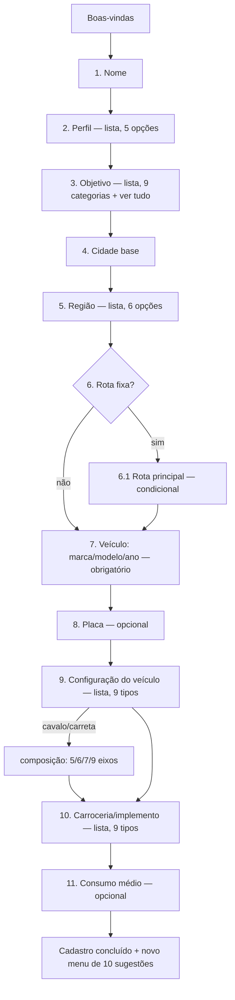

# FROTA IA — ONBOARDING V1 (WHATSAPP), COMO FICOU AGORA

**Branch** `claude/frota-ia-assistente-setup-qlrbac` · **commit** `902deee` · **em produção** desde 2026-08-23 (deploy automático via Railway, confirmado no ar).

> Todo texto marcado *"texto atual do sistema"* é cópia literal do código (`src/ai/whatsapp/onboardingConversation.ts`). Nada neste documento é ilustrativo.

---

## O que mudou

Onboarding redesenhado sob o princípio **"1 usuário + 1 veículo"**: o veículo, que antes podia ficar incompleto (só tipo/eixos, marca/modelo pulável), agora é configurado por inteiro durante o cadastro — placa, carroceria e consumo médio entraram como etapas novas, e marca/modelo/ano deixou de poder ser pulado. Ganhou também uma etapa condicional de rota principal. O menu de sugestões pós-cadastro foi trocado por completo (10 itens novos, incluindo Radar de Fretes e registro de despesa, que não tinham atalho antes).

**Sem mudança**: Google Calendar continua **fora** do onboarding — só é pedido depois, sob demanda, quando alguma ferramenta precisar. Clientes que já tinham cadastro concluído **não são afetados** — nunca reentram no fluxo novo.

| | Antes | Agora |
|---|---|---|
| Etapas de pergunta | 8 | 12 (11 sempre + 1 condicional) |
| Marca/modelo/ano do veículo | Podia pular ("depois") | Obrigatório |
| Placa | Não existia | Nova etapa, opcional |
| Carroceria/implemento | Não existia | Nova etapa, sempre resolve (nunca trava) |
| Consumo médio | Não existia | Nova etapa, opcional |
| Rota principal | Não existia | Nova, só para quem diz ter rota fixa |
| Menu pós-cadastro | 11 itens genéricos | 10 itens, com Radar de Fretes e despesa |
| Idempotência do webhook durante onboarding | Nenhuma | Proteção mínima contra reentrega de mensagem |

---

## O fluxo completo, mensagem por mensagem

### Boas-vindas — *texto atual do sistema*

> Olá! Eu sou o Frota IA, seu assistente especializado em transporte. 🚛
>
> Posso analisar fretes, calcular custos, organizar despesas, manutenção, documentos e rotas, criar lembretes e ajudar você a encontrar oportunidades de carga com o Radar de Fretes.
>
> Você pode falar comigo por texto, áudio, foto, PDF ou planilha.
>
> Para eu usar os dados corretos do seu veículo nas análises e recomendações, vou configurar sua operação primeiro.
>
> Como posso chamar você?

### 1. Nome
Resposta livre. Vazio → repete a pergunta.

### 2. Perfil — *texto atual do sistema*
> Prazer, {nome}! Como você atua hoje?

Opções: 🚛 Motorista autônomo · 👤 Apenas motorista · 🏢 Dono de empresa / transportadora · 📊 Gestor de frota · 🚚 Transportador

### 3. Objetivo inicial — *texto atual do sistema*
> O que você quer resolver primeiro com o Frota IA?

Opções: 🚛 Fretes e oportunidades · 💰 Custos e despesas · 🔧 Manutenção e pneus · 📄 Documentos e vencimentos · 📅 Agenda e lembretes · 🕐 Jornada · 🗺️ Rotas e viagens · 📊 Análises e histórico · 📰 Notícias do transporte · 📋 Ver tudo que o Frota IA faz

Quem escolhe "Fretes e oportunidades" recebe, na sequência, esta transição (*texto atual do sistema*):
> Perfeito! Você pode me mandar uma proposta de frete para analisar ou usar o Radar de Fretes para procurar oportunidades compatíveis com sua operação.
>
> Agora vamos configurar sua base e seu veículo para eu usar informações mais precisas nas análises.
>
> Qual cidade você usa como base principal da sua operação?
>
> Ex.: Curitiba - PR

### 4. Cidade base
Texto livre (`"Curitiba - PR"`). Vazio → repete.

### 5. Região — *texto atual do sistema*
> Em quais regiões você costuma rodar mais? Toque numa opção, ou digite se forem várias (ex.: "Sul e Sudeste").

Opções: Norte · Nordeste · Centro-Oeste · Sudeste · Sul · Todas as regiões

### 6. Rota fixa — *texto atual do sistema*
> Você costuma trabalhar em uma rota fixa ou recorrente?
>
> Responda "sim" ou "não".

- **"não"** → pula direto pro veículo (etapa 7).
- **"sim"** → abre a etapa 6.1.

### 6.1 Rota principal (nova, condicional) — *texto atual do sistema*
> Qual é sua rota principal?
>
> Ex.: Curitiba → São Paulo

Aceita mais de uma rota na mesma mensagem — o texto completo nunca se perde (vira memória), e a primeira rota reconhecida também vira um registro estruturado (`saved_routes`).

### 7. Veículo: marca, modelo e ano (agora obrigatório) — *texto atual do sistema*
> Agora vamos configurar o veículo que você vai usar no Frota IA.
>
> Qual a marca, modelo e ano?
>
> Ex.: Scania R450 2022

⚠️ **Diferença em relação a antes**: não aceita mais "depois" como forma de pular — precisa de uma resposta de verdade pra avançar.

### 8. Placa (nova, opcional) — *texto atual do sistema*
> Qual a placa do veículo?
>
> Ex.: ABC1D23
>
> Se preferir informar depois, responda "depois".

Reconhece formato Mercosul e antigo, com ou sem hífen/espaço. Não reconhecida ou "depois" → segue sem travar.

### 9. Configuração do veículo — *texto atual do sistema, inalterada*
> Qual a configuração do seu veículo? Toque numa opção, ou digite se preferir (ex.: "cavalo mecânico").

Opções: Toco · Truck/Trucado · Três-quartos · Bitruck · Cavalo mecânico · Carreta · Bitrem · Rodotrem · Outro/não sei

Continua sendo a única etapa que insiste até resolver (essencial pros cálculos). "Cavalo mecânico"/"carreta" soltos abrem uma pergunta extra de composição (5/6/7/9 eixos, ou só o cavalo).

### 10. Carroceria/implemento (nova) — *texto atual do sistema*
> Qual carroceria ou implemento você utiliza?

Opções: Sider · Baú · Graneleiro · Basculante (caçamba) · Tanque · Grade baixa / carga seca · Prancha · Frigorífico · Outro/não sei

**Nunca trava**: texto não reconhecido cai automaticamente em "Outro" e segue em frente.

### 11. Consumo médio (nova, opcional, última etapa) — *texto atual do sistema*
> Qual é o consumo médio do seu veículo em km/l?
>
> Ex.: 2,8 km/l
>
> Se ainda não souber, responda "não sei".

Aceita vírgula ou ponto, com ou sem "km/l" junto. Com ou sem número reconhecido, **o cadastro sempre termina aqui**.

---

## Conclusão do cadastro

Em segundo plano, o sistema cria: a empresa (com o perfil escolhido), um período de teste grátis, o veículo **completo** (marca/modelo/ano, placa, tipo, eixos, carroceria, consumo), a rota principal salva (se reconhecida) e as memórias da IA (região, rota fixa, rota principal).

Mensagem de conclusão (*texto atual do sistema*, versão para quem escolheu "Fretes e oportunidades"):
> Cadastro concluído! Sobre fretes e oportunidades, é só mandar quando quiser que eu já calculo.
>
> Aqui embaixo tem outras coisas que também faço — ou envie sua própria pergunta por texto, áudio, foto ou documento.

### Novo menu de sugestões (10 itens, substituiu o anterior por completo)

1. Analisar um frete
2. Procurar oportunidades *(Radar de Fretes — novo)*
3. Calcular custos da viagem
4. Registrar uma despesa *(novo)*
5. Organizar manutenção *(novo)*
6. Documentos e vencimentos *(novo)*
7. Consultar uma rota
8. Criar um lembrete
9. Analisar pneus
10. Ver tudo que o Frota IA faz

O último item sempre mostra o catálogo completo por texto fixo — nunca é resumido livremente pela IA.

---

## O que é criado e onde fica salvo

| Dado | Onde fica |
|---|---|
| Nome | `profiles` / `auth.users` |
| Perfil / tipo de empresa | `companies.company_type` |
| Cidade/UF base | `companies.city` / `.state` |
| Região de atuação | memória da IA (`operating_region`) |
| Rota fixa (sim/não) | memória da IA (`has_fixed_route`) |
| Rota principal | memória da IA (texto completo) **+** `saved_routes` (quando estruturável) |
| Marca/modelo/ano | `vehicles.name` / `.notes` |
| Placa | `vehicles.plate` |
| Configuração + eixos | `vehicles.vehicle_type` / `.axle_count` |
| Carroceria/implemento | `vehicles.body_type` |
| Consumo médio | `vehicles.average_consumption_km_l` |

**Nenhuma coluna nova no banco** — placa, carroceria e consumo já existiam em `vehicles` (usadas também pela ferramenta de gestão de veículo e pelo Radar de Fretes). A única mudança de banco foi aditiva: 4 novos valores no enum de estado do onboarding.

---

## Compatibilidade

Clientes que já tinham o cadastro concluído antes de 23/08/2026 **não são afetados** — o sistema nunca reabre o onboarding pra quem já terminou. O fluxo novo vale só para quem inicia o cadastro a partir de agora.
