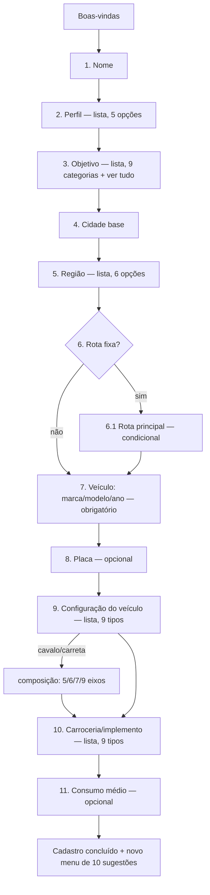
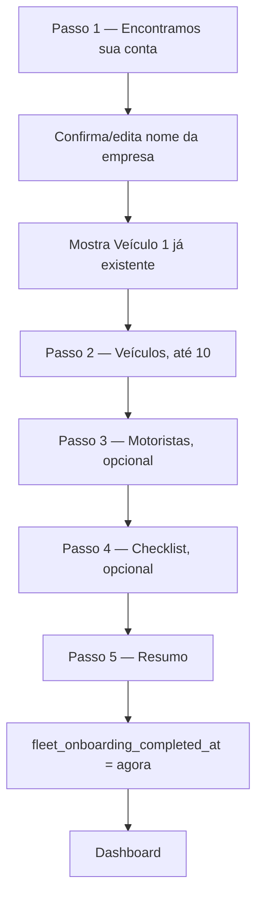

# FROTA IA — OS DOIS ONBOARDINGS, COMO FICARAM AGORA

**Branch** `claude/frota-ia-assistente-setup-qlrbac` · **commits** `902deee` (Onboarding 1) e `92d6dc3` (Onboarding 2) · **em produção** desde 2026-08-23 (deploy automático via Railway).

> Todo texto marcado *"texto atual do sistema"* é cópia literal do código. Nada neste documento é ilustrativo.

## Dois onboardings, um produto só

| | Onboarding 1 — V1 | Onboarding 2 — Gestão |
|---|---|---|
| Canal | WhatsApp | Painel web (`/frota-ativacao`) |
| Quem entra | Qualquer número novo | Quem já fez o Onboarding 1 **e** tem entitlement de Painel de Gestão |
| Cria empresa? | Sim, do zero | **Nunca** — reaproveita a empresa/veículo já criados pelo Onboarding 1 |
| Veículos | 1 | Até 10 (herda o 1º da V1 + permite adicionar mais) |
| Google | Fora do onboarding, sob demanda depois | Pré-requisito **antes** de chegar no onboarding (login + Calendar obrigatórios) |
| Etapas obrigatórias | 11 fixas + 1 condicional | Nenhuma além de reconhecer o que já existe — tudo mais é opcional |

Os dois onboardings escrevem no **mesmo banco**, alimentam a **mesma IA** e nunca duplicam empresa ou veículo entre si — o cliente nunca sente que está começando do zero ao migrar de um pro outro.

---

# ONBOARDING 1 — V1 (WHATSAPP)

## O que mudou

Onboarding redesenhado sob o princípio **"1 usuário + 1 veículo"**: o veículo, que antes podia ficar incompleto (só tipo/eixos, marca/modelo pulável), agora é configurado por inteiro durante o cadastro — placa, carroceria e consumo médio entraram como etapas novas, e marca/modelo/ano deixou de poder ser pulado. Ganhou também uma etapa condicional de rota principal. O menu de sugestões pós-cadastro foi trocado por completo (10 itens novos, incluindo Radar de Fretes e registro de despesa, que não tinham atalho antes).

**Sem mudança**: Google Calendar continua **fora** do onboarding — só é pedido depois, sob demanda, quando alguma ferramenta precisar. Clientes que já tinham cadastro concluído **não são afetados** — nunca reentram no fluxo novo.

| | Antes | Agora |
|---|---|---|
| Etapas de pergunta | 8 | 12 (11 sempre + 1 condicional) |
| Marca/modelo/ano do veículo | Podia pular ("depois") | Obrigatório |
| Placa | Não existia | Nova etapa, opcional |
| Carroceria/implemento | Não existia | Nova etapa, sempre resolve (nunca trava) |
| Consumo médio | Não existia | Nova etapa, opcional |
| Rota principal | Não existia | Nova, só para quem diz ter rota fixa |
| Menu pós-cadastro | 11 itens genéricos | 10 itens, com Radar de Fretes e despesa |
| Idempotência do webhook durante onboarding | Nenhuma | Proteção mínima contra reentrega de mensagem |

---

## O fluxo completo, mensagem por mensagem



### Boas-vindas — *texto atual do sistema*

> Olá! Eu sou o Frota IA, seu assistente especializado em transporte. 🚛
>
> Posso analisar fretes, calcular custos, organizar despesas, manutenção, documentos e rotas, criar lembretes e ajudar você a encontrar oportunidades de carga com o Radar de Fretes.
>
> Você pode falar comigo por texto, áudio, foto, PDF ou planilha.
>
> Para eu usar os dados corretos do seu veículo nas análises e recomendações, vou configurar sua operação primeiro.
>
> Como posso chamar você?

### 1. Nome
Resposta livre. Vazio → repete a pergunta.

### 2. Perfil — *texto atual do sistema*
> Prazer, {nome}! Como você atua hoje?

Opções: 🚛 Motorista autônomo · 👤 Apenas motorista · 🏢 Dono de empresa / transportadora · 📊 Gestor de frota · 🚚 Transportador

### 3. Objetivo inicial — *texto atual do sistema*
> O que você quer resolver primeiro com o Frota IA?

Opções: 🚛 Fretes e oportunidades · 💰 Custos e despesas · 🔧 Manutenção e pneus · 📄 Documentos e vencimentos · 📅 Agenda e lembretes · 🕐 Jornada · 🗺️ Rotas e viagens · 📊 Análises e histórico · 📰 Notícias do transporte · 📋 Ver tudo que o Frota IA faz

Quem escolhe "Fretes e oportunidades" recebe, na sequência, esta transição (*texto atual do sistema*):
> Perfeito! Você pode me mandar uma proposta de frete para analisar ou usar o Radar de Fretes para procurar oportunidades compatíveis com sua operação.
>
> Agora vamos configurar sua base e seu veículo para eu usar informações mais precisas nas análises.
>
> Qual cidade você usa como base principal da sua operação?
>
> Ex.: Curitiba - PR

### 4. Cidade base
Texto livre (`"Curitiba - PR"`). Vazio → repete.

### 5. Região — *texto atual do sistema*
> Em quais regiões você costuma rodar mais? Toque numa opção, ou digite se forem várias (ex.: "Sul e Sudeste").

Opções: Norte · Nordeste · Centro-Oeste · Sudeste · Sul · Todas as regiões

### 6. Rota fixa — *texto atual do sistema*
> Você costuma trabalhar em uma rota fixa ou recorrente?
>
> Responda "sim" ou "não".

- **"não"** → pula direto pro veículo (etapa 7).
- **"sim"** → abre a etapa 6.1.

### 6.1 Rota principal (nova, condicional) — *texto atual do sistema*
> Qual é sua rota principal?
>
> Ex.: Curitiba → São Paulo

Aceita mais de uma rota na mesma mensagem — o texto completo nunca se perde (vira memória), e a primeira rota reconhecida também vira um registro estruturado (`saved_routes`).

### 7. Veículo: marca, modelo e ano (agora obrigatório) — *texto atual do sistema*
> Agora vamos configurar o veículo que você vai usar no Frota IA.
>
> Qual a marca, modelo e ano?
>
> Ex.: Scania R450 2022

⚠️ **Diferença em relação a antes**: não aceita mais "depois" como forma de pular — precisa de uma resposta de verdade pra avançar.

### 8. Placa (nova, opcional) — *texto atual do sistema*
> Qual a placa do veículo?
>
> Ex.: ABC1D23
>
> Se preferir informar depois, responda "depois".

Reconhece formato Mercosul e antigo, com ou sem hífen/espaço. Não reconhecida ou "depois" → segue sem travar.

### 9. Configuração do veículo — *texto atual do sistema, inalterada*
> Qual a configuração do seu veículo? Toque numa opção, ou digite se preferir (ex.: "cavalo mecânico").

Opções: Toco · Truck/Trucado · Três-quartos · Bitruck · Cavalo mecânico · Carreta · Bitrem · Rodotrem · Outro/não sei

Continua sendo a única etapa que insiste até resolver (essencial pros cálculos). "Cavalo mecânico"/"carreta" soltos abrem uma pergunta extra de composição (5/6/7/9 eixos, ou só o cavalo).

### 10. Carroceria/implemento (nova) — *texto atual do sistema*
> Qual carroceria ou implemento você utiliza?

Opções: Sider · Baú · Graneleiro · Basculante (caçamba) · Tanque · Grade baixa / carga seca · Prancha · Frigorífico · Outro/não sei

**Nunca trava**: texto não reconhecido cai automaticamente em "Outro" e segue em frente.

### 11. Consumo médio (nova, opcional, última etapa) — *texto atual do sistema*
> Qual é o consumo médio do seu veículo em km/l?
>
> Ex.: 2,8 km/l
>
> Se ainda não souber, responda "não sei".

Aceita vírgula ou ponto, com ou sem "km/l" junto. Com ou sem número reconhecido, **o cadastro sempre termina aqui**.

---

## Conclusão do cadastro

Em segundo plano, o sistema cria: a empresa (com o perfil escolhido), um período de teste grátis, o veículo **completo** (marca/modelo/ano, placa, tipo, eixos, carroceria, consumo), a rota principal salva (se reconhecida) e as memórias da IA (região, rota fixa, rota principal).

Mensagem de conclusão (*texto atual do sistema*, versão para quem escolheu "Fretes e oportunidades"):
> Cadastro concluído! Sobre fretes e oportunidades, é só mandar quando quiser que eu já calculo.
>
> Aqui embaixo tem outras coisas que também faço — ou envie sua própria pergunta por texto, áudio, foto ou documento.

### Novo menu de sugestões (10 itens, substituiu o anterior por completo)

1. Analisar um frete
2. Procurar oportunidades *(Radar de Fretes — novo)*
3. Calcular custos da viagem
4. Registrar uma despesa *(novo)*
5. Organizar manutenção *(novo)*
6. Documentos e vencimentos *(novo)*
7. Consultar uma rota
8. Criar um lembrete
9. Analisar pneus
10. Ver tudo que o Frota IA faz

O último item sempre mostra o catálogo completo por texto fixo — nunca é resumido livremente pela IA.

---

## O que é criado e onde fica salvo

| Dado | Onde fica |
|---|---|
| Nome | `profiles` / `auth.users` |
| Perfil / tipo de empresa | `companies.company_type` |
| Cidade/UF base | `companies.city` / `.state` |
| Região de atuação | memória da IA (`operating_region`) |
| Rota fixa (sim/não) | memória da IA (`has_fixed_route`) |
| Rota principal | memória da IA (texto completo) **+** `saved_routes` (quando estruturável) |
| Marca/modelo/ano | `vehicles.name` / `.notes` |
| Placa | `vehicles.plate` |
| Configuração + eixos | `vehicles.vehicle_type` / `.axle_count` |
| Carroceria/implemento | `vehicles.body_type` |
| Consumo médio | `vehicles.average_consumption_km_l` |

**Nenhuma coluna nova no banco** — placa, carroceria e consumo já existiam em `vehicles` (usadas também pela ferramenta de gestão de veículo e pelo Radar de Fretes). A única mudança de banco foi aditiva: 4 novos valores no enum de estado do onboarding.

---

## Compatibilidade

Clientes que já tinham o cadastro concluído antes de 23/08/2026 **não são afetados** — o sistema nunca reabre o onboarding pra quem já terminou. O fluxo novo vale só para quem inicia o cadastro a partir de agora.

---

# ONBOARDING 2 — FROTA IA GESTÃO (PAINEL)

## Quem entra

Só chega aqui quem já tem, via Onboarding 1:
- uma conta/empresa criada;
- **entitlement** de Painel de Gestão (liberado manualmente hoje — não existe checkout automático ainda);
- login Google vinculado à mesma empresa do WhatsApp (`vincular_painel`);
- Google Calendar da empresa conectado.

```
sessão → empresa → entitlement → Google Calendar conectado → onboarding de ativação concluído? → painel
```

**Mensal e anual usam exatamente o mesmo onboarding** — a diferença entre os dois planos é só comercial/billing, nunca chega a influenciar o fluxo.

## Google — pré-requisito, não etapa

Diferente da V1, no Painel de Gestão o Google (login + Calendar) é **obrigatório antes** de chegar no onboarding — por isso o wizard abaixo nunca pede login nem verifica Agenda: os dois já estão garantidos quando o cliente chega lá.

## Reaproveitamento — nunca duplica

A primeira tela já mostra a empresa e o veículo **que já existem**, criados pelo Onboarding 1. Nenhuma empresa nova é criada, nenhum veículo é duplicado — o wizard só lê o que já existe e permite completar/adicionar.

## O fluxo do wizard (`/frota-ativacao`)



### Passo 1 — Encontramos sua conta — *texto atual do sistema*
> Encontramos sua conta Frota IA. Vamos preparar seu Painel de Gestão com os dados que você já cadastrou pelo WhatsApp.

Campo editável: "Como você quer identificar sua empresa ou operação?" (pré-preenchido com o nome já existente). Card mostrando o Veículo 1 (nome/placa, tipo, eixos, carroceria — os mesmos dados coletados no Onboarding 1).

### Passo 2 — Veículos — *texto atual do sistema*
> Seu plano permite gerenciar até 10 veículos. Você já tem {N} cadastrado(s).

Lista dos veículos já cadastrados + botão "Adicionar veículo" (mesmo formulário completo do painel — placa, marca, modelo, ano, tipo, eixos, carroceria, consumo). Desabilita ao atingir 10. **Opcional** — pode terminar só com o primeiro veículo.

### Passo 3 — Motoristas — *texto atual do sistema*
> Quer cadastrar seus motoristas agora? Isso não é obrigatório para concluir.

Mesmo formulário do painel (nome, telefone, veículo vinculado, CNH, toxicológico). Opcional.

### Passo 4 — Checklist — *texto atual do sistema*
> Quer ativar o checklist diário dos motoristas? Envio automático, todo dia, no horário escolhido.

Liga/desliga + horário (0-23h, Brasília) + os mesmos 4 itens fixos já existentes (óleo, água, pneus, luzes). Opcional.

### Passo 5 — Tudo pronto — *texto atual do sistema*
> Seu Painel Frota IA está pronto. Seu WhatsApp e seu painel trabalham juntos sobre a mesma operação. Você pode adicionar ou editar veículos, motoristas, checklists e outras configurações quando quiser.

Resumo (empresa, nº de veículos, nº de motoristas, checklist ativo/inativo, Agenda conectada) + botão "Ir para o Dashboard" — só aqui o onboarding é marcado como concluído.

## Limite de veículos — 1 (V1) vs. 10 (Gestão)

Antes, o limite vinha de um rótulo que o próprio cliente escolhia no cadastro (`company_type`). Agora vem do **entitlement real** — mesma fonte que libera o painel:

| | Sem Painel de Gestão | Com Painel de Gestão |
|---|---|---|
| Veículos ativos | 1 | até 10 |

Imposto em 3 lugares (banco, ferramenta de IA, API do painel) — se o cliente pedir pra IA cadastrar um 11º veículo pelo WhatsApp, ela recusa do mesmo jeito que o painel recusaria.

## Compatibilidade

Quem já usava o Painel de Gestão antes de 23/08/2026 foi automaticamente marcado como "onboarding já concluído" — não vê o wizard novo.

## O que NÃO faz parte desta etapa

Preços, checkout, upsell, plano Empresas, cobrança por veículo, mais de 10 veículos — nada disso existe ainda. O onboarding depende só de já ter o direito de acesso (entitlement), nunca de valor comercial.
